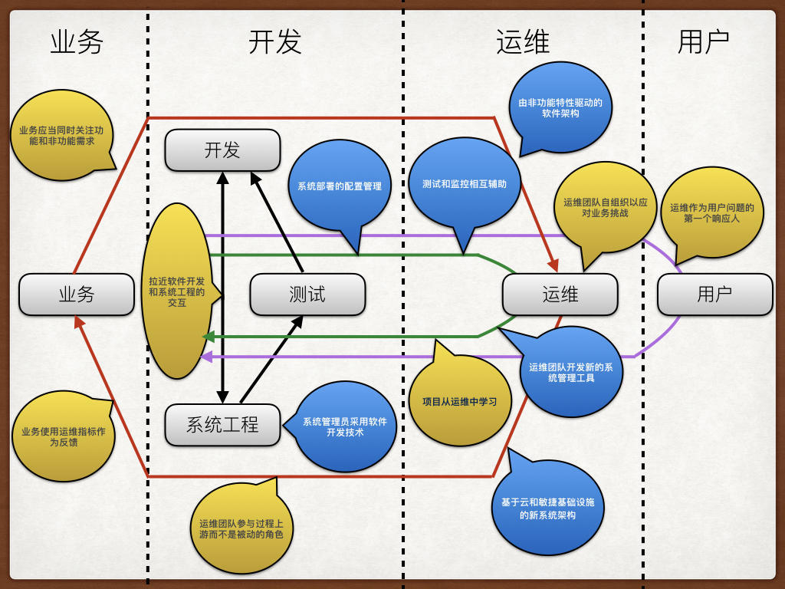

在[**\#DevOps的前世今生\# 2. Dev和Ops矛盾缘何而来？**](/blog/2017-01-17-where-did-devops-issues-come)一文中，通过Dev和Ops的历史发展总结出了Dev和Ops矛盾的历史渊源，以及 Dev 和 Ops 的核心矛盾：

**Dev**和**Ops** 的矛盾主要是面向适应性的敏捷软件交付和面向经验性的传统运维之间的矛盾。

但这个矛盾最先 **John Allspaw** 和 **Paul Hammond**在 “**10+ Deploys Per Day： Dev and Ops Cooperation at Flickr**” 提出，并以“**Cooperation**”作为整个演讲的核心，讲述了他们解决这个矛盾的实践经验。这个演讲中：

## 重新定义Ops的工作目标

在一个组织中，如果相关利益者的利益不一致，在既定流程的进行中一定会碰到诸多阻力。而在这一点上，首先做得就是把 Dev 和 Ops 的利益一致化，从而减少Ops对软件交付的阻力。在演讲中，John Allspaw 和 Paul Hammond 首先挑战的是对 Dev 和 Ops 的传统观点。

传统的观点认为Dev和Ops的工作是不同的：

**Dev的工作是增添新的功能**。

**Ops的工作是保证站点的稳定和高性能**。

他们认为，保证站点的稳定和高性能**不是** Ops 的工作目标。

**Ops的工作目标应该是激活业务（enable the business），而这一点和Dev是一致的**。

理想往往是美好的，现实往往是残酷的。激活业务会带来更多的变更，而更多的变更会引起故障！

面对这样的问题，就需要做出一个选择：为了保障稳定性减少变更，还是及时按需变更？

阿拉伯有一个谚语：“你若不想做，会找到一个借口。你若想做，会找到一个方法。”

Flicker 并没有屈服于压力，他们选择让问题向目标妥协，而不是目标向问题妥协。他们的手段是：

## 构建相互合作的工具和文化

降低变更风险的关键就是在于提高可靠性，这不仅仅是Dev在软件开发中，也需要Ops把可靠性通过非功能性需求（性能要求，扩展性，安全性等）注入到软件开发过程中。通过系统交付过程中的质量內建而不是事后检验来提升交付质量。

而 Dev 和 Ops 的具体矛盾点表现在以下两方面：

**在价值流下游的 Ops 评审认为价值链上游的 Dev 软件非功能质量不满足要求，因此阻止变更**。

**在价值流上游的 Dev 无法获得价值链下游的 Ops 的真实运行环境，因此无法提升交付质量**。

于是，逐渐陷入了“**无法提升质量**”和“ **非功能质量不满足要求**”的死循环中。

由于在 Dev 环节关心的是功能性需求，往往忽略了非功能性需求，而 Ops 更关注的是非功能性需求。所以通过质量內建，把运维加入开发反馈环。在开发环节中增加非功能性的需求的实现和验收，让 Ops 担任最终的 QA 的角色。从而提升了交付质量，也提升了反馈速度。

首先，他们通过**基础设施自动化（Automated infrastructure）**提升了基础设施准备的质量和效率。

其次，他们搭建了Dev和Ops 交付的桥梁：**共享版本控制（Shared Version Control ）**并且通过**功能开关（Feature flags ）**管理功能发布。

然后，通过**一步构建和部署（One step build and deploy ）**以及**频繁进行小变更（Small frequent
changes）**提升单向价值流速度并降低部署风险。

最后，采用**共享运维指标（Shared metrics ）**，和**即时消息工具集成（IRC and IM robots ）**提升沟通效率以做到及时反馈并进行改进。

但仅仅有这些是不够的，还需要构建出合作的文化。合作的文化的构建关键在 Dev 和 Ops 之间的**尊敬，相互信任**，以及**面对失败的改进而非指责的态度**。

第一届 DevOpsDays 在继承了这些思想的方向上则走的更远。第一届 DevOpsDays 吸引了更多关注于这一领域的人群，它们甚至都不具备技术背景。

## DevOps的目标——提升软件交付的质量內建以加速流程

在第一次 DevOpsDays 会议后，作为 DevOpsDays 活动的发起人和 DevOps 这个词的创始人，Patrick Debois 随后总结并写下了“[Charting out devops ideas](http://www.jedi.be/blog/2009/12/22/charting-out-devops-ideas/)”一文，他把第一届 DevOpsDays 这也成为后续 DevOps 运动的理念基石。在这篇文章里，Patrick从第一届DevOps活动中有了两个重要的观察，分别是：

**1. DevOps 是在业务、交付流程和运维之间反馈环中增加了一个反馈环**。

**2. 因为有了这样一个环节，我们可以提升质量以加速流程**。

简而言之，**DevOps 是把运维（Ops）加入到了价值流的反馈环中。并且通过提升软件交付的质量內建以加速价值链端到端的反馈效率。**

而要实现这一目标，要通过一些手段。

## DevOps的手段——技术升级和流程管理

于此同时，Patrick 发现， DevOpsDays 的所有话题都围绕着两条主线：**技术（technologies）**和 **流程管理（process management）**，而这些话题又相互交织在一起形成了四个不同的反馈环，如下图所示。其中蓝色气泡代表技术，黄色气泡代表过程管理：

### 开发-测试反馈环（黑色箭头反馈环）

**技术方面**：

**由非功能特性(扩展性，可用性)驱动的软件架构**：用NO-SQL数据库或队列系统（Queue
System）增加系统的可扩展性，以及混合使用编程语言和memcache这样的缓存系统。

**过程管理方面**：

**拉近软件开发和系统工程的交互**：采用敏捷团队或者其它形式的多功能团队跨越不同的部门墙。

### 开发-运维反馈环（绿色箭头反馈环）

**技术方面**：

**系统管理员采用软件开发技术**：使用代码仓库、持续集成、测试工具、设计模式来自动化的处理系统的初始化操作。

**部署的配置管理**：采用配置管理以及自动化配置工具（Chef，Puppet）用于部署和生产环境的变更。

**测试和监控相互辅助**：在监控系统中复用自动化测试逻辑（比如：cucumber-nagios），在测试环境中使用监控手段验证测试场景。

**运维团队开发新的系统管理工具**：工具也是技术水平差距的重要体现，很多系统管理员开发新的工具用来处理大规模的部署，变更以及监控。

**过程管理方面**：

**拉近软件开发和系统工程的交互**：敏捷项目或者其他形成多功能团队的方法替代不同的部门墙。

**项目从运维中学习**：架构在项目中不断获得反馈，从而知道哪些可以用，哪些不能用。这样可以得到更好的架构设计。

### 业务-运维反馈环（红色箭头反馈环）

**技术方面**：

**基于云计算和敏捷基础设施的新系统架构**：云计算和敏捷的基础设施可以获得更好和更先进的自动化部署手段和系统初始化手段。

**过程管理方面**：

**业务部门应当同时关注功能和非功能需求**：业务应当开始关注停机时间和数据丢失带来的影响。

**运维团队参与过程上游而不是被动的角色**：在运维中采用看板在项目阶段进行互动，甚至可以用在项目前的阶段（销售、服务水平管理）。

**运维团队自组织以应对业务挑战**：例如把**敏捷引入运维(agile operations)**或把**精益引入运维(lean operations)**。

**业务使用运维指标作为反馈：**要了解用户喜欢什么，如何行动。为了做出更好的业务决策，性能降低或故障中断正在成为一个重要的反馈回路。

### 业务-用户反馈环（紫色箭头反馈环）

**过程管理方面**：

**运维作为用户问题的第一个响应人：**运维人员和销售人员一样，都可以作为处理用户的问题的一线，并反馈给业务部门。

### 通过以上四个反馈环我们发现两个关键点

1. DevOps 不仅仅是IT部门的事情，他涉及到IT部门以外的部门，包括最终用户。在脱离像 Flicker 这样的互联网公司这个大背景下。企业级IT部门采用 DevOps 还会遇到更多外部挑战**。

2. 新的技术，尤其敏捷软件开发观念的深入和大规模基础设施（虚拟化，云计算，SDN）的不断发展让 Ops 以 Dev 的方式工作成为可能。**

## 总结

第一届DevOpsDays秉承着Velocity 09中 “Dev and Ops Cooperation”的理念汇集了世界上所有关注于解决 Dev和 Ops 矛盾的有志之士。然而，通过大家的交流，发现软件交付的问题并不仅仅是 Dev 和Ops合作那么简单，通过文章我们发现：

> DevOps 本质是一场以提升质量內建为手段，以加速软件系统价值流反馈为目标的技术提升和管理变革

但是，DevOps 运动后续的发展却并不顺利：

一方面，由于 DevOps 这个很短的单词中包含了太多的概念，又缺乏足够的限定，使得 DevOps 的概念很模糊。让不同的人对于 DevOps 的理解千差万别。

另一方面， 来自传统运维对 DevOps 的批评也让这种基于社区（集市）而非基于专业性组织（大教堂）产生了质疑。由于缺乏系统化的方法论，使得更多的企业在实践 DevOps 中处于观望或低水平的软件工具升级阶段。

然而，DevOps 的实践者们仍然在不断总结和完善。使得 DevOps 的文化价值体系渐渐成型，使得大家能够更好的理解和实践 DevOps。请期待下篇 **#DevOps的前世今生# 4. DevOps的文化**

感谢**ThoughtWorks 高级咨询师 马博文，伍斌，黄博文**给本文提出的宝贵意见。

## 参考链接

[http://cdn.oreillystatic.com/en/assets/1/event/29/10+%20Deploys%20Per%20Day\_%20Dev%20and%20Ops%20Cooperation%20at%20Flickr%20Presentation.pdf](http://cdn.oreillystatic.com/en/assets/1/event/29/10+%20Deploys%20Per%20Day_%20Dev%20and%20Ops%20Cooperation%20at%20Flickr%20Presentation.pdf)

[http://www.jedi.be/blog/2009/12/22/charting-out-devops-ideas/](http://www.jedi.be/blog/2009/12/22/charting-out-devops-ideas/)

[http://www.jedi.be/blog/2010/02/12/what-is-this-devops-thing-anyway/](http://www.jedi.be/blog/2010/02/12/what-is-this-devops-thing-anyway/)

[https://www.devopsdays.org/](https://www.devopsdays.org/)

[https://theagileadmin.com/what-is-devops/](https://theagileadmin.com/what-is-devops/)
