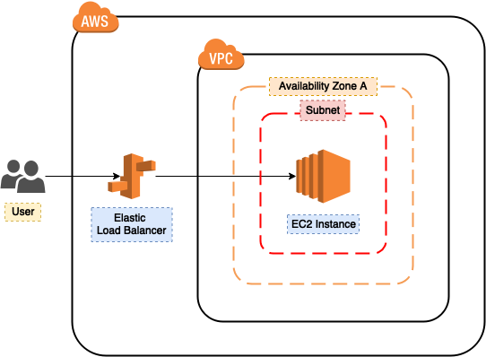
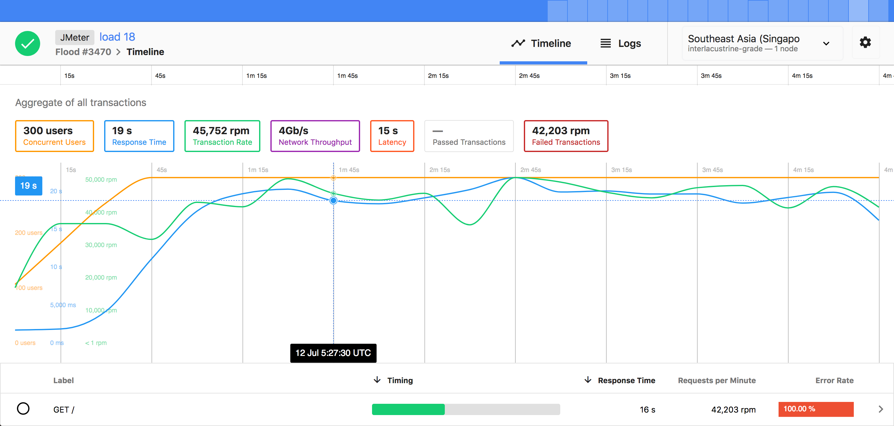

本文是我在 gitchat 上的文章[云计算生产环境架构性能调优和迁移套路总结（以 AWS 为例）](https://gitbook.cn/books/5b5d6f054f88ac0f2df54fdd/index.html)的前半部分，本文对原文有所修改和总结。交流实录请[点击这里](https://gitbook.cn/books/5b5d6f054f88ac0f2df54fdd/index.html)。

## 案例背景

案例是一个泰国网站的生产环境（请脑补一句“萨瓦迪卡”，为了叙述方便，下文中均以"萨瓦迪卡"指代这个网站。）“萨瓦迪卡”是一个 采用 Wordpress + MySQL搭建的应用。这个遗留系统已经工作了五年。客户已经把在其它 VPS 上**平移**到 AWS 上。平移（lift and shift）是说原样复制，而迁移（migration）还要进行改造。而客户唯一发挥 AWS 优势的一点就是用了一个配置很高的 EC2 虚拟机 —— m4.4xlarge。这样一台配置的虚拟机有 16 个虚拟 CPU，64 GiB 的内存，以及 2000 Mbps 的网络带宽，最高 3000 IOPS 的 200GiB 的块存储设备（也就是硬盘）。

**知识点：** GiB 是用二进制计算的，GB 是用十进制计算的。1 GiB 是 2的30 次方，而1 GB 是10 的 9 次方，1 GiB 略大于 1GB。 而且，**AWS 的 FreeTier 免费计划是按 GB 计算的哦！**

除了基本的网络和虚拟机以外，“萨瓦迪卡” 的所有东西都放在一台虚拟机上。没错，是所有东西——Web 服务器，反向代理，数据库，上传的文件——都放在一台虚拟机上。唯一个一个负载均衡用来承载 HTTPS 证书，没有使用集群，没有高可用，没有数据库/应用分离，没有防火墙，没有 WAF，没有 APM，没有 CDN 而且，没有持续交付流水线，所有部署都要 ssh 到机器上进行操作。如图所示：



“萨瓦迪卡”的生产环境可以被认为是一个裸奔的肉鸡。我曾经一度它已经被轮番入侵很久了，只是还没有被发现而已。而且，“萨瓦迪卡”生产环境的唯一一台服务器的内存率使用经常超过 95%，我很担心它的状况，任何一个小的 DoS，都不需要  DDoS，就可以让它整站宕机了。

我于是把我的担忧汇报给了客户，客户也意识到了问题。在我发现问题之前的一个月就启动了“萨瓦迪卡”的**翻新**（Revamp）项目，让这个应用**保持原样**（Keep it as is），直到 6 个月后新项目上线，替换掉当前应用。

然而，没想到我一语成谶。一天，“萨瓦迪卡”被删库了！

## "删库？别慌！"

作为一个运维工程师，最悲催的事情就是“人在家中坐，锅从天上来”。这天是世界杯的某一场小组赛，而我刚吃完晚饭正在洗碗。突然被客户的 P1 告警（P1 - Priority 1，最高级别告警）惊吓到，得知“萨瓦迪卡”被删库了。

判断的依据是：

1. “萨瓦迪卡”主页打开是  Wordpress 的初始化安装页面。证明应用是正常的，数据不在了。
2. 在服务器上用 MySQL 客户端登录数据库，找不到“萨瓦迪卡”的数据库。

还好客户每天有全量数据备份，于是客户快速从全量备份恢复了数据库，只是缺少了从备份点到故障点的业务数据。全量数据库的备份文件有 10 GiB，这么大的表如果采用 `mysqldump` 会因为锁表而导致 10 分钟左右的停机时间（别问我怎么知道的）。

## 问题分析

在恢复应用的同时，我们也开始进行了分析的工作。首先，我们怀疑是被攻击了。于是通过 AWS 的 CloudTrail（一种审计工具，用来记录登录 AWS 用户的操作）和 主机上的命令历史（history 命令）和登录日志进行分析，结果一无所获。其次，我开始检查 MySQL 的日志（`/var/lib/mysql/*.err`），在日志上发现如下片段：

```log
InnoDB: Log scan progressed past the checkpoint lsn 126908965949
180622 17:21:09  InnoDB: Database was not shut down normally!
InnoDB: Starting crash recovery.

<此处省略很多行>

180622 17:21:32 InnoDB: Initializing buffer pool, size = 3.0G
InnoDB: mmap(3296722944 bytes) failed; errno 12
180622 17:21:32 InnoDB: Completed initialization of buffer pool
180622 17:21:32 InnoDB: Fatal error: cannot allocate memory for the buffer pool
180622 17:21:32 [ERROR] Plugin 'InnoDB' init function returned error.
180622 17:21:32 [ERROR] Plugin 'InnoDB' registration as a STORAGE ENGINE failed.
```

通过分析，我们发现 mysql 发现自己有问题的时候尝试恢复数据库，但因为虚拟机可用内存不足而加载存储引擎失败，导致找不到数据库。因此，解决方案有以下三种：

1. 采用工具进行对 mysql 服务器参数进行调优。
2. 扩大内存，换个配置更高的虚拟机。
3. 将应用和数据库部署在不同的虚拟机实例或者 RDS （关系数据库服务）上。

而三种有各自的问题：

对于方案1，数据库调优需要频繁重启。对于生产环境来说，必须在低流量的时段（一般是夜间）进行。而且所花时间未知且效果很难保证。由于资源有上限，且进程相互影响，很难发现问题。所以风险较高，价值有限。

对于方案2，需要对虚拟机进行不停机镜像复制，因此会导致部分数据丢失，而且数据同步恢复困难大。而且，不知道需要多少资源的虚拟才足够。问题同方案1，只不过由于资源更多，下次出现同样问题的时间更晚罢了。这个方案的风险虽然比第一种小，但用空间换时间的价值仍然有限，不晓得能撑到什么时候。而且，可能会带来一定的资源浪费。

方案3是风险最小，价值最大的方案。它将数据作为核心资源并托管至高可用服务上，有效了隔离了风险，保护了数据的可用性。但唯一的缺点就是对于需要的资源和性能是未知的。因此，在实施这个方案之前，我们需要进行性能测量。

你可能会想，只需要增加一些基础设施监控和 APM （Application Performance Monitoring，应用性能监控）就可以得到相应的数据了。然而，在生产环境的性能度量没那么简单。

**首先，我们要保证生产环境的业务连续性。**APM 也是一种应用程序，也会占用资源，你如何确定安装和运行 APM 的过程不会造成生产环境停机？其次，如果一定会造成停机，那么会停机多久？当这些问题都是未知的情况下，鲁莽的行为只能增加更多的不确定性风险。

**因此，在迁移之前，我们要模拟生产环境进行度量并进行分析**。

### 设计性能度量

性能度量是一个从“未知”到“已知”的过程。

**首先，你需要明确所要度量的问题。**你可以和你的小组一起商定需要解决的问题。在上面这个案例里，我们所需要回答的问题包括：

1. 正常运行应用程序需要多少内存？
2. 正常运行数据库需要多少内存？
3. 进行哪些操作会导致停机时间？停机时间会持续多久？
4. 资源使用对性能的影响有多少？
5. 性能拐点在哪里？

当然，对于 CPU，网络和存储，你也可以设计以上的问题。

### 然后，找到数据基线 (Benchmark)

由于资源的使用是和用户访问数量息息相关的，你还需要知道资源使用的**均值**，**峰值**， **边际值**。

**均值**是资源使用基线，也就是最小值。

**峰值**是资源使用的警告线，如果过去发生过这么高。

**边际值**是指每单位的用户请求所消耗的资源。

一般来说，这些数据都可以从云计算提供商的**非侵入式监控服务**获得，它的数据收集不会影响资源的性能。例如 AWS 的 CloudWatch 。我们可以根据过去 6 个月或者 3个月的时间来估计均值和峰值。**但由于未来是不确定的，因此过去 6 个月或者 3 个月的数据是建立在“未来访问量不会突变”的假设基础上的。**例如，如果有类似于“6·18”  或者 “双十一” 的流量高峰，则日常的数据参考意义不大。

如果缺乏这样的手段，就要通过复制生产环境来度量了。

## 复制生产环境

**复制生产环境的一点原则就是“尽量减少不同”**，尽可能的按照生产环境的配置来构建你的沙盒环境以得到更接近真实的数据。很多云提供商都提供镜像（Image）或者快照（Snapshot）的功能用来复制当前有状态的资源。有时候二者是同一个意思。如果有区别，二者的区别在于以下几点：

1. 镜像是全量，快照是增量。
2. 镜像的构建需要停机，而快照不需要。
3. 镜像生成时间长，快照生成时间短。
4. 镜像不能指定时间点部分还原，快照可以根据时间点部分还原。

无论是哪一种，我们都要选择一个对生产环境影响最小的方案。在 AWS 中，我们可以根据当前的虚拟机实例构建虚拟机镜像 AMI （Amazon Machine Images）。它提供两种方式：一种是不重启（no reboot），这种方式的缺点是会造成构建镜像时间点以后的数据丢失。另外一种是在构建之前重启实例，这样不会导致数据丢失。

**对于上述的案例来说，生产数据的完整性并不会影响我们的度量，因此，无需重启实例。**但如果你要度量重启实例会带来多少数据丢失，则需要重启实例。

此外，为了保证你不会误操作，我建议你在非生产环境的云计算账号下重建应用。**如果你一定要在同一个账户中进行复制，请确保你做好了生产环境资源隔离。**

## 设计测试场景

当你在测试环境下复制了生产环境，你就有了一个安全的沙箱来进行测试了。当我们开始进行性能测试的时候，我们要通过“**整体**”的测试来计算对“**局部**”的影响。并找到。以“萨瓦迪卡”为例，我们通过 AWS 上的数据得到了“萨瓦迪卡”生产环境的平均响应时间：0.2 ~ 0.4 秒，RPM（Requests Per Minute 每分钟请求）大概在 4500 左右。

因此我们设计了如下测试场景：

1. 空闲使用率：0 请求的时候，资源使用率。
2. 1 个，10 个，20 个 并发请求的时候，资源使用率和响应时间，用于计算边际资源使用率。
3. RPM 和生产环境 RPM 均值相等的情况下，资源使用率和响应时间。
4. 2 倍 ，4 倍， 10 倍 生产环境 RPM 均值的情况下，资源使用率和响应时间。
5. 模拟生产环境的 RPM 增长速度（逐步增加请求到相应值，例如 5 分钟增长到 2000 RPM）进行测试。
6. 模拟生产环境极限 RPM 增长速度（一次增加请求到对应值，例如 5 秒钟增长到 2000 RPM）进行测试。

 根据以上的测试场景，我们可以构建资源使用率和响应时间之间的关系。

如果你有 CDN 或者 URL 访问分析数据，可以它来构建你的测试案例。如果什么没有，例如“萨瓦迪卡”这种情况，你就可以使用主页的 URL 来进行测试。常用的工具有 Selenium， Jmeter 和 Gatling。你可以用 Selenium 录制一个用户访问的脚本，来模拟用户访问。你也可以通过 Jmeter 或 Gatling 来增加并发进行负载测试，后者能提供更加有用的信息。

如果你无法模拟足够多的真实用户数据，把以上的工具生成的脚本或配置放到 [flood.io](https://flood.io) 上运行，得到更好的参考报告，如下图所示：


如果你需要度量某些操作的停机时间，你可以在进行负载测试的时候进行操作。也可以使用我写的小工具 [wade](https://github.com/wizardbyron/wade) （Web Application Downtime Estimation）来测试。关于 wade 的故事可以参考 [一怒之下，我写了一个开源流量测试工具](/blog/2018/2018-07-07-why-do-I-write-wade/)。

通过模拟“萨瓦迪卡”的访问数据，我得到了以下数据：

1. 当 Web 服务器（Apache）重启完，仅有健康检查访问的情况下，系统占用 367 MiB 内存。
2. 数据库占用 10 GiB 左右内存，也就是说，给 Web 应用剩下的内存有 53 GiB 左右。
3. 分别度量了 1个用户，10 个用户，20 个用户并发访问下的内存使用情况。平均每处理一个请求，最多需要消耗 133 MiB 内存。
4. 也就是说，剩下的内存最大能服务 400 个左右的用户的并发访问。如果超过 400 个用户，系统会因为资源不足而宕机。
5. 升级虚拟机 Linux 中的软件包和安全补丁会带来 5 秒钟左右的停机。
6. APM （NewRelic）的安装会占用 63 MiB 左右内存且无停机时间。

## 编写性能度量报告

当我们完成了性能度量的时候，就要编写一份性能度量报告。性能度量报告包含以下 6 个部分：

1. **背景**：主要回答为什么（Why）要做这一次性能度量。
2. **关键问题**：通过性能度量期望知道哪些问题（What）。
3. **测试设计**：主要介绍度量方法（How），以及度量方法中的注意事项。
4. **测试条件**：由于是模拟测试，要强调与真实值的匹配情况，哪些部分重要，哪些部分不重要。
5. **测试数据结果**：采用工具得出的真实数据，要有源可查，最好是截图。
6. **结论**：根据数据的计算解答第 2 步 提出的关键问题。
7. **建议**：根据度量数据得出的下一步优化建议。

至此，我们完成了对生产环境性能的分析。接下来，就要为性能设计架构迁移方案了。请关注下篇《[AWS 上的生产环境架构优化案例](/blog/2018-08-08-architecutre-optimization-case-study)》
