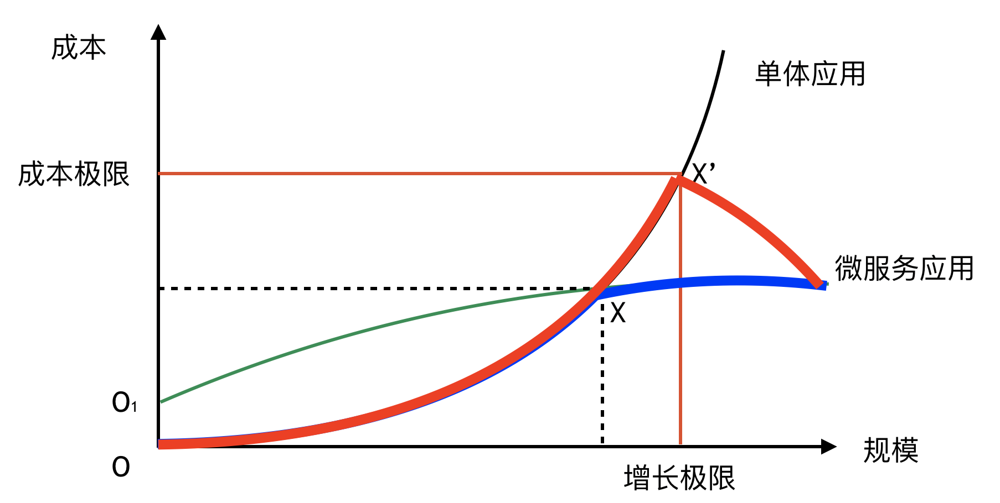

> 4 月在深圳的 GOPS 大会上我分享了“落地微服务的难点和如何高效落地微服务”，这是我 2017 年 4 月份开始做的项目总结，后来发表到了自己的博客和" ThoughtWorks 洞见" 上。

本次介绍的案例来自于我 2013 年刚加入 ThoughtWorks 所服务的客户 R，到今天已经5年整了。2013年的国庆后，我加入了客户 R 的其中一个产品团队，这个团队有三个项目：一个项目做日常维护工作（BAU），这是一个长期项目。一个项目开发一些新的功能。另外一个项目就是将现有的 Java 遗留系统进行改造，把这个 Java 应用的一部分功能从 ESB 和内部调用的方式改成用 Sinatra (Ruby 的一个 Restful API 框架) 做的 HTTP 外部调用。

当时我还不知道我们做的东西就是微服务，只是觉得通过自动化测试和持续交付的方式把应用进行了低风险的解耦。降低了系统的复杂性，减少了需要维护代码，也使得在这个代码库上工作的其它团队不受阻碍。同时减少了生产环境的故障和发布风险。

我在这个项目上工作了 8 个月，完成了“一块功能”的拆分。当时我们并没有一个独立的 Ops 团队，所有的运维相关工作都是团队内自己完成的，那时候我们也不区分开发、测试、运维。只是不同的人去认领不同的任务，不会的就现学现用，或者请教Ops 团队。这就是我最早接触的 DevOps ：一个全功能的端到端产品团队。

在 2014 年的时候我们采用 Docker 进行部署，Docker 在当时是个很新颖的东西，所以互联网上相关的材料并不多。于是我们就自己写了一些编排工具来做 Docker 的大规模部署。同一时期，我们接触到了契约测试，并把契约测试应用于我们的微服务上面。并开始使用 Scala 和 Play 框架拆分另外的应用。通过契约测试，我们会把串行的集成测试转化为一些单元测试。由于契约的约束，使得集成测试降级成为了单元测试，大大提升了测试的效率，降低了测试的成本。

你会在各种微服务的书和相关实践中都能看到 Pact 这个工具，这是客户 R 的另外一个顾问公司开发的，也是他们定义了什么叫契约测试。到了2014年底我们把几个接口拆分出来之后，我才知道这是微服务，也理解了什么是 DevOps。

2014 年 11月份我离开了这个团队，开始把在这个团队上的经验推广给不同的客户，才慢慢深入了解了 DevOps 和微服务的概念。同时，客户 R 也开始复制我们之前的成功经验，开始在整个集团内部进行了全面的微服务化改造。

2017 年 4 月份我重新回到这个客户的项目上工作到 2018 年的 9 月份，期间和其它做微服务的团队进行了一些访谈，可以从比较直观的角度来观察这 5 年来微服务改进的效果和经验。

本系列共计 4 篇，分别是《我们如何衡量一个微服务实施的成功》，《成功微服务实施的组织演进》，《成功微服务实施的技术技术演进》，《微服务架构演进中的经验和反思》。本场 Chat 是第一篇《我们如何衡量一个微服务实施的成功》，由于保密的原因，具体的客户、项目、人员名称均为化名。

## 应用系统的架构的维护成本是如何增长的

我们采用架构的规模（可以用功能数量或者代码行数来衡量），以及投入的维护成本（人员、资金、时间）来构建一个坐标。就可以做出一个简单的对比：

在一开始（O点），单体应用的构建成本是相对低廉的，因为并不需要做分布式。而一开始就做微服务的架构，势必会因为分布式的复杂性而产生额外的成本（O1点）。

随着应用规模的增长，相应的规模就会有相应的维护成本。随着这个规模的上涨，势必会迎来一个 X 点。使得单体应用和微服务应用的维护成本一致。这也说明在这一点之前，单体应用的优势十分突出。

从架构模型上看，单体应用的规模和维护成本是指数上升的，因为规模所带来的依赖使得风险不断汇聚，导致交付速度降低，部署风险增大。因此，它的维护成本以指数形式增长。然而微服务应用是由多个简单系统组合而成，它的依赖程度较低，单独的交付效率和部署风险可控，因此，他的维护成本以对数形式增长。

由于微服务的这种特性，当两种应用架构的规模超过X点之后，它们的维护成本则相去甚远，势必会迎来一个维护成本的极限 X' 点，从而约束了应用规模的极限。

而在这个情况下，就是大多数企业转型微服务的驱动力：原先的应用增长模式无法应对规模的增长。

所以，我们可以看到，大多数的企业是从 O 点出发，沿着红线走到 X' 点，然后开始进行微服务的改造。以换取应用的增长规模。

而一开始做微服务架构的应用，虽然在开始的阶段投入了更多的成本，但换取的是未来更大的规模。不过，从精益的角度看，这是一种浪费，除非你的目标就定位了一个大规模的应用。这在大多数应用系统最初建立的时候都是不可能预期的。

所以，一条理想的模型是从 O点出发，到达 X 点之后进行微服务改造。

然而，这根本不可能实现，原因有两点：

1. 人们不会同时构建两个一样的应用来做比较，从而找到增长极限。
2. 目前，也不会构建一个度量指标，来度量维护成本和应用规模。

所以，你所处的阶段，应该是 X 到 X' 之间的某一点，你开始采用 DevOps 技术来缩短研发周期，提升交付质量，也开始度量应用的交付状态。这就需要我们构建一个指标来度量架构，这就是：**边际功能收益率**（MSROI，Margin Scale Return on Investment ），也就是我创建一个新的功能，它在未来一段时期所消耗成本（人力、时间、资源）所带来的回报（降低成本，降低风险，增加收益等）。如果这个收益率持续降低，且是因为成本在不断增加，你就需要考虑是不是降低应用维护的成本了。

## 应用架构的局部性原理

事实上，一个正在运行的系统，维护过程会有两个局部性原理。我把它称为**应用系统的 DevOps 局部性原理假设**，它包含 Dev 和 Ops 的两个局部性假设。分别是：

> **开发局部性假设**：在运行着的应用系统中，维护所做的工作是对应用系统的局部进行开发。因此，对整个开发团队**应该**只产生局部性的影响。
> **运维局部性假设**：在运行着的应用系统中，由于局部的变更，**应该**只产生局部性的风险和影响。

以上两个假设有一个约束：**由于局部性的开发导致的综合成本。均小于替换整个系统的整体成本**。

也就是说，你所构建的局部性是要小于你原先系统规模的，否则你就是实现了一个新的系统。

但我们所经历的事实是相反的：一个局部性的变更需要依赖很多其它的开发团队和人员，并在应用系统中产生连锁规模的影响。

所以，如果你的应用系统是微服务的架构，就会符合上述的微服务 DevOps 假说并通过**微服务的 DevOps局部性测试**：

> 任意应用的局部变更均产生局部性的影响。

为了降低系统风险，我们需要将应用的变更风险隔离出来。因此，就有了微服务架构的 DevOps 推论：

> 运行时的维护关注点局部性使得独立开发的局部性成为可能。

也就是说，在应用运行架构风险隔离的情况下，才可能出现独立开发和独立部署。而本质上，单体应用到微服务应用的转型就是应用的内部的高风险依赖转化为外部的低风险依赖的过程。是内部复杂度向外部复杂度的转换。因此，**微服务架构改造所花费的成本大部分都在处理服务间的通信**。

**应用系统的 DevOps 局部性原理假设**的角度看，微服务本质上的目标和 DevOps 的目标是一致的。这也符合我此前做微服务的落地经验：当应用程序的部署时间和变更风险在单一应用上做到极致之后。我们可以考虑对应用进行拆分以进一步实践 DevOps。

也就是说，微服务架构是组织 DevOps 不断深入和优化的结果。

## 我们如何衡量一个微服务的转型效果

我们做微服务的主要诉求就是希望系统规模在增长的同时，管理成本降低。也就是应用结构和组织结构满足上述的假设。这个管理成本包括两个方面：

- **人员的管理成本降低**。由于通过制度构建了扁平化和全功能的团队，组织间的沟通协调成本下降。
- **技术的管理成本降低**。由于采用了松耦合的架构策略，使得应用架构既稳定又灵活。可以低成本、低风险清理技术债，修复问题。或者增加新的功能。

### 人员的管理成本降低

当业务扩张的时候，需要开发并维护更多的需求。因此，在时间和质量不变的情况下，只能通过增加资源来满足需求。但是，边际收益递减规律告诉我们：在其它条件不变的情况下，任何单一要素的投入所带来的收益是会递减的。因此，需要增加额外的要素来获得增长和回报率，特别是调整组织的结构，降低来提升容量。

而在大型应用系统开发面前，我们投入资源的只有人，因此我们可以看到。大型的项目随着人员的增加，它所带来的管理成本也会增加，直到增加人员不产生收益为止。这是我们在大型应用系统，特别是互联网应用上看到的问题。

以前粗放式的通过把复杂问题分解，并且通过人海战术开发需求的模式将不可持续。一方面，复杂度的提升，需要能够把问题合理拆解到合理规模的架构师，这样的架构师获得成本较高，无论是招聘还是培训。另一方面，随着开发维护人员的增加，人员的管理会增加额外的成本。

然而，微服务的出现。改变了应用架构，并在依据康威定律的作用下，改变了组织形式。通过自组织的全功能敏捷团队，简化了交付的流程的沟通成本。通过采用自动化手段将最佳实践制度化，提升了交付质量，降低了培训的成本。通过把一个问题分解为独立的问题，避免界限不清带来的额外成本。

从经济学角度说，微服务组织结构本身包含产权制度和界定产权两个部分。

如果你的微服务做得最够好，根据康威定律，你的架构会和你的组织结构是一致的。如果你有了一个自治且自我成长的团队后，通过把最佳实践变成制度和规则充分授权，而不需要更多的请示和汇报，你的组织结构不会有一个很厚很高的层次以及对应的回报关系。而是扁平而松散的结构，每个团队按照同样的制度独立完成任务，不会出现组织流程上的阻塞。但能够达到同样的质量效率。

而这样的文化最后最后会形成一个开发软件的文化和制度，这个制度可以在组织内复制并且推广延续。减少了更多的人工管理成本。

因此，微服务架构能够大幅度的降低组织的管理成本。我们可以看到团队自我改进、人员能力提升，你可以有更少的管理层，在 [2018 年北京 DevOpsDays 上华为 DevCloud 团队的案例分享](http://www.itdks.com/eventlist/detail/2132)也证明了这一点。

因此，一个成功的微服务实施，我们可以看到以下几点组织特征：

- 组织结构的扁平化，更少的管理层。意味着更低的管理成本。
- 组织的弹性更好，抗风险能力更佳。任何人的离开都不会带来很大的影响。
- 交付质量和产出高，至少每天一次的高质量发布使得任何变更都不会出现阻塞。
- 培训成本降低，统一了原则和文化，使得任何新人进入团队都可以快速上手。（2个迭代就有产出）
- 没有阻塞，团队独立并且实时监控组织产能情况，可以动态的调整资源和产量。

### 技术的管理成本降低

另一个微服务成功的特征就是技术管理成本的降低，这个有两个方面的成本。一方面是开发成本，另一方面是维护成本。

主要原因是在单体应用的时代，在变更请求频繁的情况下，单体应用成为了一个互斥资源。借用 DevOps 和约束理论（ToC）的话说，单体应用的代码库成为了一个约束点。在这个代码库上的所有变更都需要精心的安排和设计，否则会带来整体影响。架构师需要仔细研究推敲各个方面，才可以综合因素做下一阶段的安排。这时候，我们需要对于应用架构的变更进行“批处理”。如果一批变更太多，一个变更失败就会导致一批失败。因此，业界开始采用"小步快跑"的方式频繁的发布，减少失败率。为了达到这个目的，就有了“持续交付”以及 DevOps 相关的实践。

因此，我们需要通过一定的方法解除约束点。由于上文提到的应用程序的 DevOps 假设及其推论。我们可以把应用程序拆分成边界清晰的不同部分，用不同的代码库管理，并由不同的团队去维护。从而达到开发运维的局部性，用以实施持续交付。

这样做有几个好处：

首先，你会得到一个清晰的架构。而我们现在大部分系统的应用架构是混乱的，里面存在了太多的“暗知识”。“暗知识”就是需要通过跟踪代码，跟踪日志，实际运行监测的到的不确定的知识。现在我们去画一个系统的架构分层图，你画出来的图跟实际系统对应程度并不是很高，而且很混乱，往往出现的情况是部署架构和逻辑架构不一致。

其次，你会得到更快、更稳定的发布反馈。这实际上是 DevOps 带来的好处。使得你可以更频繁的去部署应用，在部署和更新的时候应用更稳定，存在更少的宕机时间。在这个过程中会发现有很多的自动化，然后随着微服务做得越来越多。最大的问题就是面对微服务的管理。实际上，在外部需求功能不变的情况下，微服务的大小决定了微服务的数量。同样也决定了团队的数量和管理的复杂度。所以，微服务的大小不是问题，问题是你有多少人员能够支撑这样的复杂度。

我们知道如果你的开发任务量在增加的时候，我们在不增加资金投入，不增加开发时间的情况下的情况下能做到最好的方式就是减少满足你最终交付时间点的需求。但是到了微服务的环境下，你不需要再有这样的到期时间点交付的任务，你发现不需要增加人同样可以解决这些问题。

当你发现需要管理这么多微服务你需要额外的自动化，你的团队里就会自驱形成自动化的意识。

然而，自动化带来的不仅仅是效率和稳定性。

通过持续交付流水线，我们把功能测试和非功能测试都自动化起来，并且集成到持续交付流水线里。

这样，我们就把提升质量作为一种制度贯彻下去，避免人为质量管理带来的疏漏和质量下降。

记住，频繁发布的前提是不断提升质量。如果降低对质量的要求，持续交付就只剩频繁发布了。所谓“质量不能降，一降就走样”。

有了高质量作为发布门禁和要求，我们就会看到团队会向这个标准努力并提升自己的能力。发布的风险和带来的影响会越来越小。

任何让你缺乏信心的发布都有一个质量忙点，问题是，有多少人会愿意制度化的方式去解决，而不依赖人和测试。

因此，从技术上看，我们可以看到一个成功的微服务实施具备以下几点特征：

- 很多个代码库，以及一一对应的流水线。
- 应用可以随时部署，并不需要等待。
- 大量的自动化测试。
- 更少的变更事故。
- 更低的发布风险。
- 可以按需扩展。
- 更多的自动化手段。

## 最后

当我们知道如何度量微服务的效果之后，我们就可以拿这个参考来考察一下微服务的组织实践和技术实践是否有助于我们达到以上的效果。接下来，我们会通过对比该微服务化架构组织和技术的异同来说明微服务所带来的转变。请期待下一篇：《成功微服务实施的技术演进》
