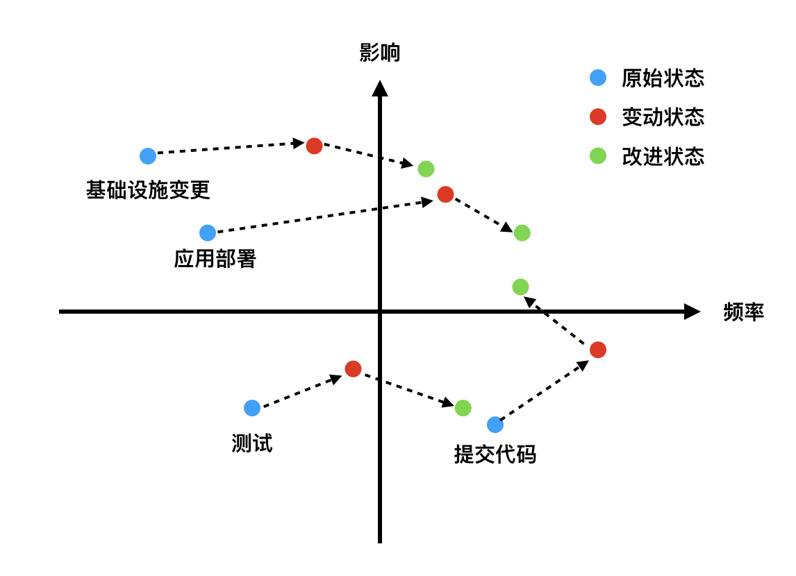
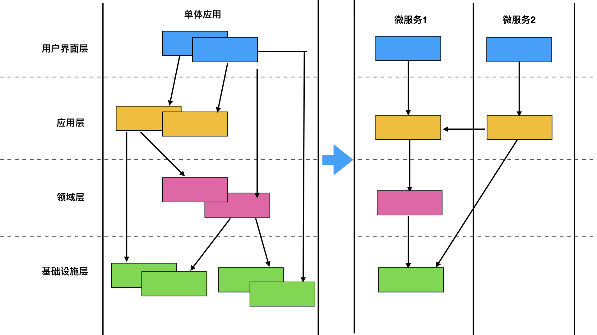

大部分微服务的案例，我们往往都只能看到一个结果，很难看到其过程，特别是实践中的弯路。让人有一种“采用就会成功的错觉”。经过前三篇的探讨，我们通过一个成功案例的三方面分析对微服务成功度量、技术演进和组织演进有了一个基本的认识。本文试着把我在客户身上看到微服务落地中那些经验和反思分享给大家。

## 软件开发中的“灰犀牛事件”

“灰犀牛”是与“黑天鹅”相互补足的概念，“灰犀牛事件”是太过于常见以至于人们习以为常的风险，“黑天鹅事件”则是极其罕见的、出乎人们意料的风险。

在产品研发的早期，特别是产品开始投入市场的时候，为了取得短期的高速增长所采用的临时方案。然而，虽然会有资深架构师或者程序员告诉你产品这样做不行。但作为决策层，它并未感到技术债带来的成本和风险（风险和成本的积累是需要时间反应的）。于是技术债就变成了一个“狼来了”的故事，而架构本身就变成了一个灰犀牛事件：

> 我们从未切实的感到过应用架构崩溃所带来的成本，所以对技术风险选择性失明。

然而，随着资本周转的速度越来越快，这些技术债务的利息会慢慢到期，变成一个又一个定时炸弹。于是应用的交接就变成了一个击鼓传花的游戏。越早构建的应用越能体会这样的痛：

1. 竞争对手的变更越来越频繁，如果不这样很难保持领先优势，因此你也需要更快的交付；

2. 应用质量使得应用交付没有办法快起来；

3. 为了避免质量问题，增加需要采用严格的流程和中间环节审查才能确认变更没有问题；

4. 为了采用严格的流程和中间环节审查，于是应用交付的流程越来越长，导致交付速度进一步变慢；

5. 由于应用交付的流程越来越长，限于交付截止日期。每个人都只关注自己所处的流程，而无法把控整体质量，导致质量进一步变差。

于是，这就变成了一个悖论：**你想让软件交付变快的手段只会导致它越来越慢**。

对于以上的问题，DevOps 给出了解决方案：通过精益（Lean）缩短流程，通过自动化（Automation）提高效率，通过度量（Measure）看到问题，通过分享/分担（Share）避免只见树木不见森林，通过文化（Culture）一系列的自律自治而非顶层设计产生的原则注入到组织里的每个人身上。这就是 DevOps 的 CLAMS 原则。

然而，DevOps 并没有解决“规模”的问题，它所适用的场景对于“两个披萨”的团队来说如鱼得水。但那些超过“一百个披萨的团队”又应该怎么办？

庆幸的是，在“规模化 DevOps” 出现之前，就有人意识到了 “DevOps 规模化”面对的问题，也避免了那些对“规模化 DevOps ” 避而不谈的尴尬。毕竟，“规模化敏捷”也正处在骑虎难下的境地之中。直到“微服务”吸引了大家的注意力。

我们并没有看到那些技术债，因为工程师们正在承担着技术债的利息。我们也没有看到那些崩溃的应用，因为新的应用会取而代之。那些负责人呢？别担心，也总会有下一个。毕竟所有人都在闭着眼睛扶梯子，而且会有人对你说“你又没站在梯子上，何必认真呢？”

## 直面风险：关注弹性而非确定性

> 风险管理的本质：不是让所有的风险都消失，而是确保风险发生时有相应的应对措施。
> ——《人件》

在打造稳定的应用系统上，人们往往倾向于提升应用系统预期结果的确定性，避免异常情况的出现，这就是让“风险都消失”。这实际上是灰犀牛问题的一种表现：我们选择的不去面对那些一定会发生的风险，而是一厢情愿的避免真实的问题发生。

在这种观念下打造的应用系统会因为僵化而变得更加脆弱，使黑天鹅事件造成的影响更大。然而，如果我们把所有的风险都穷尽，解决这些问题则会花费过多的成本。

我们可以通过事件发生的频率高低和影响大小，构造一个开发-运维事件矩阵。并且监控每个事件对系统造成的影响，如下图所示：

根据上图，通过不断的度量，我们可以看到在微服务的过程中带来的变化。然后，我们可以根据各种事情的变化，构建出一个动态的、可自动恢复的弹性应用系统。

[Chaos Engineering](https://github.com/wizardbyron/principlesofchaos_zh-cn)——"混沌工程"就是一种方法论，能够通过模拟真实发生的风险来验证你的自动化应对措施是否有效。

组织结构上也存在同样的缺乏弹性问题，一个常见的风险就是人员的离职和流动，这是一个常常被忽视的且影响很大的风险。而一个错误的做法是极力挽留一个“重要的人”。

如果一个人离开了造成的很大的影响，凸显出这个人重要性的同时也说明一个组织制度的不成熟。所以，我们要构建一个职责轮换的机制，提升这些事情低频率的发生，并通过组织自发的改进机制来降低它带来的影响。这是我所认为 Design For Failure 的意思：直面风险，而不是选择性失明。

所以你得先看到那些高频率的影响大的事情。去制造它的发生，然后在不断的适应中让他不再那么痛苦。

## 保持团队信息的极度透明

微服务架构实施中一个常见的反模式就是组织和应用的“碎片化”：很多组织在拆分微服务之后，会安排独立的团队负责微服务，并以责任边界隔离代码和团队。

这样会使团队之间从技术到组织流程进入了另一个“深井”。为了解决这个问题，就需要增加了更多的管理人员来解决这些问题。于是一个微服务后的组织被不断的“垫高”。

按照《我们如何衡量一个微服务实施的成功》一文中的度量方式。如果在微服务改进中管理的长期成本提升，往往说明我们走错了路。微服务的实施不能带来信息的垄断和碎片化，反而要提升透明度和统一化。以下两点十分重要：

1. 打破信息的垄断，让所有团队的所有状态和信息——产品路线图、交付进度、运营状态等——对所有团队开放，而不是只存在几个人的手里。

2. 代码全民所有制：团队和微服务不应该是强绑定的关系，用任务类型取代角色。任何人都可以修改任何微服务的代码，每个人对自己的修改负责。

## 按需拆分微服务

很多企业已经在拐点到来之前开始进行微服务改造：引入 Docker、Kubernetes、Kafka……而对于真正的架构问题，大家避而不谈，三缄其口，只把一些时兴的工具祭奠成了玩具。但是，

> 如果用技术去解决一个管理问题，要么你高估了技术带来的转变，要么你低估了管理问题的难度。

微服务带来的第一个好处就是对风险的隔离：**把稳定的部分和不稳定的部分隔离开来**。

这种隔离是两个方面的，一方面是一个应用系统运维部分和开发部分的隔离，把经常变动的业务逻辑和不经常变动的业务逻辑执行环境隔离。另一方面就是在应用内部隔离，把稳定的业务和不稳定的业务隔离。

因为微服务本身就是把内部的复杂度，也就是应用内部的依赖。通过分布式工具转化为外部复杂度，也就是应用之间的依赖。所以，需要通过额外的基础设施来管理这些应用之间的依赖。 然而，这样的转换所带来的就是运维成本的上升。

此外，从业务逻辑上“重新拆分”：为了便于理解，进行了更高层的抽象。划分成了“几大中心”，“几大模块”，“各司其职，分别治理”。这满足了决策层“重新画蛋糕”的变革诉求，也很想当然的降低的管理的难度。而习惯于“整体规划”的人往往会从高层设计一个“全局微服务架构”，然而这些设计难以落地，因为高层不理解底层实现。接下来的微服务就会不计成本的落地。一方面为了维护“架构师的尊严”，一方面为了“缩短时间成本”。然而，这些都美好的愿望、经常碰到几个问题：

1. 理想的架构和现实的架构差异很大，因为很多实现的问题在设计的时候并没有考虑；

2. 服务拆分后每人只关注自己的服务，缺失的服务间业务设计则需要增加管理层来弥补；

3. 自动化不足，需要更多的人员来解决工作量；

4. 急功近利面对太多的未知引发风险和成本的规模性增长；

5. 由于以上问题缺乏度量，微服务的改造进度处于“停滞”的状态。

如果不对微服务采取度量，你的微服务改造往往是失控的。

此外，并不是所有的应用都适合微服务架构。首先得明白微服务架构所解决的问题。而微服务面对的问题有一个常见的误解是遗留系统不断膨胀，使其内部复杂度达到一个不可维护规模，即：

> 应用规模会增长到规模的增加边际收益为零为止。

这可以说是经济学边际回报递减规律的一种应用。也就是说，无论你增加功能还是增加人手。当这种增长并不会带来收益的时候，它就已经到达极限了。然而，我们对这些指标并不度量，所以很多情况下这种成本是未知的。

所以这种事情并不一定会发生，因为我们应用的增长规模并不显著。我们有足够长的交付周期和人员流动可以让这些问题变得不显著。

只有系统集成的时候，特别是采用 ESB 进行系统集成的时候，这种突然陡增的规模才会引发规模性痛点。集成到一起的系统，同时也加倍集成了复杂度和风险。在这种集成下，交付周期和人员规模一下就变得严重短缺。我们并没有从深层次的角度去化简这种复杂性，而是通过增加人手来弥补这种短缺。直到无法继续招聘到合适的人为止。

我们可以看到，我们从一种均衡（各自缓慢演进的独立系统），经过了规模化动荡（通过系统集成汇聚了风险和成本），通过增加维护人员，达到了另外一种均衡（更大规模的系统和组织）完成了增长。

然而这种增长仍然会面临规模上限的挑战，直到而对资本回报率的要求会带来连锁性质的崩溃——不光财务债务到期，技术债务也到期了。缩小规模化成本最简单粗暴的形式——裁员以降低维护成本，而剩下的工程师工作量更大了。

人们是不会砍掉系统功能来缩减维护成本的。毕竟，应用系统是对客户的承诺，承诺砍了，就意味收入砍了。所以这就带来了微服务拆分的第二件事：微服务是架构的重构，重构意味着不改变应用的行为，而对应用的内部组织进行优化。而这种优化所带来的好处是无法度量的。这就意味着如果投入人力，它的成本可能无限大。

对于业务/IT 分离组织来说，没有业务价值的技术改造是没有预算的。这也就意味着我们不能用“休克疗法”——停止开发，开始改造。所以，微服务的拆分往往就是在开车的时候更换轮胎，伴随着新需求开发的同时进行应用的重构。

而这时，我们要对新需求成本和微服务变更成本进行约束。根据新需求的预算限定新团队的大小，并通过团队的大小约束微服务的大小和规模。在新团队中采用新的代码库和环境以隔离对遗留系统的影响。采用“绞杀者”策略隔离新引入系统的风险。通过“修缮者”策略隔离遗留系统内部的风险。通过“拆迁者”策略替换掉那些不需要维护的代码以降低维护成本。

在我介绍的案例里，我的客户用了 5 年把系统的微服务化推进到了 60% 到 70% 左右就不再继续了。因为微服务化的目的是降低开发运维产品的成本，而不是引入微服务。因此，我们在做新需求的同时兼顾了架构的演进。在不同的阶段采用了不同的策略，同时度量这些活动所带来的成本。如果不进行估算和度量，你的微服务改造一定会因为失控而面对更多的麻烦。

所以，就像之前的文章提到的，做微服务的时候先不要急于你“是”一个微服务的架构。而应该在你的系统里先有一个微服务。然后看看这个微服务带来什么样的效果，做好各方面的度量，它的投入是什么？收益是什么？你需要花更多的成本管理中间的问题？而且你要面对一些不确定的风险？

所以，如果你一开始做微服务的话，你可以考虑一下先成立一个小的微服务团队，然后感受一下。如果你已经做到深水区，你可以适当减缓速度，缩小规模。或者通过自动化提升效率和规范性。但第一要先做的，是做好度量。

## 微服务的合并

如果你看到上文发现自己的微服务改造下手太早了，或者已经停滞不前了，往往说明你进入了深水区。在这个阶段你开始度量，你会发现微服务的拆分并没有带来收益，反而增加了成本。具体表现为以下几个方面：

1. 基础设施没有规范化、自动化管理；

2. 强依赖被拆分了，需要额外的手段保证；

3. 拆分后质量更加难以把控，测试的难度增加了；

4. 微服务网络性能低下；

5. API 网关成为了新的单点故障。

当你出现了这几种情况，你所面对的可能是微服务的一个反模式——“毫服务”（Nano Service），这个反模式往往是因为在缺乏度量和风险约束的情况下进行拆分导致的。因此，过早拆分微服务是万恶之源。

所以，当你开始度量，你会发现有些应用是不能拆分的。如果你已经拆分了，就要根据实际的度量，进行合并。我把“微服务的合并”看做是企业微服务化的一个成熟度标志，这标志着微服务拆分的度量体系形成。你开始考虑什么时候该拆，什么时候该合，也会理解影响拆合的因素。

这些因素主要包括：组织责任边界、一致性、性能。

我们曾经有一个子系统，它因为组织变动的关系，会在两三次的变动中划给不同的部门。划完之后我们微服务就是拆了合，合了又拆，拆到最后一次拆，前后拆合了 3 次。

在做微服务拆合的时候心里要牢记康威定理：你的系统结构跟你的组织结构是一一对应的。这样，你就可以从宏观的角度发现问题，也知道哪些是在加速过程中难以逾越的“音障”。

对于性能或者保证事务完整性做的合并，这往往是由于在设计的过程中没有考虑部署架构。你得理解，网络间的远程调用并不如一个进程内的程序上下文调用那么可靠和性能高。微服务拆分到分布式的环境中需要额外考虑网络的问题。

因此，为了避免这些问题，提前了解并规划好部署结构是十分重要的。

## 六边形架构

我们习惯于采用分层的方式来描述架构：展现层、领域层、基础设施层、数据访问层，然后我们根据业务，采用垂直的方式进行切分。如下图所示：

然而采用这种方式进行微服务架构的拆分都会落入一个陷阱：业务中的依赖会被忽视，直到代码拆分和服务间通信的时候才发现架构的错乱。那是因为分层架构展示的是技术层面的关系，通过分层架构我们是很难描述出业务层面的依赖性的。而业务的依赖性则是微服务拆分的核心：业务中决定了哪些部分是强依赖，哪些部分是弱依赖。

然而，在大规模系统中，特别是集成后的大规模系统中，这些依赖的发现则更加困难。

而采用六边形架构的方式，我们则更容易的看到业务之间的关系。

图片来自：www.herbertograca.com

“六边形架构”又被称之为“端口与适配器”模式。 六边形架构将系统分为内部（内部六边形）和外部，内部代表了应用的业务逻辑，外部代表应用的驱动逻辑、基础设施或其他应用。内部通过端口和外部系统通信，端口代表了一定协议，以 API 呈现。一个端口可能对应多个外部系统，不同的外部系统需要使用不同的适配器，适配器负责对协议进行转换。这样就使得应用程序能够以一致的方式被用户、程序、自动化测试、批处理脚本所驱动，并且，可以在与实际运行的设备和数据库相隔离的情况下开发和测试。

在六边形架构中，业务是固定和稳定的。而实现则是可以替代和替换的。不同的六边形代表了不同的领域对象，各自可以成为一个独立的微服务。如果你可以用如果你能用六边形架构去画你的架构图，那么你离微服务已经不远了。它的耦合和技术实现相对清晰和稳定。

## 对齐“统一语言（UBIQUITOUS LANGUAGE）”

实际上，微服务的架构需要考虑以下几个架构的相互匹配：

1. 组织架构：人员的管理层级架构；

2. 业务架构：根据人员管理层级带来的业务流转架构；

3. 应用架构：根据业务流转进行的应用程序逻辑划分架构；

4. 部署架构：将应用程序逻辑组织在分布式计算平台上的架构。

在这四类架构中，1 和 2 都是非技术因素，但是决定了 3 和 4 的技术因素。这就是上文提到的“康威定律”的另一种表现形式。而工程师看待系统的角度和用户看待系统的角度是不同的。这很大一方面的原因是没有采用同一种方便两者相互理解和交互的语言进行对话。

此外，不同的系统在集成时也需要对齐接口中所采用的语言和单词，否则同一个词语在不同的系统中有不同的解释，导致深层次的麻烦。

在我之前提到的客户身上，发生了这样一件事情。他们系统包含了一个报价系统和一个核算系统。一个对内部使用，一个给外部使用。在国外，对于外部使用的系统来说，价格是含税的。而对于内部计算统计来说，报价是不含税的净收入。这个比率大概是在 10% 左右。然而，由于两个不同的系统都采用统一的单词 Price 来作为系统之间交换数据的字段。因此，系统就把内部的不含税价格暴露给了客户。当我们发现这个问题的时候，这个系统已经运行了三年。也就是说，这个系统在这三年里每年都损失了  10% 的收入帮客户缴税。

整个过程是因为我们在帮这些系统增添自动化集成测试案例的时候，发现这个自动化测试失败了，然后就发现了两个系统之间价格的不一致性，虽然都是价格（Price），但一个含税，一个不含税。

当你去和不同的系统进行集成的时候，你会发现对齐统一语言非常重要。这也是我们在做微服务架构的过程中会发现的一个问题。由于程序员不懂得业务，就会导致这样的问题。所以你需要有一个领域专家在不同的系统集成时对齐领域语言。

后来，我们把“价格”这个单词在不同系统里用两个不同的单词来表示。这样我们就知道在进行价格计算的时候需要重新考虑它是否含税。然后，我们编写了一些自动化测试来保证计算正确。一旦税率修改了或者规则修改了，我们就知道在哪里去修改相应的业务逻辑。

## 不要过早的开发出统一化的工具

微服务本质上仍然是一个分布式系统，在拆分微服务的过程中，是用运维的代价去交换开发的代价。由于运维的相关内容比较稳定，因此进一步隔离了系统中的风险。

如果我们把这一类运维问题看做一个独立的问题，我们也可以采用软件的方式来解决这个问题。很多组织，包括我所介绍案例中的客户，也开发了一套统一的工具来解决微服务的问题。

但是，统一化的工具是一把双刃剑。作为程序员总是喜欢不断重复造轮子来自动化，然后就会做一些工具加快自己的工作效率。但是当你去做统一化的工具的时候，你会要求每一个团队都使用这个工具，就会造成新的依赖。

而且，这个工具未必没有开源的成熟解决方案。如果你要开发一个工具，你需要投入一个人，甚至一个团队来维护它的时候，很可能就会进入“黄金锤”反模式。

而在微服务化的初期，通用场景识别的很少的情况下，它的场景是有限的。一旦场景出现变化，统一化工具就会变成一个阻碍。到后面场景越来越复杂的时候你需要不断修改工具，保障向前兼容的同时还要向后兼容。你可能会发现你开发微服务的时间要远远小于你处理统一化工具问题的时间，你就要额外花费成本。

我们的客户就开发了一个结合 AWS 发布 Docker 应用的生命周期管理工具以及对应的微服务模板。但是随着场景的增加，这个工具变得越来越复杂。很小的部署诉求都要增添很多无用的组件和配置。于是我把这个工具去掉，采用最简单的 AWS 原生方式来部署应用。

如果你做了一个统一化工具，那你就把它开源推广。如果你做一个工具不去推广，你的工具会被其他成熟的开源工具取代，你的研发投入就浪费了。如果你开源效果好，说不定成为了业界的某一标准，就会有很多人帮助你来维护这些工具。

我听说过某互联网电商大厂的一个故事：由于 Docker 化的需要，就自己研发出了一套很先进的容器管理平台，但是就憋在自己手里，不开源。后来的故事就是，它们把自己辛苦研制的容器管理平台换成了 Kubernetes。所以当你一开始做这种工具，就要考虑它的研发成本和替换成本，减少这个成本的一个方式就是开源。在全球范围内，我们去编写软件构造技术壁垒是没有意义的，因为总会有一个人把好的方案开源出来。然后成为大家竞相模仿的对象，而后形成事实上的标准。

在这种情况下，如果你的团队有想开发统一工具的一点点动向，请首先考虑业界有没有成熟的开源方案。造轮子、卸轮子和换轮子的成本都很高。软件行业发展这么多年，天底下并不会有特别新鲜的事情。

## 越来越厚的微服务平台

统一化工具的另一个方面就是微服务平台。统一化工具给了我们一套开发的规范，而微服务平台给我们了一个透明的基础设施。

我们的客户成立了“熊猫团队”（PandA，Platform AND Architecture 平台和架构团队）来降低微服务的部署和发布的门槛。这往往是由于 DevOps 的“二次分裂”产生的。当 DevOps 的应用越来越广泛之后，开发和运维的边界从模糊再一次变得清晰。使得开发应用越来越快，越来越标准化。另一方面，运维部门会把所有的服务都 SaaS 化并提供统一的规范来降低管理的成本。

随之而来的是另外一个问题：当我们使用流程、工具，应用更多平台的概念的时候。我们会发现，整个工作流程可能变得不再敏捷了。在敏捷里，我们说个体和互动高于流程和工具。在这个情况下，我们会增加越来越多的流程和工具，从而减少个体和互动。

我们在之前强调敏捷的时候，认为敏捷宣言的的左项和右项是对立的。但是现在我们回顾敏捷宣言，我们可不可以两者同时有？既提升个体和互动，又有流程和工具。从这个角度想的时候，我们就会创造新的工具、新的方法论解决它的矛盾。

这就是我所说的后 DevOps 时代，我们运维团队变成内部的平台产品团队，它在给开发团队提供一个基础设施产品。而开发团队变成了一个外部的应用产品团队，它在给用户提供一个满足业务需求的产品。彼此独立但又保持 DevOps 生命周期的完整性。

## 最后

以上是我对这个客户 5 年来微服务改造过程中的部分观察，作为微服务改造的亲身经历和见证者，我有幸观察到了一个组织是如何通过微服务从内而外发生变化的。在我的经历里，微服务是 DevOps 深入的必然结果。当我们的部署和发布遇到了瓶颈，就需要采用低成本且可靠的方式分离关注点和风险点，调整应用的架构以进一步提升 DevOps 的反馈。

当我们开始实践微服务的时候，首先得先统一微服务的认识，让大家对微服务有统一的理解。其次是了解我们为什么要做微服务？微服务解决了你的什么问题，而不是陷入了盲目的技术崇拜中。
