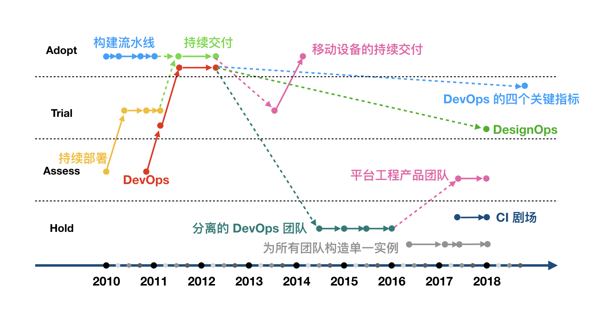

> 本文原文发表于 2019 年 4 月 16 日的 [ThoughtWorks 洞见](https://insights.thoughtworks.cn/devops-and-continuous-delivery/)，后经过修改发表到博客上。

2009 年底，比利时根特举办了第一届 DevOpsDays。ThoughtWorks 的咨询师[Chris-Read](https://blog.chris-read.net/) 作为嘉宾之一，代表 ThoughtWorks 出席了这次活动并带来名为 “[持续集成，流水线和部署](https://www.slideshare.net/ChristopherRead/continuous-integration-build-pipelines-and-continuous-deployment)”的演讲。ThoughtWorks 作为 DevOps 运动最早的见证者和奠基人，并没有意识到这个周末聚会将在接下来 10 年给全球 IT 行业带来的深远影响。

1 个月后，ThoughtWorks 发布了第一期的技术雷达。作为一个新兴的名词，DevOps 还没有成熟到让令人瞩目的阶段。然而，即便 DevOps 还没有被纳入技术雷达，但与之相关的早期实践和工具都已出现。在接下来的十年中，DevOps 已经成为每期技术雷达不可或缺的一部分。从这个角度上说，技术雷达就是 DevOps 发展的见证者。

DevOps 和技术雷达都将迎来自己的不愁之年。作为 IT 行业技术的先行指标，技术雷达上面的技术平均领先行业 3 至 5 年。也就是说，出现在技术雷达 采纳和 试用区域的技术，在 3 - 5 年后大概率将成为业界主流。

作为 DevOps 和技术雷达的粉丝，我想从技术雷达的角度总结 DevOps 的发展历程。该系列文章共分为三篇，分别是：

* DevOps 和持续交付
* 基础设施即代码和云计算
* 容器技术和微服务

本文为“DevOps 和技术雷达的十年”系列文章第一篇：DevOps 和 持续交付。

## DevOps

虽然持续集成、构建流水线和持续部署从技术雷达创刊号就存在。但 DevOps 作为一个正式条目进入技术雷达的评估象限是在 2010 年 8月的第三期技术雷达。那时，对 DevOps 的描述是这样的：

> DevOps 是一个新的运动，在寻找可以满足业务需要的快速交付的软件和稳定的生产环境。它拥有两个目标：首先， 让开发和运维的合作更加紧密。其次，在运维流程中应用敏捷实践（协作，自动化，简单化）来处理初始化虚拟机，变更管理和生产环境监控。它包含文化、流程和工具，全部用于支持更好的沟通，快速的交付和反馈以及可预测的产出上。

半年后，DevOps 运动所引发的影响越来越大。2011 年 1 月，DevOps 作为条目进入了 “试用” 区域。这意味着至少 ThoughtWorks 内部已经全然接受 DevOps 。在这一期的技术雷达中，对 DevOps 的描述做了一些调整：

> DevOps 运动持续让人们关注经常断裂的开发和运维关系。DevOps 提升了开发和运维的合作以及共同的责任。DevOps 在运维过程中应用敏捷实践, 初始化虚拟机，变更管理和生产环境监控并为开发阶段引入了近似生产环境的思维，工具和环境。DevOps 是对一个想对应用发布到生产环境实施持续交付的关键基础。

就像本文开头说的，作为 IT 技术的先行指标，出现在技术雷达上的技术条目成为业界主流平均领先行业 3 至 5 年。2011年 6月，DevOps 正式进入技术雷达的采纳象限，这就意味着 DevOps 最晚在未来的 5 年中会成为业界的主流。

2012年 3 月，技术雷达彻底更新了之前对 DevOps 的描述：

> 改进开发和 IT 运营的交互和关系让有效的交付生产系统更加稳定和可维护。创建一个 DevOps 文化需要关注团队组织，工作实践，汇报线和激励机制。它会带来对更加快速和安全的交付的共同责任。我们推荐采用 DevOps 是因为是看不到任何无法带来正面收益的情况。

这也就是说，在2012年，全球的 ThoughtWorker 们就已经认为在未来 DevOps **一定** 会带来益处。而 5 年后的 2017 年，北京才举办第一届 DevOpsDays ，标志了 DevOps 在中国发展的元年。

最初，社区想让 IT 运维敏捷化，但 DevOps 走出了另外一条路。

## 持续交付

我个人一直觉得，如果持续交付在 2009 年 Velocity 大会上出现， DevOps 很有可能不会出现。

当 Jez Humble 于 2010 年第一次在 DevOpsDays 介绍持续交付的概念之后，持续交付就成为了 DevOps 的核心实践，直到现在。然而，持续交付在一年后才进入技术雷达，且第一次出现在技术雷达上的时候就直接落入了“采纳”环，技术雷达是这么描述持续交付的：

> 如果你想知道 "敏捷之后会发生什么", 你应该关注持续交付。虽然您的开发流程可能已完全优化, 但您的组织可能需要数周或数月才能将单个更改转化为生产。持续交付的重点是最大限度地实现自动化, 包括作为代码的基础架构、环境管理和部署自动化, 以确保您的系统始终为生产做好准备。它是关于收紧你的反馈循环, 而不是推迟任何东西, 直到结束。持续交付与持续部署不同, 这意味着将每个更改部署到生产环境。连续持续交付不是牛仔表演。它让您对生产环境负责。企业可以选择部署的内容和时间。如果你认为自己已经确定了敏捷开发的目标, 但没有考虑如何实现持续交付, 你真的还没有开始。

虽然 DevOps 比持续交付提前半年进入了技术雷达，但持续交付这一理念的各个组成部分早在技术雷达的创刊之前就存在了。

在2010 年 1月的技术雷达创刊号上，“构建流水线”（Build Pipeline）的概念就已经处于技术雷达的“采纳”环内。在持续交付出现之前，构建流水线已经连续 4 期稳坐在技术雷达的“采纳”环内。我们现在可以把构建流水线看做是“持续集成”的一种扩展实践，当时它已经被广泛的运用到了各种开发项目上。

与此同时，“持续部署”（Continuous Deployement）作为“软件交付最后一公里”的实践，由于风险始终处于“评估”和“试用” 阶段。直到和持续交付同时出现在技术雷达上。彼时，构建流水线、持续部署和持续交付是三个不同的实践。你可以简单的认为“构建流水线 + 持续部署 = 持续交付”，然而，持续交付所涉及的内容却不止涵盖技术层面。《持续交付》一书的作者 Jez Humble 在其博客[“持续交付 vs 持续部署”](https://continuousdelivery.com/2010/08/continuous-delivery-vs-continuous-deployment/) 中详细介绍了其中的区别：

> 首先，严格来说，部署并不暗示发布，你可以持续的部署到 UAT 环境。让持续部署变得特别的是把每一个改动都通过自动化测试（或者简短的QA门禁）部署到生产环境。持续不是发布每一个良好构建给用户。这么说来，更准确的叫法应该是“持续发布”。
> 其次，持续交付是关于把发布计划交给业务，并不是交给 IT 来决策。实现持续交付意味着确定你的软件在整个生命周期内都是可以部署到生产环境上的。任何一个构建都有机会通过自动化的过程被发布给用户。
> 但是，这并不是说都把每次成功的构建交付给用户是一个好主意。特别是，有些嵌入式产品包括了软件和硬件的变更。在这些情况下，少次变更的感受可能会更好。关键在于，这些发布都是**业务驱动**的。

2011 年 6 月份的技术雷达中，持续交付和 DevOps 同时出现在了 的“采纳”象限。严格的说，DevOps 并不是一项技术、也不是一种实践，它是围绕着一个理念的运动。由于 DevOps 缺乏官方的定义，所以 DevOps 可以包含很多内容。但持续交付不同，持续交付通过《持续交付》这本书传播了一套完整和系统的方法论。这套系统的方法论和 DevOps 的理念不谋而合，因此，在 DevOps 社区内被广泛应用。直至今日，持续交付与否仍然是一个组织是否具备 DevOps 能力的一项关键能力。

换句话说，**持续交付可以没有 DevOps，但 DevOps 不能没有持续交付。**

技术雷达判断的没错，《持续交付》不光影响了 DevOps ，也影响了其他软件领域。随着持续交付的盛行，特别是流水线的概念深入人心，在不同领域诞生了不同的持续交付技术。例如：[基础设施流水线](https://www.thoughtworks.com/radar/techniques/pipelines-for-infrastructure-as-code)，[镜像构建流水线](https://www.thoughtworks.com/radar/techniques/machine-image-pipelines)，[移动设备的持续交付](https://www.thoughtworks.com/radar/techniques/continuous-delivery-for-mobile-devices)

## 持续交付和 DevOps 中的反模式

由于 DevOps 缺乏一个官方标准或者规范，因此对 DevOps 的理解和实践就会有所偏颇。在知道什么是“好的实践”的过程中，我们也需要知道那些“不好的实践”，例如[CI 剧场（CI Theatre）](https://www.thoughtworks.com/radar/techniques/ci-theatre)：

>长期以来, 我们一直倡导持续集成 (CI), 我们是构建 CI 服务器程序 以自动构建签入项目的先驱。使用得当的情况下, 这些程序作为开发人员每天承诺的共享项目主线上的守护进程运行。Ci 服务器构建项目并运行全面测试, 以确保整个软件系统集成并处于始终可发布的状态, 从而满足持续交付的原则。遗憾的是, 许多开发人员只是设置了一个 CI 服务器, 错误地认为他们正在 "做 CI", 而实际上他们错过了所有的好处。
>
>常见的故障模式包括: 对共享主干运行 CI, 但很少提交。 因此集成并不是真正连续的;运行测试覆盖率较差的生成;允许构建长时间保持红色却不修复; 或对特征分支运行 CI, 从而导致连续隔离。随后的 "CI 剧场" 可能会让人感觉很好, 但却会让任何可信的 CI 失败。

此外，很多人在理解持续集成（CI） 的时候，就仅仅以为是安装一个 CI 软件（例如 Jenkins ），然后在上面打包（运行自动化构建）。而忽视了整个 CI 的九项关键原则：

1. 维护单一代码库
2. 自动化构建
3. 让构建可以自测试
4. 所有提交都要在一台持续集成机器上进行构建
5. 让构建保持快速
6. 在类生产环境上进行测试
7. 让任何人都可以轻松的取得最新的可执行版本
8. 每个人都可以看到发生了什么事情
9. 自动化部署

关于如何正确的做持续集成，可以参考[ThoughtWorks 官方的持续集成介绍](https://www.thoughtworks.com/continuous-integration)，进一步了解详情可以查看 [Martin Fowler 的原文](https://martinfowler.com/articles/continuousIntegration.html)。

此外，随着持续集成这项实践被广泛采纳。大型的项目也开始迁移到持续集成服务器上，就会导致 “[为所有团队构造单一 CI 实例](https://www.thoughtworks.com/radar/techniques/a-single-ci-instance-for-all-teams)”：

>我们不得不再次告诫, 不要为所有团队创建一个 CI 实例。虽然在理论上整合和集中持续集成 (CI) 基础结构是一个不错的主意, 但实际上, 我们在这个空间的工具和产品中没有看到足够的成熟度来实现所需的结果。软件交付团队必须定期使用集中式 CI 产品, 这些团队会根据中央团队执行次要配置任务或解决共享基础结构和工具中的问题而长时间的延迟。在这一阶段, 我们继续建议各组织将其集中投资限于建立模式、准则和支持交付团队运行自己的 CI 基础设施。

然而，随着 CI 不断膨胀使得 CI 管理员不得不拆分流水线和自动化测试，以便使得大型、缓慢的自动化测试能够独立运行。一个代码库被拆成多个代码库。一条流水线被拆成多条流水线。既然能够独立测试、必然能够独立部署。于是，慢慢的也就产生了微服务的概念。关于微服务，我们将在《从技术雷达看DevOps 的十年——Docker和微服务》。

下面是持续交付和 DevOps 相关条目的发展历程一览图。实线为同一条目的变化，虚线为影响的相关条目：

DevOps 和持续交付的理念在10年中不断发酵，影响了之后工具和技术的发展，技术雷达捕捉到了这些全球的趋势。让我们从最早开始改变的数据中心和云计算看看 DevOps 带来的影响。

敬请期待第二篇《从技术雷达看DevOps 的十年——基础设施即代码和云计算》

相关条目：[持续交付](https://www.thoughtworks.com/radar/techniques/continuous-delivery-cd)，[构建流水线](https://www.thoughtworks.com/radar/techniques/build-pipelines)，[持续部署](https://www.thoughtworks.com/radar/techniques/continuous-deployment)，[基础设施流水线](https://www.thoughtworks.com/radar/techniques/pipelines-for-infrastructure-as-code)，[镜像构建流水线](https://www.thoughtworks.com/radar/techniques/machine-image-pipelines)，[移动设备的持续交付](https://www.thoughtworks.com/radar/techniques/continuous-delivery-for-mobile-devices)，[Spinnaker](https://www.thoughtworks.com/radar/tools/spinnaker)。
