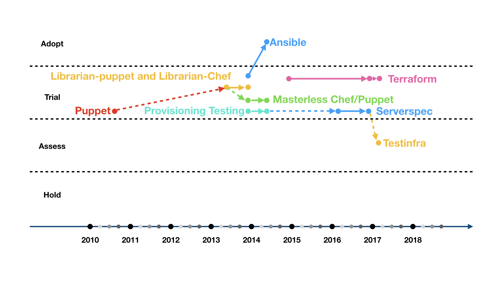
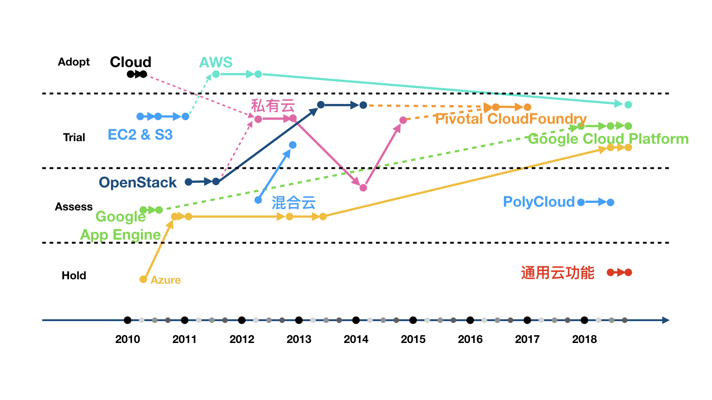

> 本文原文发表于 2019 年 5 月 21 日的 [ThoughtWorks 洞见](https://insights.thoughtworks.cn/infrastructure-as-code-and-cloud-computing/)，后经过修改发表到博客上。

在上一篇文章中，我们讲到了DevOps 和持续交付的关系。本篇将回顾最先改变运维工作的相关技术 —— 基础设施即代码和云计算，通过技术雷达上相关条目的变动来跟踪其趋势变化。

## 基础设施即代码

和持续交付一样，基础设施即代码（Infrastructure as code）这项技术第一次在技术雷达出现就被纳入到了“采纳”环。

十年前，云计算的普及程度远不如当今。很多企业开始采用虚拟化技术（严格的说，那时候还不能称作是云）来解决资源不足和设备异构的问题。简单的说，你可以接虚拟化技术是在异构的设备上构建了一个通用适配层。使得各种不同的应用程序和设备能够通过通用的操作进行统一的管理，那时候面临这样问题多是通信、银行、政府、石油等关键领域。即便 IBM，Oracle，EMC 微软等都有“整体解决方案”，但为了避免供应商绑定风险，政府还是希望能够“混搭”：通过做大蛋糕来降低风险。当然，这种做法也降低了效率。然而当虚拟化技术解决了异构问题之后，基础设施资源被抽象为网络、计算、存储三类资源。由于业务的异构性，企业级领域迟迟没有解决方案。毕竟为了让虚拟化的资源能够尽快产出价值，往虚拟资源的迁移工作相关的集成工作占据了工作主要内容。

于是运维工程师和网络工程师慢慢远离机房，和系统工程师以及数据库工程师坐在了一起，共同成为了“脚本工程师”。

此时，Linux 开始通过 Xen 和 KVM 侵蚀传统 UNIX 厂商的市场份额。SCO，AIX 和 HP-UX 这些过去按卖 License 获得售后服务的方式毕竟太贵了。可以说，借由 Linux 虚拟化技术的云计算技术给商业 UNIX 来了一记补刀，如今你很少能看到这些商业 UNIX 了。

虚拟化技术把所有的空闲资源收集到了一起，这些资源完全可以在不增加基础设施设备投入的情况下运行更多的应用程序。拟化技术还可以通过整合小型设备，得到和大型设备一样的表现。

但是，如果你通过虚拟化节约出来的空闲资源你使用不了，但是还要收取电费，这就是很大的浪费。于是有些人则想到了把这些空闲的资源租出去，变成一个单独的业务。这就是另外一个故事了，我们稍后会提到。

随着 VMware，Oracle，Cisco，IBM 推出了各自的解决方案，“脚本工程师”们开始考虑如何管理大量的空闲资源。随着敏捷软件开发逐渐成为主流，基础设施的变更效率显然满足不了敏捷的迭代速度。基础设施的变更带来的风险和周期远远大于应用。如何让基础设施敏捷起来，成为了敏捷软件开发在交付最后一公里需要迫切解决的问题。

这时候，由于规模和复杂度都很大，脚本工程师们考虑的第一个问题就是：如果规模没办法改变，我们就降低复杂度吧。

### Puppet 和 Chef 的短暂辉煌

Puppet 是第一个嗅到这个商机的工具，它在第2010年8月的技术雷达上出现在了“试验”环里。

Ruby 很适合构建领域特定语言（DSL），继 Cucumber 在这方面的成功探索后，脚本工程师们希望通过 DSL 缩小 Dev 和 Ops 之间的差距。作为同一时期的竞争者，Chef 以对开发人员更加友好的方式出现。Chef 相比 Puppet 更有竞争力的一点就是对于 Windows 的支持。

不过，由于缺乏最佳实践，Puppet 和 Chef 很快就被玩坏了，复杂性的治理难度超过预期。随着治理规模的扩大，Puppet 和 Chef 带来的负面效应逐渐显现。曾经有人这样讽刺 Puppet：

> Puppet 就像蟑螂。当你刚开始用了 Puppet，慢慢的你会发现你的代码库里到处都是 Puppet。

此外，事实证明 Ruby 是一个便于开发，但是难于维护的语言。Ruby 及其社区的频繁发布和不兼容特性使得后期接手维护的脚本工程师们叫苦不迭，加之 Ruby 工程师的招聘成本和培训成本都更高。即便 Ruby 的 Puppet 和 Chef 工具学习曲线比较平缓，但遗留的基础设施即代码的学习曲线却非常陡峭。基础设施的变更风险很大，且缺乏必要的质量实践，特别是主从模式的中心化还带来了单点故障和复杂度，这些都使得基础设施代码越来越难以维护。

在敏捷团队中，去中心化、自治的团队往往是被提倡的。于是 Puppet 推出了 standalone 模式，Chef 出现了 chef-solo 这样去中心化的特性。技术雷达很快就出现了与之相对的[Librarian-puppet and Librarian-Chef](https://www.thoughtworks.com/radar/tools/librarian-puppet-and-librarian-chef) 和 [Masterless Chef/Puppet](https://www.thoughtworks.com/radar/techniques/masterless-chef-puppet)这样去中心化的实践。

于是，大家把聚光灯从 Ruby 转向了 Python。从中心化转向了去中心化。然而，当“[无状态服务器](https://www.thoughtworks.com/radar/tools/immutable-servers)” 出现在2012 年 10月的技术雷达的“采纳”区域时，新的基础设施即代码管理思想也应运而生。

### 从菜谱（Cookbook）到剧本（Playbook）—— Ansible

在 Puppet 和 Chef 的最佳实践并没有创造出新的市场份额，而是给它们创造了一个新对手——Ansible。Ansible 在 2014 年 1 月首次出现在了技术雷达的 “试验” 区域，短短半年后就在 2014年 7月的技术雷达中出现在了 “采纳” 区域。

Ansible 采用了 Python + Yaml 这种 Python 社区常见的组合。用 Yaml 作为 Playbook 的格式来存储虚拟机的配置。通过把虚拟机抽象成状态机，在 Playbook 中版本化保存状态的方式使得基础设施即代码的“状态”和“状态变更”的分离更加彻底，大大减少了代码量和编程量。甚至坊间有人笑称 Ansible 把运维工程师从脚本工程师变成了配置管理工程师，基础设施即代码变成了基础设施即配置。

### 面向云计算的基础设施即代码

基础设施即代码的技术最早不是为云计算设计的。但随着云计算的广泛应用，脚本工程师对于“看不见的机房”的管理就只剩下编程了。然而，面向于传统机房和 IaaS 的基础设施即代码技术在PaaS 盛行的今天却有点捉襟见肘，云平台自己的 CLI 工具是为管理员设计的，而不是为开发者设计的。此外，尽管 Puppet，Chef 和 Ansible 各自都增添了对云计算更友好的功能，但本质上是面向虚拟机而非云计算平台设计的。对云计算平台的操作仍然需要通过构建一个 Agent 的方式处理。

这些诉求推动了面向云平台的技术设施即代码工具的出现。最先为大众所熟知的就是 Terraform。

“Hashi 出品，必属精品”，HashiCrop 就像 DevOps 界的暴雪娱乐。在云计算和 DevOps 的领域里，HashiCrop的每一款产品都进入了技术雷达，并引领了接下来几年 DevOps 技术的发展。

在虚拟化技术刚刚成熟的时候，HashiCrop 就推出了 Vagrant。Vagrant 于 2011 年 1 月出现在技术雷达的 “评估” 区域，2012 年进入了 “试验” 区域。

随之在技术雷达上就出现了对[开发工作站的基础设施自动化](https://www.thoughtworks.com/radar/techniques/infrastructure-automation-of-development-workstations)的实践。随着 Packer 在 2014 年 6 月 进入技术雷达“采纳”区域的同时，[镜像构建流水线](https://www.thoughtworks.com/radar/techniques/machine-image-pipelines)也出现在了技术雷达上。

Vagrant 和 Packer 这样的组合深深影响了 Docker，这个我们后面再说。我们还是回过头来说说 Terraform。2015 年，Terraform 出现在了技术雷达的 “评估” 区域上。技术雷达是这么描述的：

> 使用 terraform, 可以通过编写声明性定义来管理云基础架构。由 terraform 实例化的服务器的配置通常留给 Puppet, Chef 或 Ansible 等工具。我们喜欢 terraform, 因为它的文件的语法可读性比较高, 它支持多个云提供商, 同时不试图在这些提供商之间提供人为的抽象。在这个阶段, terraform 是新的, 并不是所有的东西都得到了实施。我们还发现它的状态管理是脆弱的, 往往需要尴尬的体力工作来解决。

虽然 Terraform 有一些问题，但瑕不掩瑜。HashiCrop 改进了 Terraform。一年之后，在 2016 年 11 月的技术雷达中，Terraform 进入了 “试验” 区域。这些改进也被技术雷达敏锐的捕捉到：

> 在我们近两年前首次更谨慎地提到 terraform 之后, 它得到了持续的发展, 并已发展成为一个稳定的产品, 已经证明了它在我们项目中的价值。现在, 通过使用 terraform 所说的 “远程状态后端”, 可以回避状态文件管理的问题。

为了避免重蹈 Puppet 和 Chef 被玩坏的覆辙，Terraform 总结了最佳实践并发布了 [Terraform: Up and Running](https://www.oreilly.com/library/view/terraform-up-and/9781491977071/) 一书。随之推出了与之对应的工具[Terragrunt](https://www.thoughtworks.com/radar/tools/terragrunt)，Terragrunt 于 2018 年 11 月出现在了技术雷达，它包含了之前介绍过的“基础设施流水线”的思想。

### 基础设施即代码的自动化测试

可测试性和自动化测试永远是技术雷达不可缺少的话题，基础设施即代码也是一样。在提出基础设施的可测试性诉求后，[Provisioning Testing应运而生](https://www.thoughtworks.com/radar/techniques/provisioning-testing)，它的目的在于对服务器初始化正确性的验证，被纳入到了 2014 年 1 月技术雷达的 “试验” 区域。Puppet 和 Chef 分别有了 rspec-puppet 和 kitchen 作为各自的测试框架来支持这种实践。

但当基础设施即代码采用不止一种工具的时候，采用各自的测试套件就比较困难了。因此，寻找与基础设施即代码无关的测试工具就非常必要，毕竟 Chef，Puppet 和 Ansible 都只是一种实现方式，而不是结果。

采用 Ruby 编写的 [Serverspec](https://www.thoughtworks.com/radar/tools/serverspec) 出现在了 2016 年 11 月技术雷达的 “试验” 区域。半年后，采用 Python 写的[Testinfra](https://www.thoughtworks.com/radar/tools/testinfra) 也出现在了 2017 年 6 月技术雷达的 “试验” 区域。它们都可以通过工具无关的描述方式来验证基础设施的正确性。

有了自动化测试工具，我们就可以采用 TDD 的方式开发基础设施。先用代码来描述服务器的规格，然后通过本地或远程的方式进行验证。此外，这样的自动化测试可以被当做一种监控，集成在流水线中定时运行。

下面是基础设施即代码相关条目的发展历程一览图。实线为同一条目变动，虚线为相关不同条目变动：

相关条目：[Puppet](https://www.thoughtworks.com/radar/tools/puppet)，[Librarian-puppet and Librarian-Chef](https://www.thoughtworks.com/radar/tools/librarian-puppet-and-librarian-chef)，[Masterless Chef/Puppet](https://www.thoughtworks.com/radar/techniques/masterless-chef-puppet)，[Provisioning Testing](https://www.thoughtworks.com/radar/techniques/provisioning-testing)，[Testinfra](https://www.thoughtworks.com/radar/tools/testinfra)，[Serverspec](https://www.thoughtworks.com/radar/tools/serverspec)，[Terraform](https://www.thoughtworks.com/radar/tools/terraform)，[Terragrunt](https://www.thoughtworks.com/radar/tools/terragrunt)。

## 揭开云计算的大幕

咱们接着说“有人想把虚拟化后的空闲资源变成一个独立的业务”这件事。彼时，网格计算和云计算的口水战愈演愈烈，大家似乎没有看出来IDC（Internet Data Center）机房里托管虚拟机和云计算之间太多的差别，云计算听起来只是一个营销上的噱头。

2010 年第一期的技术雷达上，云计算就处在了 “采纳” 区域，技术雷达是这么描述云计算的：

> Google Cloud Platform Amazon EC2 和 salesforce. com 都声称自己是云提供商, 但他们的每个产品都有所不同。云适用于服务产品的广泛分类, 分为基础架构即服务 (例如 Amazon EC2 和 Rackspace)、平台即服务 (如Google App Engine) 和软件即服务 (如 salesforce. com)。在某些情况下, 提供商可能跨越多个服务类别, 进一步稀释云作为标签。无论如何, 云中基础设施、平台和软件的价值是毋庸置疑的, 尽管许多产品在路上遇到了坎坷, 但他们肯定已经赢得了自己在雷达上的地位。

那时的 IaaS、PaaS 和 SaaS 都可以被称之为云计算，只不过每个供应商的能力不同。而它们的共同点都是通过 API 提供服务。

到了2010年4月的第二期技术雷达，技术雷达则把 SaaS 看作是云计算的最高级成熟度。而 IaaS 和 PaaS 是不同阶段的成熟度。并把原先的云计算拆分成了三个条目：EC2&S3 （来自 AWS），Google Cloud Platform，Azure。并且分别放在 “试验”、“评估”、“暂缓” 象限。也就是说，在 2010年，ThoughtWorks 一定会用 AWS，有些情况下会考虑 GCP，基本不会考虑使用 Azure。

而公有云计算供应商的三国演义就此展开。

### AWS 一马当先

多年以来 AWS 上的服务一直引领者云计算的发展，成为众多云计算供应商的效仿对象，也成为了多数企业云计算供应商的首选。虽然 AWS 正式出现在技术雷达是在 2011 年 7 月，然而 EC2 & S3 的组合在第二期就出现在技术雷达的 “试验” 区域了。在 Docker 出现的第二年，AWS 就出现了托管的弹性容器服务 ECS (Elastic Container Service)，也是第一家在云计算平台上集成 Docker 的供应商。为了解决大量不同品牌移动设备测试的问题推出了 AWS Device Farm，使得可以通过在线的方式模拟数千种移动设备。在微服务架构流行的年代，不光推出了第二代容器基础设施 AWS Fargate 和 7层负载均衡 Application LoadBalancer。更是先声夺人，率先提供了基于 Lambda 的函数即服务（Function As A Service）无服务器（Serverless）计算架构，使得开发和部署应用变得更加灵活、稳定和高效。

然而，随着成熟的云平台的选择增多。AWS 不再是默认的选择，在2018 年 11 月的技术雷达中， AWS 从 “采纳” 落到了第 “试验” 区域。但这并不是说明 AWS 不行了，而是其他的公有云供应商的技术能力在不断追赶中提升了。这就意味从 2018 年开始， AWS 并不一定是最佳选择。Google Cloud Platform 和 Azure 可能会根据场景不同，成为不同场景的首选。

### GCP 紧随其后

开发人员最不想面对的就是基础设施的细节。它们希望应用程序经过简单的配置可以直接在互联网上运行。而无需关注网络、操作系统、虚拟机等实现细节——这些细节对开发者应该是透明的。

Google App Engine 最早就以云计算的概念出现在技术雷达上的 “评估” 象限，存在了两期后便消失不见。在那个时代，人们对于无法控制基础设施细节的云计算平台还是心存怀疑。更重要的是，按照新的编程模型修改现有应用架构的成本远远大于基于 IaaS 平台的平行移动成本。前者需要重构整个应用，后者几乎可以无缝对接。

然而，新时代的容器技术和 SaaS 应用让 Google 笑到了最后。基于 Kubernetes 的容器编排技术几乎成为了行业标准。Google Cloud Platform 适时推出了自己的 Kubernetes 平台服务GKE – Google Kubernetes Engine，使得 Google Cloud Platform 重回技术雷达的视野，在 2017 年 11 月的技术雷达，Google Cloud Platform 进入了 “尝试” 象限。技术雷达是这么描述的：

> 随着GOOGLE CLOUD PLATFORM(GCP)在可用地理区域和服务成熟度方面的扩展，全球的客户在规划云技术策略时可以认真考虑这个平台了。与其主要竞争对手Amazon Web Services相比，在某些领域， GCP 所具备的功能已经能与之相媲美。而在其他领域又不失特色——尤其是在可访问的机器学习平台、数据工程工具和可行的 “Kubernetes 即服务解决方案”(GKE)这些方面。在实践中，我们的团队对GCP工具和API良好的开发者体验也赞赏有嘉。

即便 AWS 也推出了对应的 Kubernetes 服务 EKS (Amazon Elastic Container Service for Kubernetes，别问我为什么不是 ECSK，官方网站上就这么写的)，但也无法撼动其领先位置。随着更多的企业已经接受容器化技术，并通过 Kubernetes 在私有云中进行编排以实现 DevOps。通过 GKE 实现云迁移成本降低了很多。

### Azure 后来居上

Azure 在 2010 年的第二期技术雷达被放到了”暂缓”区域。意思就是在考虑云计算平台的时候，就不要考虑用 Azure 了。尽管如此，Azure并没有因为被边缘化就逡巡不前。经过了 7 年， Azure 伴随着一系列激动人心的新产品重回人们的视野。然而，从 2017 年底开始，Azure 的服务开始进入技术雷达的 “评估” 区域。首先进入技术雷达的是 Azure Service Fabric：

> AZURE SERVICE FABRIC是为微服务和容器打造的分布式系统平台。它不仅可以与诸如Kubernetes之类的容器编排工具相媲美，还可以支持老式的服务。它的使用方式花样繁多，既可以支持用指定编程语言编写的简单服务，也可以支持 Docker 容器，还可以支持基于 SDK 开发的各种服务。自几年之前发布以来，它不断增加更多功能，包括提供对Linux 容器的支持。尽管 Kubernetes 已成为容器编排工具的主角，但 Service Fabric 可以作为 .NET 应用程序的首选。

而后到了 2018 年，Azure 的后发优势不断在技术雷达中涌现出来，除了 Azure 进入了 “试验” 以外，就是 Azure Stack 和 Azure DevOps 两个产品了。技术雷达在 2018 年 5月是这么描述 Azure Stack 的：

> 通过 AZURE STACK，微软在全功能的公有云和简单的本地虚拟化之间提供了一个有意思的产品:一个运行Microsoft Azure Global云的精简版本软件。该软件可以安装在诸如惠普和联想这样的预配置通用商品硬件上，从而让企业在本地获得核心的 Azure 体验。默认情况下，Microsoft 和硬件供应商所提供的技术支持是彼此分离的(他们承诺要相互合作)，但系统集成商也能提供完整的 Azure Stack 解决方案。

在我看来，Azure Stack 就是云时代的 Windows。相较于以前硬件厂商受制于 Windows 的各种设备而言，未来的虚拟设备厂商也会受制于 Azure Stack。这时候 Azure Stack 不单单是一套私有云了，它更是未来硬件厂商的渠道。虽然在私有云领域中有很多的选择，但在使用体验上，微软的产品正在超过其他竞争者。

另外一个强烈推荐的服务就是 Azure DevOps。DevOps 运动发展以来，不断有公司在开发 DevOps 平台这样的产品，希望能够通过产品巩固自己在 DevOps 领域的话语权。也有很多做 DevOps 的企业通过集成不同的工具来构建自己的 DevOps 平台。目的是将计算资源和开发流程采用工具整合起来，形成一套由工具构建的工作流程和制度。并采用逆康威定律——用系统结构反向改变组织结构，从而达到 DevOps 技术和管理的双转型。

但很少有产品能够跨越足够长的流程来做到管理，这也导致了 DevOps 平台由于范围的限制引起的不充分的转型。而Azure DevOps 提供了完整的产品端到端解决方案，Azure DevOps 的前身是微软 VSTS，也有基于企业的 TFS 产品可供选择。它涵盖了产品管理，任务看板，持续交付流水线等服务，这些服务也同时可以和 Azure 其他服务有机结合。并且可以和 Visual Studio 完美集成。真正解决从需求编写到上线发布中间每一个活动的管理。你还可以构建仪表盘，用各个活动中的数据来自动化度量 DevOps 的效果。

### 私有云——从 IaaS，PaaS 到 CaaS

公有云和私有云似乎是在两个世界。很久以来，私有云算不算”云”也存在争议。甚至有人把私有云称之为”企业虚拟化 2.0″。但直到多个公有云上的实践和工具同时能够兼容企业的私有虚拟化平台，私有云的概念才真正建立起来。这就是为什么私有云在技术雷达上出现的时间要比 OpenStack 这样的虚拟化工具更晚。OpenStack 在 2010 年第二期技术雷达就出现了，而私有云要到 2 年后，也就是 2012 年，才出现在技术雷达上。

OpenStack是由NASA（美国国家航空航天局）和Rackspace合作研发并发起的，以Apache许可证授权的自由软件和开放源代码项目。OpenStack是一个开源的云计算管理平台项目，由几个主要的组件组合起来完成具体工作。OpenStack支持几乎所有类型的云环境，项目目标是提供实施简单、可大规模扩展、丰富、标准统一的云计算管理平台。OpenStack通过各种互补的服务提供了基础设施即服务（IaaS）的解决方案，每个服务提供API以进行集成。

虽然 OpenStack 出现在技术雷达上比较早，但直到2013年5月，也就是 3年后，才进入到 “试验” 区域。即便有很多企业用于生产环境，技术雷达的编写者仍然很慎重的选择这样的开源产品。毕竟，可能造成的影响越大，就越要小心。

在众多大型厂商的私有云和虚拟化平台中，OpenStack 因为其开源的免费，并且有 NASA 和 Rackspace 做背书。成为了很多企业构建私有云的首选。然而，构建一套基于 OpenStack 的 IaaS 基础设施到真正能够帮助开发人员提升效率是需要花费很大成本的。随着 OpenStack 的影响力不断扩大，用户需要的技术支持服务也慢慢成为了一个新兴的市场。甚至于有企业将基于 OpenStack 开发自己的私有云产品以提供对外服务。

然而，彼时的 OpenStack 在开发者体验上并没有什么优势。不过由于 OpenStack 是基于 Python 开发的，OpenStack 的流行可以说是促进了 Python 的大规模推广。( Python 的第二次大规模推广是大数据和人工智能，如果想问的话。)这使得一批基于 DevOps 理念的 PaaS 平台崛起，最先为人所知首当其冲的就是 Pivotal 的 CloudFoundry。由于 Pivotal 是一个商业组织，他更关心客户的痛点，为此构建了很多解决方案。甚至将 CloudFoundry 自身部署在 OpenStack 上，使得 OpenStack 看起来不是那么的难用。

> 自2012年我们上次提及 CloudFoundry 以来, PaaS 空间发生了许多变化。虽然开源核心有各种分布, 但作为 Pivotal Cloud Foundry公司组装的产品和生态系统给我们留下了深刻的印象。虽然我们期望非结构化方法 (Docker、Mesos、Kubernetes 等) 与 Cloud Foundry 和其他公司提供的结构更结构化、更固执己见的构建包样式之间继续保持趋同, 但我们认为, 对于愿意这样做的组织来说, 我们看到了真正的好处。接受采用 PaaS 的约束和演化速度。特别令人感兴趣的是开发团队和平台操作之间交互的简化和标准化所带来的开发速度。

不过，正在 IaaS 和 PaaS 正在讨论谁更适合做 SaaS 平台的时候。Docker 的出现成为了云计算市场和 DevOps 领域的另一个标志性事件。使得无论是公有云产品还是私有云产品，IaaS 产品还是 PaaS 产品。都不约而同的开始了对 Docker 的支持。并且有人认为 Docker 会是云计算的下一个里程碑和战场。正如上文介绍的那样，AWS 推出了 ECS，Google 推出了 GKS，Azure 也推出了自己的容器服务。同时也有不少的创业公司提出了 “容器即服务”(Container as a Service)的概念，企图从云计算市场上分得一杯羹。关于 Docker 和容器平台，我们会放在下一篇详细讲。

### 混合云（HybirdCloud）

和私有云同时出现在了 2012 年 4 月的技术雷达上，但是是在 “评估” 区域。彼时，混合云只是为了在资源不足时对私有云进行临时扩展：

> 混合云描述了一组结合公共云和私有数据中心的最佳功能的模式。它们允许应用程序在正常时段在私有数据中心运行, 然后在公有云中使用租用的空间, 以便在交通高峰期实现溢出容量。以敏捷的方式组合公共云和私有云的另一种方法是使用公共云的弹性和可塑性来开发和了解应用程序的生产特征, 然后将其移动到私有数据中的永久基础结构中中心时, 它是稳定的。

在体会了公有云”真香”之后，大多数企业都回不去了。然而，种种限制还是阻碍了企业从私有云向公有云迁移的进度。不过，这种情况下促生了混合云的生意。不光公有云供应商提供了自己的服务，很多创业公司也加入进来。于是技术雷达在半年后更新了混合云：

> 混合云结合了公有云和私有数据中心的最佳功能。它们允许应用程序在正常时段在私人数据中心运行, 然后在公共云中使用租用的空间, 以便在交通高峰期实现溢出容量。现在有许多基础架构解决方案允许跨混合云 (如 Palette 和 Rrightscale) 进行自动和一致的部署。借助来自亚马逊、Rackspace 和其他公司的强大产品, 我们正在将混合云转移到此版本的雷达上的 ““尝试”” 区域。

从另外一个角度说，公有云的技术发展速度和成本是远高于私有云的。这也是集中化投资的优势，减少研发和协调上的浪费。当企业开始结合公有云和私有云之后，就会慢慢发现公有云带来的成本和技术优势。私有云和数据中心就会被公有云逐渐取代。

### 多云（PolyCloud）共用时代

多云不同于混合云，混合云指的是私有云和公有云之间的混合使用。多云指的是不同的公有云供应商之间的混合使用。在三大公有云供应商共同相聚在 2018 年 11 月的 “试验” 之前。多云的趋势就在 1 年之前进入了技术雷达的 “评估” 区域：

> 主要的云提供商 (亚马逊、微软和谷歌) 陷入了一场激烈的竞争, 以保持核心功能的平价, 而他们的产品只受到轻微的区分。这导致少数组织采用 Polycloud 战略, 而不是与一个提供商 “All-in”, 而是以最佳的方式将不同类型的工作负载传递给不同的提供商。例如, 这可能涉及将标准服务放在 AWS 上, 但使用 Google 进行机器学习, 将 Azure 用于使用 SQLServer 的. net 应用程序, 或者可能使用 Ethereum 联盟区块链解决方案。这不同于以供应商之间的可移植性为目标的云无关策略, 这种策略成本高昂, 并迫使人们采取最小公约数思维。而多云则专注于使用每个云提供的最佳产品。

然而，短短半年，多云就进入了 “试验” 区域。与其说技术雷达推荐，倒不如说是两方面大势所趋：一方面，企业在采用混合云之后会想要跟多的云服务。另一方面，公有云供应商之间的产品同质性迫使它们要发挥自己的特色。此外，如果其中一个云供应商出了问题，我们还有其他的供应商可用。这就引发了一个新问题：企业不想自己被供应商绑定。于是就有了 “泛化云用法”（Generic cloud usage，我自己的翻译）这样不推荐的实践。它和多云一起出现在了 2017年的技术雷达和 “暂缓” 区域:

> 主要云提供商继续以快速的速度向其云添加新功能, 在 Polycloud 的旗帜下, 我们建议并行使用多个云, 以便根据每个提供商的产品优势混合和匹配服务。我们越来越多地看到组织准备使用多个云–不过, 不是从个别供应商的优势中获益, 而是不惜一切代价避免供应商 “锁定”。当然, 这导致了泛化云用法, 只使用所有提供商都有的功能, 这让我们想起了10年前我们看到的最低公分母场景, 当时公司努力避免了关系数据库中的许多高级功能以保持供应商中立。锁定的问题是真实存在的。但是, 我们建议不要使用大锤方法来处理此问题, 而是从退出成本的角度看待此问题, 并将这些问题与使用特定于云的功能的好处相关联。

然而，这种警告确实在早期很难引起注意。因为大规模的”[通用云用法](https://www.thoughtworks.com/radar/techniques/generic-cloud-usage)“导致的不良后果不会来的那么快。

> 主要的云提供商在定价和发布新功能的快速速度方面的竞争力越来越强。这使得消费者在选择并承诺向提供者承诺时处于困难境地。越来越多的人看到, 我们看到组织准备使用 “任何云”, 并不惜一切代价避免供应商锁定。当然, 这会导致泛化云用法。我们看到组织将其对云的使用限制在所有云提供商中共有的功能, 从而忽略了提供商的独特优势。我们看到组织对自制的抽象层进行了大量投资, 这些抽象层过于复杂, 无法构建, 维护成本也太高, 无法保持云不可知论。锁定的问题是真实存在的。我们建议使用多云策略来解决此问题, 该策略根据使用特定于云的功能的好处, 评估从一个云到另一个云的迁移成本和功能的工作量。我们建议通过将应用程序作为广泛采用的 Docker 容器运输来提高工作负载的可移植性: 使用开源安全和身份协议轻松迁移工作负载的标识, 这是一种与风险相称的供应商策略, 以只有在必要的时候才能保持云的独立性, Polycloud 才能在有意义的情况下混合和匹配来自不同提供商的服务。简而言之, 请将您的方法从通用云使用转向明智的多云战略。

下面是云计算相关条目的发展历程一览图。实线为同一条目变动，虚线为相关不同条目变动：

当大规模的基础设施能够通过开发的方式管理起来以后。似乎运维工程师也变成了一类开发者——基础设施开发者。而和一般应用程序开发者的区别就是面向的领域和使用的工具不同。而基础设施即代码技术和云计算的结合使用可以大大降低基础设施的复杂度。于是我们就可以驾驭更加复杂的应用程序了，特别是微服务。请期待下一篇：从技术雷达看DevOps十年——容器和微服务。

相关条目：[AWS ECS](https://www.thoughtworks.com/radar/platforms/aws-ecs)，[AWS Device Farm](https://www.thoughtworks.com/radar/platforms/aws-device-farm)，[AWS Lambda](https://www.thoughtworks.com/radar/platforms/aws-lambda)，[AWS ECS](https://www.thoughtworks.com/radar/platforms/aws-ecs)，[AWS Fargate](https://www.thoughtworks.com/radar/platforms/aws-fargate)，[AWS Application Loadbalancer](https://www.thoughtworks.com/radar/platforms/aws-application-load-balancer)，[Google App Engine](https://www.thoughtworks.com/radar/platforms/google-app-engine)，[Google Cloud Platform](https://www.thoughtworks.com/radar/platforms/google-cloud-platform)，[GKE](https://www.thoughtworks.com/radar/platforms/gke)，[Azure](https://www.thoughtworks.com/radar/platforms/azure)，[Azure Service Fabric](https://www.thoughtworks.com/radar/platforms/azure-service-fabric)，[Azure Stack](https://www.thoughtworks.com/radar/platforms/azure-stack)，[Azure DevOps](https://www.thoughtworks.com/radar/platforms/azure-devops)，[Private Clouds](https://www.thoughtworks.com/radar/platforms/private-clouds)，[Hybird Clouds](https://www.thoughtworks.com/radar/platforms/hybrid-clouds)，[PolyCloud](https://www.thoughtworks.com/radar/techniques/polycloud)，[Generic Cloud Usage](https://www.thoughtworks.com/radar/techniques/generic-cloud-usage)
