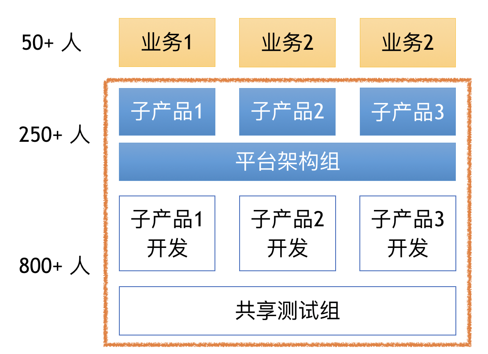
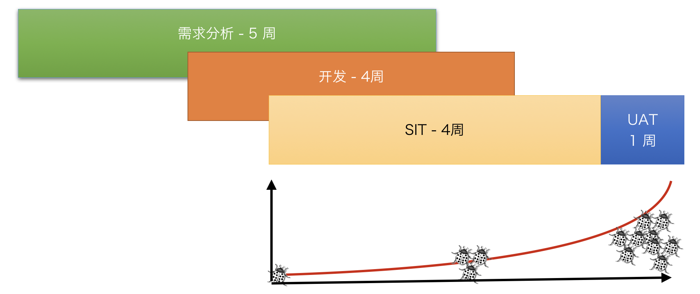
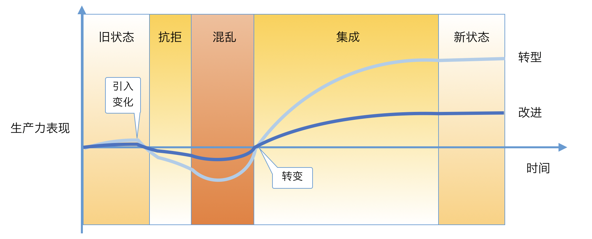
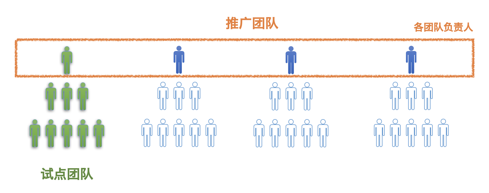
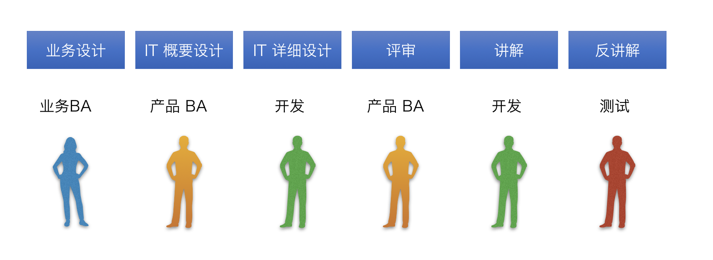
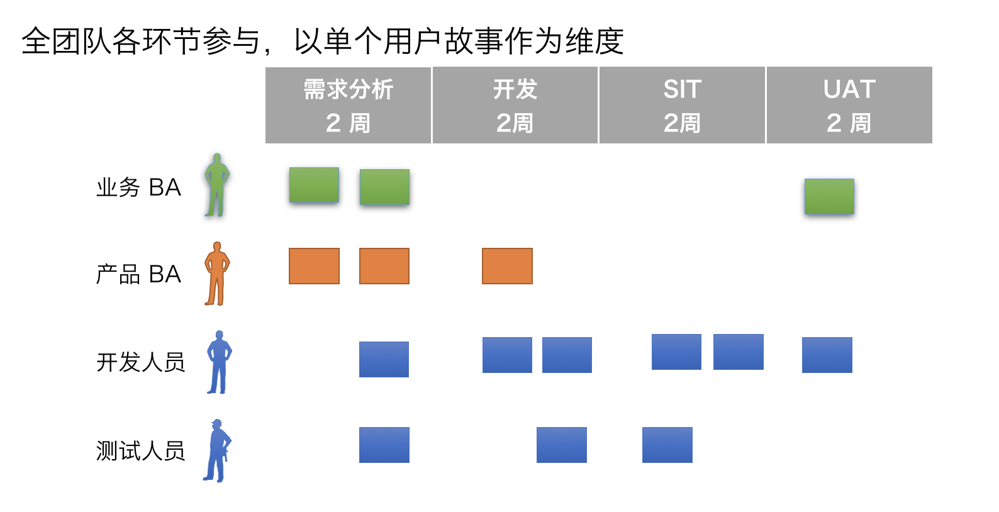
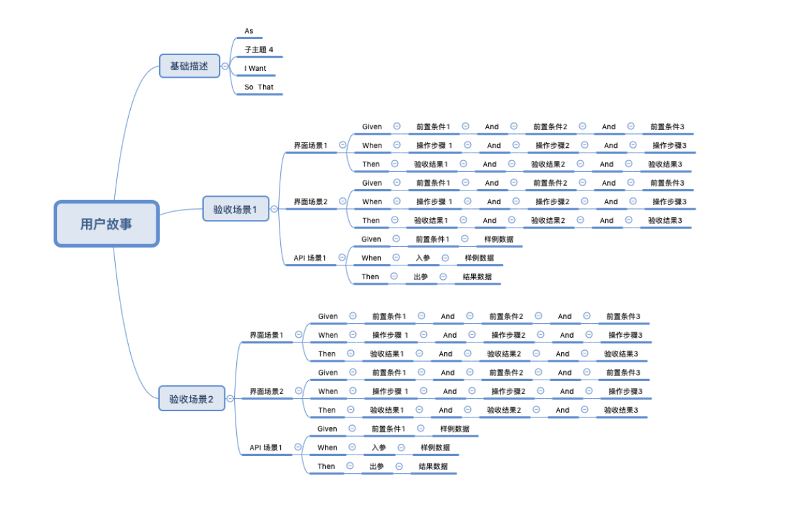

> 本文已收录至 2020 年出版的[《研发质量保障与工程效率》](https://book.douban.com/subject/35413388/)一书中，书中内容有所调整。

## 案例背景

在2018年年底，我参与了某一个大型产品团队的 DevOps 转型。这个产品的团队分为三个组织：产品业务部门（50多人），产品IT部门（250多人），以及产品的外包团队（800多人）。 经过产品化和微服务拆分后，组织开始以独立业务的方向划分。但是，由于之前的组织划分，团队并没有成为一个全功能的团队。而是采用原先的交付模式：业务部门提出需求，然后让IT部门开始设计解决方案，最后交给外包团队开发和测试。并且将测试团队和 计算平台团队变成各子产品的的公共资源，如下所示：

在这样的组织里，没交付一个产品需要 8 周的时间。按照原先的计划，2周完成需求分析，2周完成开发，2周完成产品的集成测试，2周完成用户验收测试，然后就进行发布，如下图所示：

然而，这个理想的计划并未得到实施。由于有些需求需要跨子产品，或者需求方案变更和延迟，导致需求延迟完成，使得接下来的环节相继延迟。然而，最核心的问题是版本计划不能根据变化调整，必须按照计划上线需求。因此，缺乏足够开发时间导致的不合格的软件半成品会堆到集成测试阶段。使得在用户验收测试阶段大量出现问题，“Bug”的数量爆发增长使得用户满意度大幅下降,如下图所示：

所以，用户希望通过 DevOps 能够弥合组织间的沟通间隙，将质量工作前移，减少Bug 数量并且缩短交付周期。在这个过程中，我总结了在50人以下的小型团队不会出现的关键问题以及对应的9个实践：

1. 采用外部 DevOps 顾问
2. 组织内部达成一致的 DevOps 理解和目标
3. 采用改进而非转型减少转型风险和反弹
4. 采用试点团队和推广团队
5. 构建全功能团队并合并流程
6. 提升需求质量
7. 实践不同级别的 TDD
8. 构建“比学赶超”的组织氛围
9. 规范化管理实践并不断优化

## 聘用一个外部 DevOps 顾问

如果你是一个小型的团队，可以不用外部顾问。主要的原因是组织结构不复杂，很多事情只要团队能自主决策就能推动 DevOps 发展。

但如果你是一个大型组织，特别一个职能分工明确的组织向多个跨职能的全功能组织发展的时候，更多需要处理的是组织内部的复杂关系，重新切割和划分组织边界，组织内部就会出现矛盾。而 DevOps 顾问则是承接和转化矛盾的最理想人选。

### 那么，聘用一个外部 DevOps 顾问需要注意哪几点

首先，一个外部 DevOps 顾问需要至少两个以上企业或者客户的转型经验，特别是案例总结。因为不同企业在做 DevOps 的时候组织特点决定了不同的组织痛点和方法。做过多个企业的 DevOps 转型后，一个 DevOps 顾问就会明白这些区别。否则，就会把自己过去的经验“复制”过来，以为 DevOps 只有一种，从而拒绝学习组织现有的知识。那么就会盲目复制，导致转型效果和转型期望有很大差距。此外，“转型”是一门艺术，面对什么样的组织，采用什么样的话术和方法也是一门学问。这些细节也会影响 DevOps 转型的效果。

然后，DevOps 改进涉及到管理提升和技术提升两个方面。DevOps 顾问除了要具备精益，敏捷的管理实践。还要具备自动化测试、自动化运维、持续交付等技术能力。管理实践和技术实践两者都不可少，没有了管理实践，技术实践往往沦落为“工具赌博”，很多买来的工具都没有起到效果。没有了技术实践，管理实践也无法通过自动化取得进展。技术实践和管理实践相辅相成，技术实践是落地管理实践的手段和工具。只有二者紧密结合，才能发出最好的效果。

最后，DevOps 顾问一定要可以和团队在一起实践，而非在一边“指挥”。有一些 DevOps 教练没有动手实践过，只是“知道”，而非“做到”。这里面就会有很大的风险因素在里面，任何一个实践的落地和见效需要投入和时间。魔鬼都藏在细节里。如果没有做过，就难以避开转型上的“暗礁”

所以，在面试 DevOps 顾问的时候，要问 DevOps 顾问之前的转型案例，特别是的关注的点。而且不光要有管理实践，还有技术实践。在面试这些的内容的时候不光要讲方法论，还要讲采用什么工具如何落地。落地中间的困难点和关键点事什么。

### 为什么招聘一个 DevOps 专家转型效果不好

你可能会想，不如招聘一个 DevOps 专家来做。不是说不可以，而是说不要对这种方式做 DevOps 转型抱太高期望。因为他的工作也会受组织制度的制约。为了能够在组织生存下去，避免风险，他就会避免矛盾的发生。而这些矛盾的突破才是转型的关键。因此，聘用一个 DevOps 专家很难解决一些“顽疾”。

其次，很多专家会将自己的 DevOps 经验“复制”过来。然而，除了 DevOps 的实践本身以外。“转型”也是一系列技巧，如何获得信任，调整对方的预期，如何与对方沟通，在组织内应该说什么不应该说什么，以及怎么说怎么做都是技巧。没有做过“转型”的专家往往会忽略这些关键的细节。

在这个项目上工作了四个月之后，客户自己招聘了一个资深的应用架构专家。这个应用架构专家只有一家企业的 DevOps 经历，并没有“转型”经验。他申请来做 DevOps 转型。但他低估了 DevOps 转型在组织内部和各利益方的矛盾和挑战，导致自己在转型的过程中“腹背受敌”：如果不继续，自己工作的绩效受影响。如果继续做，又要面对同事之间的矛盾。

DevOps 顾问的另外一个工作就是要根据一套评估模型来对组织当前的状态进行评估，并给出改进建议。但无论什么样的成熟度模型，要兼顾到不同组织，所以大部分都是定性的条目。也就是说，职能给出“是”或“否”的结论，比如，发布周期是以“月”计算还是以“周”计算。但很难给出定量的结论，比如是三周好还是四周好。所以，如果你需要一些定量性的改进建议，就需要进一步定制化的进行度量。

## 建立 DevOps 共识

DevOps 是一个抽象的概念，也缺乏一个定义。因此，每个人对 DevOps 的理解各不相同。DevOps 运动刚兴起的时候，每个人都会纠结“DevOps 是什么?”的问题，想要找到一个正确的方向或者自己来定义 DevOps。于是涌现了大量的技术和实践。

随着 DevOps 运动的发展以及管理实践和技术实践的总结，DevOps 这个概念下已经产生的大量的内容。所以，现在做 DevOps 我们更关注“DevOps 能做什么？”的问题。

在大型组织中，推广 DevOps 概念是一件比较困难的事情。一方面，“DevOps 的发起人”会有自己的诉求，此外，要达到效果，中途要解决各种其它相关部门的问题。在以职能进行分工的组织内，大部分中层管理人员看到的是自己的利益点和关注点，并没有统一的认识。如果没有统一的认识，DevOps 的改进就很分散，没有合力，DevOps 的转型效果就会慢。甚至是遭受到来自于部门内部的反对和抗拒。

所以，DevOps 转型的一开始就要在全组织得到对 DevOps 改进一致的共识，无论是提升质量，还是效率。在 DevOps 的总体方向上一定要是一致的。 所以，在分析完 DevOps 的成熟度之后，需要根据组织的状态来给出改进优先级。这里面有几个小技巧：

1. 首先按照“三步工作法”的第一步，构建从左到右的交付流程图。要包括步骤名称、责任人实名以及对应的角色、工作事项以及每个事项交付的产物。
2. 和每个角色单独聊天，关于某个环节的痛点和问题，这样可以获得更多的信息和信任。
3. 最后将所有的碎片拼起来，构成一条完整的，可视化的流程，先和每个人单独确认一遍，确保没有遗漏的信息。然后在一个公开的会议上确认一遍。这里要注意的是只说事情本身表现出来的结果，不要追究角色和人的责任。否则你会失去一些当事人的信任，为日后展开工作带来不便。
4. 在公开的场合下允许大家提出不同的观点。但是要指明哪些是“事实”，哪些是“假设”。
5. 和所有人确认了问题和痛点后，结合优先级发一封给所有人的邮件，之后要定期更新这些问题的进度。

为了整体上取得最终的效果，局部过程中一定会有损失。就像上文说的，在转型的过程中会面对组织的矛盾。所以，我们就要采取接下来介绍的几个策略。

## 采用“DevOps 改进”和而非“DevOps 转型”

提到“转型”的时候，它的潜台词是“短时间内的巨大（或者显著）改变”，“变革”也是同样的意思。这就和小孩子长个子一样，小孩子长个子是每天都在增量发生的事情。但是，相隔几年时间来看，就会有很大的差距。如果我们仅仅拿出两个时间较长的观测点来看，是转型。而把它细分到每一天，就是改进。也更加符合 DevOps 的精神 —— 持续的改进。

根据“萨提亚改变模型”，一种改变的过程会经历“抗拒期”、“混乱期”和“集成期”，最终完成变化。如下图：

所以，当我们谈到转型的时候。指的是在现有状态下，在一个固定的周期里（通常以版本计算），引入了多少实践去进行改进。短期内引入的实践越多，对个人和组织来说带来的影响和抗拒就越大，同样，反弹的几率也会更大。但如果把这些实践逐步引入，在巩固好了前一个实践的基础上引入，带来的抗拒就会小一些，但时间就会长一些。

在这个的案例里，我们的“DevOps转型”经历了两个版本后，虽然得到了不错的结果。但同时也引起了团队的不满。因此，在之后版本的里，我们将“转型”变为“改进”——巩固已有成果，再逐步增加内容。这样可以使 DevOps 改进的效果更持久。

## 采用试点团队和推广团队

“试点团队”是转型过程中一种规避风险的方法，我们可以用较少的代价来进行体验和整合，避免将风险扩大到整个组织。挑选“试点团队”一定要找表现最差的团队，只有表现最差的团队有了效果，其它团队产生效果的几率就会很大。但如果找表现最好的团队来进行试点，遇到表现较差的团队很可能失灵。

小规模组织的做法是将“试点团队”的实践进行复制：每次按照试点团队的样子重新组织并复制经验。但正如上文所述，“复制”就是一种“转型”引入的变化太多，效果也很不好。但这种方式在大型组织里面不适用，特别是水平分布呈长尾形状的分布。

所以，我们在试点团队以外，组织了“DevOps 实践推广团队”，如下图：

我们在每个版本 DevOps 试点团队会将一些实践进行总结，并在 DevOps 转型评审会上给所有产品的负责人进行说明，由各产品负责人根据自己的情况进行评审和采用。这样，就可以将实践按照版本一个一个落地，达到低风险的改进效果。

## 组织全功能团队且合并流程

DevOps 带来的一个很重要的转变是缩短了交付周期。在我们的案例中，我们的客户会经历 22 个交付环节，每个环节都有自己加工过的输出。并且是按角色单线串行传递的。仅一个需求分析环节，就包括至少6 个步骤，如下图所示：

在这个过程中，信息被传递了太多次就会造成失真，开发人员拿到手上的信息已经和当初需求提出者的信息差异很大，而且缺乏前后完整的确认。往往导致交付的结果不是需求提出人想要。这是很大的浪费。因此，我们在转型中做了三点：

1. 合并流程，所有角色参与所有环节，避免失真。
2. 减少输出，尽量让所有的输出集合在一份文档上，避免写出丢失信息的文档。
3. 对各个环节的活动和输出结果进行质量控制，活动质量和结果质量同样重要，没有高质量的活动就缺乏高质量的结果。

最后的结果是如下图所示，每个环节都有多个成员参与：

在这个过程中，我们也编写了如何提升活动质量的规范，以量化活动的质量。

## 采用用户故事成熟度提升需求的质量

在上述整体流程里面，我们发现质量问题是由于在过程中丢失信息导致的。丢失信息有几方面的原因：

1. 需求提出人没有充分表达。
2. 需求在传递过程中丢失信息。
3. 开发团队没有和需求提出人在方案各个环节确认规格。

提升质量最好的办法是将质量要求提到开发早期阶段并和需求提出方核对。

我们采用用户故事描述需求，这里面需要注意一点。就是用户故事不是一个文档格式，它不是一个需求文档格式。而是一种形成需求的方式。用户故事是需求的来源，但用户故事不是需求。需求是一个把抽象的想法通过设计变成规格化的文档的过程，这个过程需要所有人的参与。

用户故事包括三个内容，即 3C：Card（卡片）、Conversation（讨论）、Confirm（确认）

采用卡片而不是文档一方面是为了减少信息，这样会减少用户提出需求的压力，把大框架思考清楚而不必在开始拘泥于细节。另外一方面，少量的信息也有更多的讨论空间，为讨论和确认提供空间。

讨论实际上是一个引导的过程，一定要避免用户告诉你怎么做。软件开发是一种专业服务，提出需求的人往往不是专业人士。如果让非专业人士指导专业人士，结果一定不会太好。但是我们可以设计方案，和用户协商出一个双方都合意的结果。

最终的设计方案一定要和用户确认，以避免开发出来的软件不符合用户的预期，这就是很大的风险和浪费。所以，用户故事一定要包含验收条件（Acceptance Criteria）。

此外，一个好的用户故事要符合 INVEST 原则。但 INVEST 原则的理解很多材料上都缺乏实例和判断标准。所以我们列出了以下原则来判定一个用户故事是不是符合 INVEST 原则：

* 独立的（Idependent）：用户故事是完整的，并且不可再拆分，目的是从业务角度解耦。
* 可协商的（Negotiable）：避免需求是用户来确定，而是和团队之间讨论决定的，哪怕最后讨论的结果对用户故事没有任何影响，都要通过讨论环节来做沟通和理解的对齐。
* 有价值的（Valuable）：从存储、计算、传输的三个方面来说明用户需要的特性是如何帮用户提供价值的。
* 可估计的（Estimable）：开发团队可以承诺完成验收条件。
* 小的（Small）：如果不可估计或者超出一个迭代，就是大的。需要进一步拆分，但不能违反以上的原则。我们也会用 XS,S,M,L,XL 这样 T恤的大小来估计。我们的迭代周期为两周，XS 指的是小于一天的，S 指的是1-2天的，M 是2-5天的用户故事，L 是一个迭代以内的，XL 则是超出一个迭代才可以完成的。如果一个故事是 XL，我们就需要把它拆分为多个 L 、M 或者 S。
* 可测试的：如果不可测试，就不可估计。这里的测试指的是有测试场景、测试用例和测试规格。更好一点的方案是可以被自动化测试，因为只有可以被自动化测试，规格才是明确的。

我们结合以上原则制定了用户故事的成熟度：成熟度级别越高，表示用户故事的质量描述越完善。

* 1级 - 符合基本的用户故事格式，有对用户场景的 5W1H分析。
* 2级 - 具备验收条件，并且和需求提出者确认。
* 3级 - 根据验收条件分析出测试场景，并用 Given-When-Then的格式描述。
* 4级 - 根据测试场景分析出测试用例，测试用例包含测试规格。
* 5级 - 可以进行自动化测试。

在我们的案例中，我们对不同的团队都有不同的要求。我们要求所有的用户故事起码要做到 3 级，默认做到 4级，最好做到 5级。此外，为了避免丢失信息，我们采用思维导图来记录用户故事、测试场景和细节。如下图所示：

在需求讨论的过程中，完成了所有的问题就能保证需求的质量，从而使下游开发和测试减少更多的不确定性。

## 实践不同级别的TDD

在 DevOps 里，自动化测试是提升质量和效率的核心实践。因此，DevOps 离不开自动化测试。而在自动化测试里面，测试驱动开发（TDD）又扮演了十分重要的角色。

很多组织在落地 TDD 的时候认为很困难。我们在落地的过程中把TDD落地分为以下三个层次：

1. 工具：掌握基本的单元测试框架的用法和场景。
2. 习惯：有没有养成先思考测试的习惯。
3. 遗留代码：从新的项目开始做 TDD 很容易，但面对遗留代码往往无所适从。

在以上三个层次中，工具最简单。习惯比较难，但通过人为或者技术的手段可以强制代码都有单元测试覆盖。但不一定是TDD，也有可能是先写实践，再补测试。虽然这种方法不推荐，但算是在短期内的“次优”选择。而在遗留代码的情况下，特别是很多测试场景对数据有强依赖且场景不封闭的情况下，只能逐渐提升用例覆盖率，或者进行一次用测试用例驱动的数据规范化项目。否则，每一次发布都是一次高风险的赌博。

质量低下的高效没有意义。只有在某一个质量水准不降低的情况下，才能考虑如何提升效率。让团队养成经常提问“如何测试”和“如何自动化测试”的思维习惯是很重要的。所以，我们在用户故事讨论和需求规格确定时就要确认测试用例。这就是“测试用例驱动开发”（Test case Drive Development）

### 测试用例驱动开发 （Test case Drive Development）

在测试用例驱动开发中，开发人员要理解和确认测试用例和场景，在开发完毕提交给测试人员前。就要先按照条件进行自测。这就是把测试从开发-测试环节向前移一个步骤。如果测试人员在测试的时候发现测试用例没有满足，开发人员是需要进行考核的。因此，测试人员作为最后结果的责任方，职责和权力就会大一点。这就进入了“测试人员驱动开发人员”（Tester Drive Developer）

### 测试人员驱动开发人员 （Tester Drive Developer）

在测试人员驱动开发人员的场景中，由于测试人员是最终的责任者，他在一开始和用户确定需求规格的时候就要把关。并依据测试用例评估开发人员的开发质量。如果用例分析不到位，或者用户的需求没有理解到位，就会由用户来考核。

### 测试计划驱动开发计划 （Test plan Drive Development plan）

当测试用例分析的足够清楚后，我们可以根据思维导图把用户故事和需求进行进一步的拆分成更小的粒度。这样，我们就可以分散测试的工作量。把每八周测试一周的压力分散到每天。如果用户每天可以进行测试和确认，我们就具备了每天发布的潜在条件。这样一方面降低了发布风险，另一方面更快和用户对齐理解。

持续测试是持续发布的基础，如果我们有了这样的粒度，加上自动化的发布和运维，就而达到了 DevOps 提升发布效率，降低发布风险的效果。可以认为，DevOps 就是对软件开发质量进行更细粒度的控制。

## 构建“比学赶超”的组织氛围

在大部分组织里面，DevOps 转型都是一个自上而下的“政治任务”。因此，DevOps 转型带来的压力和负面印象居多。这也是 DevOps 落地的一大难点之一。

所以，我们需要一个方式把“要我做 DevOps” 转变为“我要做 DevOps”，这就是 DevOps 的组织级激励设置。“王者荣耀”这款游戏启发了我。王者荣耀让人不能自拔的原因主要包括以下几方面：

1. 相对公平的竞争机会，玩家的获胜几率分布比较均衡。
2. 快速的反馈：每一场时间不会太长。
3. 基于排名的奖励机制。

因此，我们根据我们所期望达到的 DevOps 效果设计了团队间的排名，并定期公布结果和奖励。比如自动化测试覆盖率的排名。而且，在设立激励机制的时候有以下几点要注意：

1. 设立的度量指标相对公平。
2. 奖励成绩靠前的，例如第一名或者前三名。
3. 要求获胜团队进行分享，并且把经验总结到统一的 DevOps 知识制度库里。
4. 无论是否获胜，成绩只能提升，不能降低。
5. 评比周期不宜太短，月度排名比较合适。

所以，当我们开始比起来，团队之间的学习、追赶和超越就成为了自发的行为。这样 DevOps 转型就由被动化为主动。在我们的案例里，我们就简单度量并比较了LeadTime 和 UAT 阶段的 Bug 数量。就起到了很好的示范作用。有了这样的结果，团队纷纷开始拥抱测试驱动开发。

## 规范化 DevOps 实践

在 DevOps 改进的过程中，我们要把很多的实践文档化，规范化以用来复制和扩张。否则大家的理解和执行往往不一致，小型团队这样的问题不明显。但到了大型团队传播和理解就会成为很大的问题。所以，我们需要建立一个规范化的文档中心。让所有的知识和要求有单一可信的来源。

规范化实践要包含以下几个内容：

1. 名词的解释和定义，最好只有单一定义，并引用。
2. 步骤说明和注意事项。每个步骤落地中一定有很多细节。
3. 好的例子，坏的例子。并对例子有说明。
4. 效果和度量，计分表或者成熟度模型等。

制度树立起来之后，就需要执行并不断完善。每个人都可以根据自己的实践来不断更新规范文档。让这个文档能够帮助和指导实践，而不是没有任何效果的文档。用文档中的约束和定义来考评团队各方面的表现，这个文档就会被用起来。

让每个人都可以修改并发表意见，这样，团队就会有参与感，才会愿意执行和维护这个制度。否则，规范就很难执行下去。

此外，在组织里也要养成执行和建立规范的文化。在遇到事情时，首先问有没有制度规范，如果有就执行，如果没有，就要想办法建立。在执行后也要能够根据实际的使用情况和 DevOps 改进大目标进行调整，而不是一味的死守制度。

规范化是 DevOps发挥规模效应重要的一环，在开始的时候就需要建立。在我们的例子中，则是在取得一定成果推广后才开始的，这个时候规范化和文档化的压力就会很大。所以在初期，就要把这样的制度和文化建立起来，并且配合其它实践一起使用。
