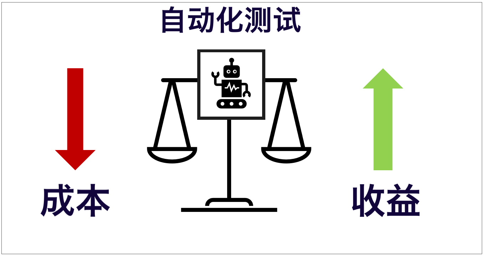
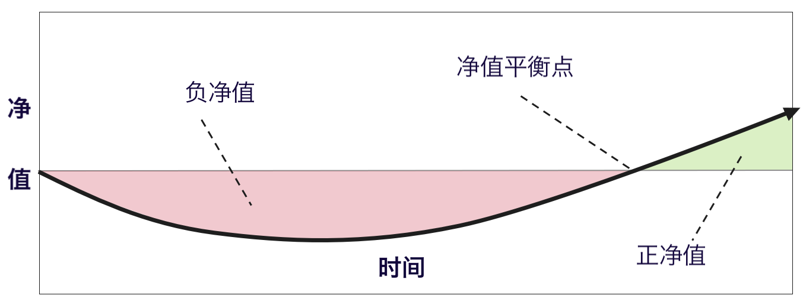
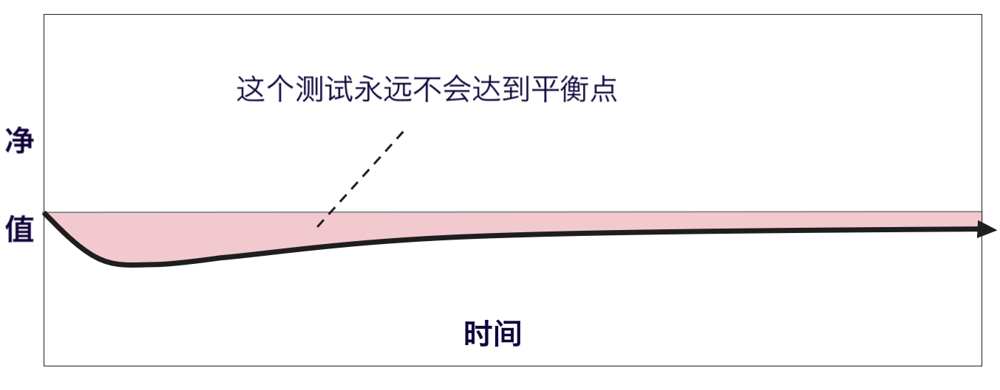
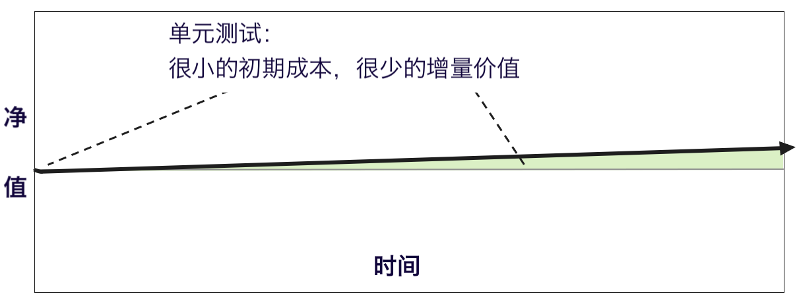
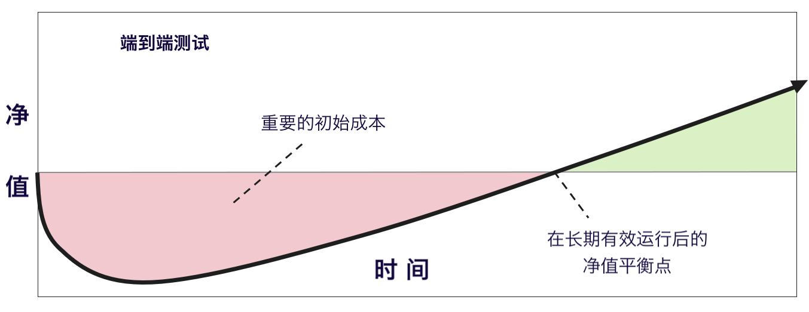
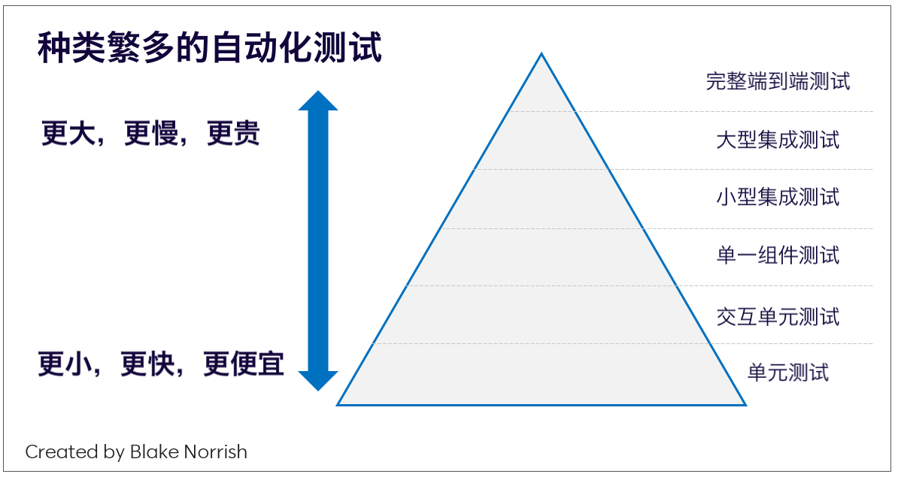
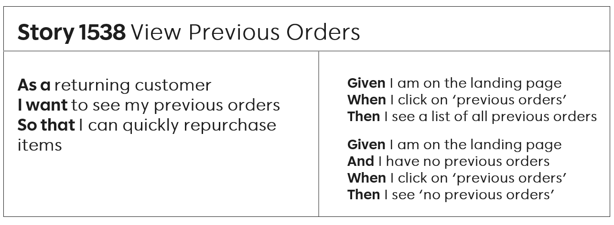
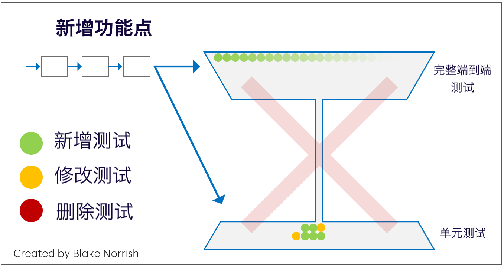
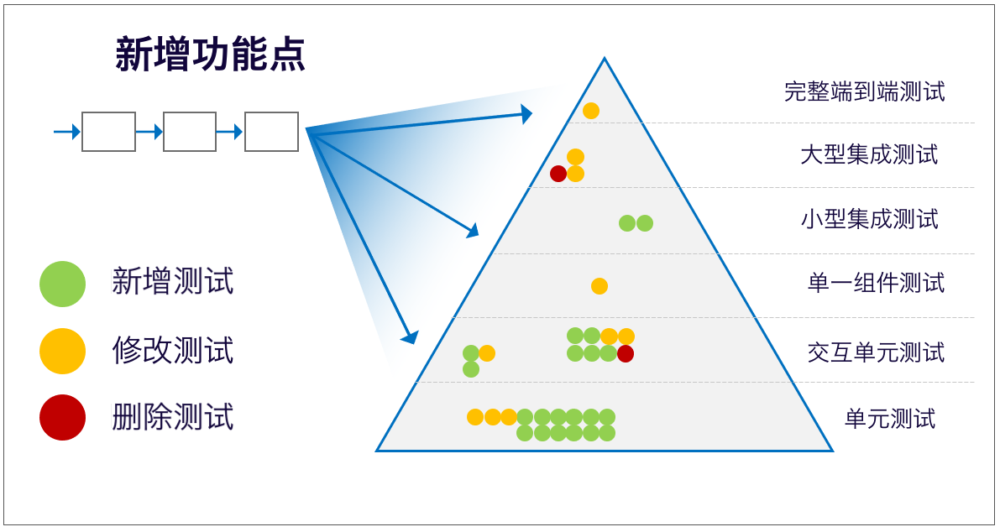

> 所有的自动化都应该被视为一种投资，特别是一种风险投资。每种类型的自动化测试代表不同类型的风险，我们需要通过不断评估成本和收益来管理整体风险并最大化投资价值。
> 原文：<https://medium.com/slalom-build/dont-automate-test-cases-58e3b959ce6>

把测试用例作为测试自动化的待办工作列表是一个常见的实践。作为日常测试工作的一部分，QA 会从用户故事中分析并编写测试用例，然后把这些测试用例自动化。每个迭代都会有更多的用户故事要被测试，从而产生更多的自动化测试用例，并使自动化测试套件变得的更大。工程负责人会推行诸如“自动化测试用例百分比”之类的指标，并对团队达到更高的比率表示祝贺。有团队甚至雇佣了专职的“自动化工程师”，这些人唯一的工作就是把测试用例自动化。

不幸的是，自动化测试用例和推行自动化测试百分比指标是一种质量工程反模式，并必然使得自动化测试套件臃肿、难以维护且缺乏价值。虽然自动化对于敏捷交付至关重要，但这种简单化的“自动化工厂”心态并不是推行测试自动化的健康方式。

在本文中，我们将说明为什么自动化工厂被误导，并描述了一种更好的自动化测试开发方式，以确保测试自动化得以持续并加速交付。

## 测试自动化的成本和收益

要理解为什么把当前的测试用例自动化会产生问题，我们需要先回顾一下自动化理论。 具体来说，我们需要深入理解自动化的成本和收益，分析自动化测试的预期价值随时间变化，接下来分析不同类型的测试的预期价值如何随变化。然后我们会分析使用“自动化工厂”方法产生的自动化测试用例会如何影响整个测试套件。

所有自动化测试都有两种成本：最初的开发成本和持续的维护成本。自动化测试会带来一些收益：手动执行测试的时间与（假设的）更快的自动化测试之间的差异。虽然还有其它无形的收益（例如更有趣，可以教授有价值的技能等），但本文不需要考虑这些。

虽然这是对自动化测试用例的经济效益的简化，但它确实捕获了关键内容——每种类型的每个自动化测试都有成本和收益，两者都很重要。作为自动化专家，我们正在努力实现收益最大化和成本最小化。

以下因素会影响自动化测试的成本：

- 存在（或缺乏）承载测试的自动化测试框架
- 现有测试框架和套件的整洁度
- 设置测试状态（例如测试数据）的难易程度和能力
- 可接受的测试预言（Test Oracle）的可用性
- 测试将与之交互的接口或功能的波动性
- 测试运行环境的稳定性
- 创建和维护自动化测试的的 QA 的技术技能

以下因素可能影响自动化测试的收益：

- 测试预期的运行频率（每次提交、每天、每次发布等）
- 测试对被测系统进行有效检查的时长。
- 手工验证相同测试的成本（及时性或其他）
- 手工运行测试容易出错的程度

以上两个列表都完整，一名经验丰富的质量工程师可能会要求添加其它的因素。幸运的是，我们不需要列出一份详尽的清单来证明每个测试都有一连串因素影响预期成本和收益。

自动化成本可以分为**前期开发成本**和**持续维的护成本**。其收益还具有时间维度：自动化测试的价值不会在编写完成后立即兑现，而是在整个生命周期里积累。因此，自动化测试的完整价值并使不在创建时固定不变，而会随着时间的推移而变化。

如果我们为一般性的自动化测试绘制价值随时间变化的曲线图，那么它看起来会像这样：

该图展示了一个测试最初具的净价值为负：自动化测试最初的开发的成本超过了节省时间的收益。 然而，随着时间的推移节省的时间最终超过了初始成本以及持续的维护成本，从而使净价值为正。基于上面列出的所有变量，每个自动化测试测试都会经历这样的曲线。

根据最初的开发成本、维护成本和获得的收益，测试的成本和价值可能会快速的达到平衡并更快地提供价值，也有很可能永远达不到平衡：

上图表现了一个最初贡献一些价值的自动化测试（在最初的开发之后，这条线开始向上倾斜），但后来不再贡献价值。也许这个测试不再运行，或者不够稳定，或者它所测试的功能将会下线。

无论是什么原因，上面的图表告诉我们，我们最好不要一开始就把测试用例自动化。

这里想说明的要点是：自动化测试的价值受到许多变量的影响，这些变量会导致自动化测试在生命周期的总时间里贡献价值可能为正，也可能为负。

## 种类的繁多的自动化测试

接下来，让我们考虑一下不同类型的自动化测试的价值曲线随时间变化会是什么样的。 这里的自动化测试类型包括：最小的代码级单元测试、稍大的“社交”单元测试（有交互）、甚至更大的组件级测试、更高级别的集成测试、绕过 UI 并直接调用 API 的测试、模拟 API 的测试。以及仅在 UI、跨越整个技术栈的端到端（E2E）测试等。

重要的是要注意：在复杂的现代软件中，有很多的自动化测试类型分类方法。几乎有无数种方法把被测系统分解为多个可以独立测试的部分。每种分解方法可能都对应着一种新的测试类型。

对每种非常见的自动化测试类型的探索并不在本文讨论之列，但推荐[实用测试金字塔](https://martinfowler.com/articles/practical-test-pyramid.html)和[微服务架构的测试策略](https://www.martinfowler.com/articles/microservice-testing/)作为入门材料。为了使本文简洁，我们将只考虑两个极端的自动化测试：最小小型单元测试和最大的端到端 (E2E) 测试。

单元测试的成本/收益方程和价值随时间的图表会取决于以下特征：

- 单元测试通常最多在几几十秒或者几分钟内编写完毕。
- 单元测试（应该）不受外部影响。因此会通过 mock、测试替身、stub 等来确定外部依赖的行为。
- 单元测试的执行完毕的时间为毫秒级，单元测试套件的执行时间为秒级。
- 单元测试每天可能会执行数千次，不仅每次提交代码后会在 CI/CD 流水线中执行，并且每个开发人员会在编写代码时本地执行。
- 即使有 100% 的覆盖率，单元测试也无法证明应用程序按预期工作，而只能验证非常小（通常是单一的）内容。

鉴于以上的特点，单元测试的价值随时间图可能与上述一般性的测试曲线有所不同：它几乎没有前期成本，维护量最少，并且虽然一直在执行，但每次增量执行实际上只贡献了很小的价值。

单元测试的净价值曲线看起来可能会是这样：

在所有自动化测试类型中最大的 E2E 自动化测试如何？ 它的价值随时间变化图会是什么样子？

E2E 测试的关键点：

- E2E 测试（根据定义）相比其它测试受到最多状态的影响，因此需要最多的设置和测试数据控制。
- E2E 测试是针对完整环境执行的。 这种环境的某些部分通常是共享的。
- E2E 测试通常包括许多（数十个，甚至数百个）串行步骤。
- E2E 测试是所有测试中最慢的，可能要运行几分钟之久。
- E2E 测试通常必须通过用户界面来驱动功能。
- E2E 测试通常在 CI/CD 流水线中执行得更晚。
- E2E 测试是唯一可以证明应用程序按照客户使用方式工作的自动化测试类型。

鉴于这些特点，E2E 的净价值曲线将是这样的：

该图显示了明显更高的前期成本：最初使净值高度为负。但是，随着时间的推移继续执行该测试最终使其达到收支平衡，然后价值转正。

同样，该测试最终将提供正值的期望基于本节开始的假设，例如：该测试会的生命长度，运行频率，对其测试结果的信心，当底层接口（如 UI）发生变化时修改测试的难易，执行测试的环境有多稳定等等。而达到收支平衡则是永远无法保证的。

## 哪里需要自动化

E2E 测试的特性使得它们的开发和维护成本很高。它们必然依赖于（或可能受其影响）系统中的大多数状态。它们更容易出现计时、同步、网络或外部依赖性问题。他们通常使用网络浏览器的功能，而浏览器主要供人使用，而不是软件。由于 E2E 测试是针对完整的软件运行环境执行的，所以这些测试更有可能必须与其他 E2E 测试或用户共享部分或全部的环境，这可能会导致资源冲突和意外结果。

所有这些（以及更多的）原因使大型测试具有最大的风险，并且只有它们可以提供的巨大的互补价值的情况下才是合理的：只有 E2E 测试表明集成的系统以真实的方式协同工作时。

还有许多其他类型的测试需要考虑。在复杂的系统中，较低级别的测试很可能更直接地测试相关功能，而不会产生与更大或更高级别测试的相关成本。

**换句话说：不要针对已部署的服务实例构建 API 测试来验证可以在单元测试中就能验证的逻辑。不要为可以通过单个 API 进行验证的逻辑构建 E2E 测试。永远不要引入超出必要的其它依赖以证明某些东西正常工作。确定需要测试的逻辑或行为，并创建一个完全隔离该行为的测试。 仅使用更高级别的测试来测试事物的实际集成，而不是这些事物中的逻辑。**

最重要的一点是，端到端测试是有风险的，并且在很少情况下是测试特定功能的最佳类型。通过价值曲线来说明测试类型选择策略：应该总是选择达到同样价值且成本最低的测试类型，并对乐观估计通过大规模自动化所节省的时间保持怀疑。

这种类型的成本效益分析正是多年前产生[自动化测试金字塔](https://martinfowler.com/bliki/TestPyramid.html)概念的思想。自动化测试金字塔主张，在所有条件相同的情况下，你通常需要更多的小型快速廉价测试和更少的大型慢速昂贵测试。

虽然我不会试图让你相信你的测试套件的形状必须始终并且完全是一个金字塔（Kent Dodds 说它是一个[奖杯的形状](https://kentcdodds.com/blog/the-testing-trophy-and-testing-classifications)，James Bach 更喜欢[地球层次模型](https://www.satisfice.com/blog/archives/4947)，Justin Searls 说这只是一种[分心](https://twitter.com/searls/status/1393385209089990659)），我希望我确实让你相信所有测试自动化都会带来风险，并且确保在适当的级别创建对应类型的测试有助于减轻和控制这种风险。自动化工作的很大一部分（与团队的其他成员合作！）是准确确定哪种类型的测试是合适的，并判断能够提供终身正向价值的可能性。

**换一种说法：所有的自动化都应该被视为一种投资，特别是一种风险投资。每种类型的自动化测试代表不同类型的风险，我们需要通过不断评估成本和收益来管理整体风险并最大化投资价值。**

## 自动化工厂和头重脚轻的测试套件

让我们再看看“自动化工厂”。

如果考虑 QA 将从用户故事和验收标准中创建测试用例，你认为这些测试用例会自然映射到哪种类型的自动化测试？ 如果我们只是盲目地把测试用例自动化，通常会创建什么类型的自动化测试？

借助普遍接受的敏捷文档技术，例如：需求优先级、以用户为中心的语言（通常我们甚至称其为用户故事）传达给测试人员。 想想“Given-When-Then”和“As a......I want......so that ......”的验收条件。

即使故事被水平分割并描述特定组件的行为（例如 REST 服务的 API），需求也会以该组件的“用户语言”进行沟通。 因此，从本创建的测试用例自然会映射到更大、风险更高的测试自动化类型。

这是自动化工厂方法的根本问题——把测试用例自动化的方法不可避免地过分强调大型、缓慢和昂贵的自动化测试，因为测试用例自然是用手动测试人员的语言编写的。因此它们映射到价曲线里恰恰是我们要避免的自动化测试类型！

第二个促使自动化人员错误地更喜欢大型 E2E 测试而不是小型测试的强大因素是因为 大型 E2E 测试从心里上会让非技术人员（以及一些技术人员）感到放心。例如，业务负责人可以理解测试用例，因为大型测试用例采用他们所熟悉的业务语言描述了应用程序的功能，而知道这些用例会被自动的执行会让他们安心。这样他们就不会在凌晨 2 点接到愤怒客户的电话。而开发团队有 90% 以上的单元测试覆盖率则不会达到这样的效果。

因此，有些人会推行自动化测试用例百分比和自动化测试数量这样的指标，因为这会让他们感到更舒服，而不是因为它实际上是一种更有效或更高效的自动检查系统的方法或行为。推行每个测试用例自动化可能会让你感到安全，但不会创建一个健康的自动化套件。

## 自动化测试工厂的症状

以“输入测试用例，输出自动化测试”为目标的自动化测试工厂的常见症状如下：

- 测试套件需要花费数小时才能执行完成，或者只能在夜间运行。
- 自动化团队的唯一目的是对先前执行的失败的测试原因进行分析并分类——这会占用他们大部分时间。
- 减少测试失败的方式是不断重新执行直到测试通过。
- 从 CI/CD 流水线中删除测试套件，或将其降级为非阻塞步骤。
- 开发人员避免或完全拒绝运行测试套件，因为他们不信任测试套件的测试结果。
- 包含数千个测试的套件，分布在数百个文件夹（甚至是不同的代码库！）中，包含重复的测试、注释掉测试以及没人知道做了什么就通过的测试。
- 自动化工程师为管理臃肿的测试套件或用 Gherkin（例如：Cucumber等）隐藏背后复杂性花费了巨大的精力。

所有这些症状都表明测试套件没有为团队提供价值。不幸的是，这在开发组织中很常见。受苦的团队在他们的开发过程中优先考虑测试自动化，但以一种天真的自动化工厂心态来对待它，这是值得反思的。

## 健康的自动化

OK，那么应该如何处理测试自动化以避免臃肿的自动化测试套件？

应通过分析每种测试类型所对应的自动化选项来全面评估新功能的自动化测试需求。不要假设新功能必然需要新的最高级别的 E2E 测试。相反，评估功能如何通过所有的测试类型分层覆盖。

你需要的不是用例的自动化，而是功能点测试的自动化。测试用例只包含了功能点的部分测试，但把每个分散的测试用例自动化到的功能点自身的自动化测试中，从测试人员手工所执行的角度上看，永远不会有效或高效。

事实上，测试新功能的最有效方法可能只是更新现有的自动化测试，将测试转化成更合适的测试类型，甚至创建全新的测试类型。不要忘记，随着系统功能的变化，你应该尽可能地删除测试，就像添加测试一样！

虽然你需要的测试类型高度依赖于系统架构、可接受的风险概况、现有工具等。通常健康的自动化调整方法如下：

1. 在可能的最低级别添加新测试。
2. 更新现有自动化测试以覆盖新功能。
3. 删除任何现在过时或冗余的测试，或合并测试。
4. 在高级别测试一般情况，然后将该测试分散到更小、更低类型的测试中。
5. 仅在绝对必要时添加新的高级 E2E 测试。
6. 如果任何现有类型的测试都无法涵盖此功能，则引入一种新类型的自动化测试。
7. 修改系统架构以启用新型自动化测试。
8. 与开发团队一起持续和批判性地评估所有测试类型的健康状况。

上述第 7 点值得特别关注，因为它是健康自动化方法和自动化工厂之间的关键区别。

作为开发团队，我们必须停止将测试自动化视为在软件构建之后才做的事情。相反，自动化应该被视为软件开发过程本身的关键部分。自动化必须随着软件的发展而发展，对自动化的需求应该像任何其他设计需求一样推动系统的架构设计。

这样会使更小、更经济的测试自动化类型在缺乏可自动化设计的系统里无法应用。健康的架构是为了测试而设计的，而自动化的作用就像在系统构建后才通知系统设计人员有这些设计需求。

了解所有自动化都有成本并且这些成本会带来风险，应该使用不同类型的自动化测试来测试功能，测试自动化的挑战是适当地利用不同的测试类型从整体上创建最有效和最高效的自动化套件，并意识到可测试性在系统设计中与任何其他要求一样重要——这是测试自动化的健康方式。而创建“自动化工厂”并盲目地用高层级的自动化测试把所有测试用例自动化则不是。

## 参考

在互联网上可以找到成吨的健康测试分布、测试类型、测试投资、以及其它在本文中讨论的主题。不幸的是，它们被大量肤浅、不知情的猜测和营销材料所掩盖。

以下是一些是关于本话题我最喜欢的内容：

[The Practical Test Pyramid](https://martinfowler.com/articles/practical-test-pyramid.html), Ham Vocker

[Testing Strategies for a Microservice Architecture](https://www.martinfowler.com/articles/microservice-testing/), Toby Clemson

[The Diverse and Fantastical Shapes of Testing](https://martinfowler.com/articles/2021-test-shapes.html), Martin Fowler

[Write Tests. Not too Many. Mostly Integration](https://kentcdodds.com/blog/write-tests), Kent C. Dodds

[The Testing Trophy and Test Classifications](https://kentcdodds.com/blog/the-testing-trophy-and-testing-classifications), Kent C. Dodds

[Testing Pyramid Ice-Cream Cones](https://watirmelon.blog/testing-pyramids/), Alister Scott

[Round Earth Test Strategy](https://www.satisfice.com/blog/archives/4947), James Bach

[Just Say No to more End-to-End Tests](https://testing.googleblog.com/2015/04/just-say-no-to-more-end-to-end-tests.html), Mike Wacker

[Testing vs Checking](http://www.satisfice.com/blog/archives/856), Michael Bolton and James Bach

[The Regression Death Spiral](https://medium.com/slalom-build/the-regression-death-spiral-18f88b9fb030), Blake Norrish (对，这也是我写的)

[Test Cases are not Testing](https://www.satisfice.com/download/test-cases-are-not-testing), James Bach and Aaron Hodder

[The Oracle Problem in Software Testing, A survey](https://discovery.ucl.ac.uk/id/eprint/1471263/1/06963470.pdf)，IEEE TRANSACTIONS ON SOFTWARE ENGINEERING

(完)
