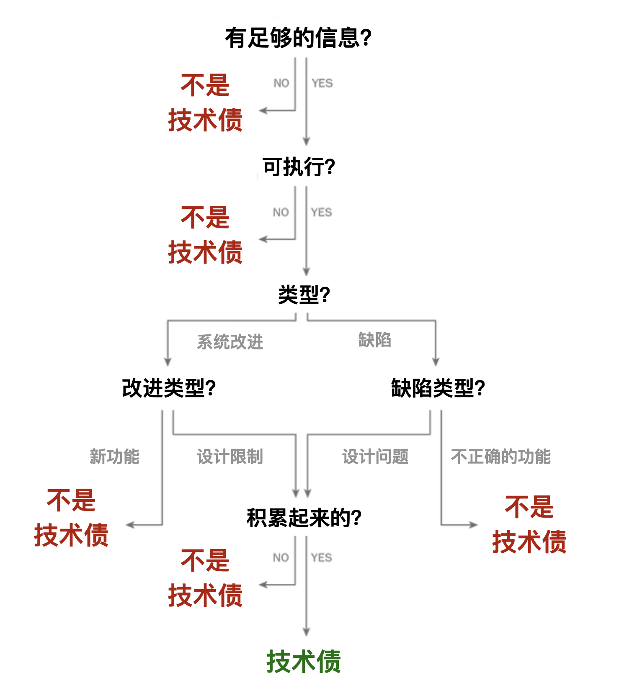

> 原文: <https://insights.sei.cmu.edu/blog/got-technical-debt-track-technical-debt-to-improve-your-development-practices/>

什么是技术债？为什么要识别技术债？它难道不应该被视为缺陷和 Bug 吗？通过严格的方法讨论技术债及其后果是研究人员和软件工程师都感兴趣的领域。如果缺乏经过验证的工具和技术获得可重复的结果，开发人员就会求助于临时实践，最常见的是使用问题跟踪系统（issue tracker）或待办事项管理(backlog-management)实践来跟踪技术债。我们调研了开源项目和政府项目中使用的四个问题跟踪系统里的 1,264 个问题，并确定了 109 个技术债样本。这些研究被记录在论文[Got Technical Debt? Surfacing Elusive Technical Debt in Issue Trackers](https://resources.sei.cmu.edu/library/asset-view.cfm?assetid=453508)里。论问题表明了技术债已经进入问题跟踪系统，并在开发人员的工作讨论中。即使开发人员没有明确将某些记为技术债，也可以使用我们发明的分类方法在这些问题跟踪系统中识别技术债项目。我们使用这些结果来改进技术债的定义以及在问题跟踪系统中明确报告技术债的方法。在本文中，我们描述了这个分类方法以及跟踪债对实践和研究的影响。

## 识别和分类技术债

为了理解软件开发人员如何使用问题跟踪系统来沟通技术债，我们对四个软件的问题跟踪系统进行了探索性研究，包括：[Chromium](https://bugs.chromium.org/p/chromium/issues/list) 和 [CONNECT](https://www.connectopensource.org/)开源项目和两个政府 IT 项目。 我们发现，在确定一个问题是否代表技术债时，专家会采用非正式的规则和实践。 我们通过人工检查四个问题跟踪系统的 1,264 个问题以及技术债文献（例如，Guo 2011、Li 2014、Potdar 2014 和 Ernst 2015）中观察到了这一点。 我们创造技术债分类方法的目标是精确识别可重复的问题分类。 在这里，我们总结了我们流程中的关键决策点：

**与可执行文件或数据相关**：关于技术债定义的不清晰原因之一是用项目管理活动（例如文档、需求分析和质量评估）来概括某些概念。 开发团队要对技术债采取行动，它必须与具体的工件（Artifact）相关，例如代码、实现单元、数据模型、构建脚本和单元测试。 我们将任何未提及具体开发工件的问题归类为非技术债。 从这一点开始进行分类则需要进一步阐明模糊的概念，例如缺陷（Defect）、Bug 和设计关注点。 缺陷和Bug是最终用户可见的不正确功能；而技术债往往源于用户不可见的设计和系统问题。 我们将缺陷与系统改进问题分开。同样，我们将新功能（作为一种系统改进）与潜在设计限制导致功能请求的情形区分开。

**类型 > 缺陷 > 不正确的功能**：我们发现了许多描述系统未按指定或预期运行的缺陷示例。 例如，按钮在用户界面中不起作用或系统崩溃。这些问题不是技术债。

**类型 > 缺陷 > 设计问题**：几个缺陷影响了质量属性，例如可用性、安全性或性能； 在其他项目中，清理活动影响可维护性。 我们将这些问题归类为设计考虑因素。 如果还发现了意外副作用累积的证据，或者估计它们会积累；就将这些问题归类为技术债。包括重复代码、非标准绑定、类型不匹配、不一致的实现和未使用的类。

**类型 > 改进 > 新功能**：我们将系统改进的新功能分类为非技术债，例如向传感器组件添加新节点或删除下拉框。

**类型 > 改进 > 设计限制**：一些问题描述了系统改进以弥补设计限制，例如无法快速添加新功能、可维护性问题或重构的后果。 为了处理这种情况，我们引入了“设计限制”类别。 当副作用的证据不明确时，即使对于明确提到重构以弥补设计限制的问题，我们也将该问题归类为非技术债。

因此，我们的分类方法将技术债的定义细化为“**与可能承载当前或预期的额外积累的软件单元相关的设计工作**”。 我们在一般意义上使用术语“设计工作”来表示问题的某些方面是由软件设计的结构或质量引起的（因此我们将实施的系统设计包括在此定义下）。 图 1 说明了我们目前对类别的理解以及用于对技术债进行分类的流程树。 我们用于在问题跟踪系统中对技术债进行分类的方法也可以帮助从业者在他们的开发项目中定义和识别技术债。

## 使用识别技术债务的方法改进开发实践

问题跟踪系统作为沟通技术债的切入点，因为开发人员使用它们来管理工作任务优先级。对开发人员的调查反馈表明，即使在问题跟踪系统中包含有关技术债的详细信息，他们也可能不会优先偿还债务，或者他们可能会解决其表面症状而不是根本原因。我们的发现提供了一些实际改进，使技术债更加明显。

有一些国际标准（例如 ISO/IEC 25010:2011）可以为错误报告提供足够的信息，以便它们可以被复制和修复。 这些基本属性编码在问题跟踪系统的预定义字段中。 这些字段对于描述技术债是必要的，但还不够。 最近关于技术债的研究（如 Zazvorka 2013 和 Li 2014）为报告技术债提供了模板。 这项工作与我们的工作具有相似的目标，但模板使用了财务类比的概念，例如估计本金和利息，这与开发人员的日常工作任务中差异较大。

我们的分析表明，技术债在与软件单元相关时变得具体，而不是与软件过程工件（如需求或文档）相关。 这种范围的细化有助于开发人员及其利益相关者将技术债理解为与依赖软件的系统相关的技术债项的累积。

技术债项是连接一组开发工件的技术债的单个元素。 它会对系统的质量、价值和成本产生影响。 同样，它是由与流程、管理、上下文和业务目标相关的原因触发的。 应使用表 1 中的属性来描述技术债项目，这些属性基于技术债分类的概念（以粗体显示）。

表1: 技术债项的属性

| **名称** | 用于速记技术债的名称 |
| :---------------| :----------------------|
| **开发工件** | 系统中可执行的元素 |
| **症状** | 可观察到的定性或可度量的后果 |
| **后果** | 系统的某个效果在价值、质量或成本的积累形式。额外成本会降低生产力，滋生缺陷。|
| **分析** | 开发方法（设计考量/设计限制）满足了利益相关人的需要或期望的程度 |

引入这些属性可以帮助开发人员了解并权衡和技术债的长期后果。 它还可以帮助他们在与管理层沟通时提出额外资源的理由。 我们建议开发人员利用这些属性来描述技术债，使其可见，并提高将问题分类为技术债的自动化程度。 表 2 显示了根据 CONNECT 提交的问题的这些属性组织问题文本的示例。

表2: 技术债项的例子
| **名称** | CONNECT #GATEWAY-1631: 空 Java 包(死代码) |
| :---------------| :----------------------|
| **开发工件** | 代码架构重构以支持多个 HwHIN 规范 在引入的新 Java 打包规范 |
| **症状** | 可观察到的定性或可度量的后果 |
| **后果** | 在多个项目中散落的空的 Java 包目录 |
| **分析** | 新的和现存的 class 文件已经移动到新的包目录中；但是之前的包目录已经不在有 class 文件 |

这些属性还可以帮助开发人员解析问题并确定什么是模棱两可或缺失的。 例如，如果没有关于债务积累的明确信息，就无法正确分类问题，也无法理解并权衡取舍。技术债应促进业务和技术参与者之间的对话。 将问题归类为技术债允许开发人员证明预算项目资源以偿还债务的合理性，类似于分配修复缺陷的预算，而不是继续支付解决症状的持续成本。

## 调查结果的总结以及未来的工作

在回顾了我们的研究结果后，我们假设开发人员可以使用自动文本分析和机器学习技术更系统地发现技术债问题。 为了探索这个假设，我们对一组我们研究过的问题进行了搜索，包括以下词语：重复、自定义、解决方法、不一致、黑客、遗留、重写、清理、重构和刷新。 我们假设，与包含关键字但未被归类为技术债的一组问题相比，我们会发现包含这些关键字之一且属于技术债的问题的百分比之间存在统计学上的显着差异。 我们观察到 67% 的问题包含一个关键词，并被归类为技术债。 只有 8% 属于后一类。 这些发现表明，对与技术债相关的关键概念的自动单词搜索是有希望的，但需要对更大的数据集进行更多的实验。

评估累积量是我们在本研究中对技术债问题进行系统分类时观察到的最大挑战之一。 评估的困难来自于两方面：

- 首先，开发者用来描述积累的语言比设计问题描述更模糊。例如，开发人员写道，“时间已经过去了，现在我们有重复的数据”，“这可能会给用户带来困惑”，或者“我们应该尽量简化，以便更容易维护”。指示债务累积的非结构化语言使审阅者难以一致地对技术债项进行分类，开发人员难以评估影响，研究人员也难以研究如何自动化分类技术债。

- 其次，问题通常包括三种类型的累积信息：
  1. 与当前问题相关的现有累积。
  2. 与当前问题相关的未来重复累积。
  3. 与当前问题的潜在解决方案相关的累积。

在本研究中，我们将累积范围限制在类型 1。未来的研究需要根据不解决问题的成本和稍后解决问题的额外成本来更好地定义和模拟债务累积。

我们的研究结果表明了几个未来的研究机会，我们的计划包括以下内容：

- 评估挖掘非结构化数据以定位软件存储库中的技术债的其他技术。
- 通过提交日志跟踪开发人员文本讨论中的技术债，以评估问题跟踪系统中自我报告债务的有效性。
- 根据修复成本、未修复成本和时间影响（当前和未来成本）对累积维度建模，以改进管理技术债的指导方针。
- 以对 Chromium 数据集的投资为基础，对缺陷和软件漏洞进行相关性研究，以更好地了解这些软件异常之间的关系。

我们欢迎您在下面的评论部分中对我们的技术债分类和技术债项目描述提供反馈。如果您想尝试分类方法，可以在 SEI 网站上访问的[分类指南](https://resources.sei.cmu.edu/asset_files/ConferencePaper/2016_021_102_453522.pdf)中找到我们研究中的决策流描述。这项研究是 [SEI 技术债研究](https://www.sei.cmu.edu/research-capabilities/all-work/display.cfm?customel_datapageid_4050=6520)的一部分。如果您想合作研究管理技术债，请与我们联系。

## 其它资源

在以下出版物中了解我们最近在管理技术债务方面的工作：

- Avgeriou, P., Kruchten, P., Nord, R., Ozkaya, I., and Seaman, C. 2016. [Reducing Friction in Software Development](https://resources.sei.cmu.edu/library/asset-view.cfm?assetid=453308). IEEE Software 33, 1 (2016), 66−73.
Bellomo, S., Nord, R. L., Ozkaya, I., and Popeck, M. [Got Technical Debt? Surfacing Elusive Technical Debt in Issue Trackers](https://resources.sei.cmu.edu/library/asset-view.cfm?assetid=453508). Mining Software Repositories 2016, co-located with ICSE 2016, in Austin, Texas, May 2016.
- Bellomo, S., Nord, R. L., Ozkaya, I., and Popeck, M. [Technical Debt Classification Approach and Technical Debt Issue Examples](https://resources.sei.cmu.edu/asset_files/ConferencePaper/2016_021_102_453522.pdf). Sample data set and classification guidance for the conference paper Got Technical Debt.
- Ernst, N., Bellomo, S., Ozkaya, I., Nord, R. L., and Gorton, I. [Measure It? Manage It? Ignore It? Software Practitioners and Technical Debt](https://resources.sei.cmu.edu/library/asset-view.cfm?assetid=446826). In Proceedings of the 10th Joint Meeting of the European Software Engineering Conference and the ACM SIGSOFT Symposium on the Foundations of Software Engineering, 50−60. ACM, 2015.
