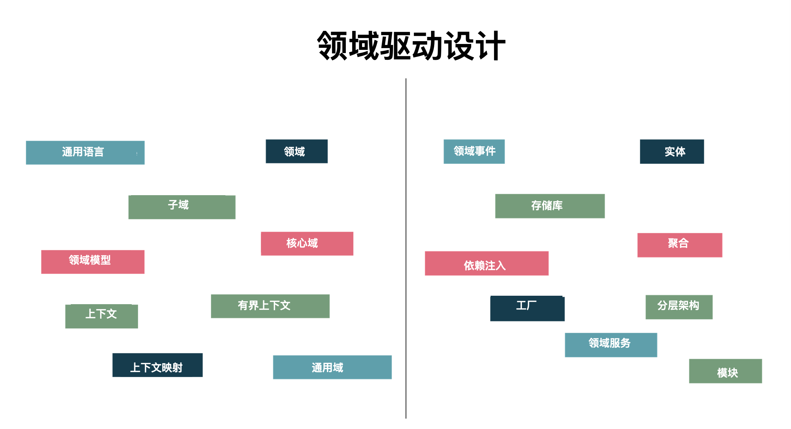

领域驱动设计 (DDD) 提供了许多技术和模式来控制软件应用程序中的复杂性——即使这些是用函数式编程语言编写的。 不幸的是，用函数式编程语言实现 DDD 可以参考的资源非常有限。 即使你设法找到了它，它也常常缺乏函数式编程的实质。

因此，DDD 通常被认为只适用于面向对象的编程。 例如，就有人会认为，函数式语言默认使用不可变（immutable）的数据结构，因此可以抛弃来自领域驱动设计的许多想法。

虽然状态不可变会使得影响状态的代码更加可见，但最终结果仍然是多段代码直接影响全局的状态（例如可能存储在数据库中）。 当然，副本从一个函数传递到下一个函数，但仍然存在一个“当前”状态，让一切直接失去控制。

在某种程度上，问题不在于状态的可变性，而在于它的所有权。谁负责保持状态内部的一致？

领域驱动设计提供了一组模式来解决许多这样的问题。在这篇文章中，我们将探讨如何让领域驱动设计适合函数式编程语言。

## 战略模式 vs 战术模式

领域驱动设计（DDD）分为战略模式和战术模式。 战略模式由限界上下文、通用语言和上下文映射等模式组成； 战术模式由值类型、实体和聚合等模式组成。

战略模式很容易映射到任何语言。 它们主要涵盖更高级别的软件设计，例如有界上下文、上下文映射、反腐败层、有界上下文集成模式。 这些模式不依赖于所使用的编程语言或框架。

然而，战术模式依赖于编程语言结构和范式。 我们将进一步探讨如何在函数式语言中应用这些战术模式中的一些，而不会失去函数式编程的真正本质。

## 聚合

聚合背后的想法是强制一致性和不变量（invariants）。聚合是强制执行不变量并充当一致性边界的地方。当更新聚合的一部分时，可能还需要继续更新其他部分以确保其一致性。

在从面向对象 (OO) 映射函数式编程 (FP) 中的聚合等概念时，我曾有一个误解，那就是只考虑因为数据和行为在 OO 中总是共存的。 但是，在 FP 中，你会倾向于将数据和函数分开。

通用语言不仅是任何领域名词的集合，而且是动词、过程和约束的集合。 名词对应数据结构，动词对应领域中的操作。 识别动词也是一个重要部分，因为它决定了哪个操作应该在其领域中。

## 值类型和实体在函数时编程中的区别

经典的 DDD （面向对象的）实现基于它们的可变性和唯一性概念来区分值类型和实体类型。 值类型是不可变的，它们本身不能传达足够的信息，例如，颜色可能是一种值类型，其中颜色类型本身没有任何意义，但是当附加到像衬衫或汽车这样的实体时（例如红色 衬衫或黑色汽车）就在领域中有了意义。

相反，实体具有生命周期。 这些是可变的类型，并通过不同的生命周期事件变化。 例如，订单可以是经历不同生命周期事件的实体，例如添加到订单的商品或从订单中删除的商品。 每个生命周期事件都会改变实体。

在函数式编程中，默认情况下一切都是不可变的，这导致我们错误地认为不需要区分值类型和实体。 但是值和实体类型的概念是基于领域模型的生命周期的，因此同样可以应用在函数式语言中。

## 建模聚合

当应用程序增长时，你最终可能会对数据库分区或使用分布式数据库，这意味着曾经存在于同一台机器上的实体/聚合现在存在于不同的机器上。关于代码库中实体位置的任何假设可能不再有效； 在单个事务中更新多个实体的任何尝试都将进入分布式事务的不稳定领域。 因此，要避免这些陷阱，请遵循以下三个准则。

1. 聚合作为事务边界：每个聚合用作事务边界。 这个唯一标识的聚合是事务的范围，不要尝试将多个聚合放在一个事务范围中，因为如果这些聚合移动到不同的机器，你无法保证事务的成功。

2. 消息用于聚合：无论您是构建微服务还是单体应用程序，你都不应该对其他聚合的位置做出任何假设。每个聚合通过向其地址发送消息与另一个聚合进行通信 — 通过聚合的唯一ID。

3. 聚合表示不相交的数据集：不要因为它们看起来相同或方便就让不同的聚合共享模型。不要构建持久层来连接这些不相交的聚合。不要为了遵循 DRY（Don't Repeat Yourself）就创建一个库来共享来自不同聚合的模型。而是需要更多的思考，以确保这些聚合代表一组不相交的数据。

以下是一些领域驱动设计中常用的函数式编程模式：

1. 采用 Lens 更新聚合：在函数式编程中，更新深度嵌套的聚合可能很麻烦，因为数据是不可变的。 这就是 Lens 发挥作用的地方。Lens 允许您更新深度嵌套的值，并获取整个更新后的聚合。
2. 使用 monoid 来表示值对象：本文档很好地解释了 DDD 上下文中的 monoids。
3. 使用基于属性的测试来测试领域不变量。
4. 如果想更炫，使用Reader Monad 进行依赖注入。
5. 通过遵循命令式外壳和函数式核心模式或使用 Free Monad，将副作用保持在边缘。

DDD 设计原则似乎与一些函数式编程的良好实践相冲突，但它是对复杂业务领域进行建模的重要工具。 我认为关键是理解 DDD 模式的本质，然后找到合适的构造/抽象来表示它们。

（完）
