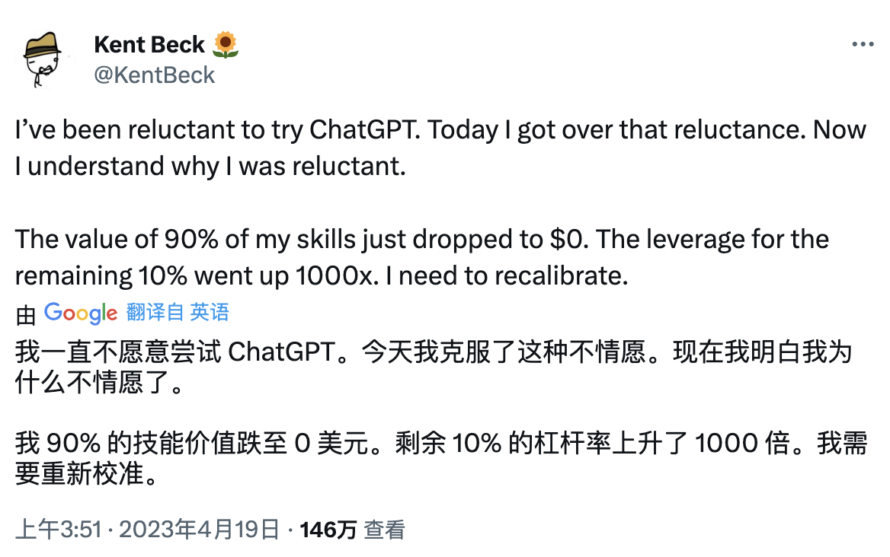

> 本文是作者顾宇在2023年对自己一年生活的总结。文章主要分为四个部分：生活、工作、学习和阅读。
>
> 在生活部分，作者介绍了家庭管理架构的演进，从家庭OKR到家庭战略，以及每月对家庭OKR的复盘。
>
> 在工作部分，作者总结了在腾讯做技术战略的工作，包括延续去年的知识管理内容，以及今年开始进行研发效能的治理。
>
> 在学习部分，作者介绍了使用GPT辅助学习和开发应用的经验，包括用SwiftUI写了一个全屏时钟，以及用LangChain开发了一个总结网页内容的程序。
>
> 在阅读部分，作者分享了自己阅读的书籍，包括《让孩子的大脑自由》、《高效能家庭的7个习惯》等。
>
> 总的来说，本文是作者对自己2023年生活的总结和反思，以及对未来的规划和展望。
>
> [生成结果用时：8.42秒]

当父亲的第二年，开始很依恋和孩子相处的时光。看着他一天天长高，长大，睡去，醒来。

我觉得带孩子对我来说是最治愈的事情，我很享受和他一起玩的时光，更享受一家三口在一起的日子。

依照惯例，将我今年一年的生活汇报如下。

## 生活 - 家庭管理架构 3.0

年初我和太太共同（主要是她）设计了家庭管理架构 3.0，并且用以指导我们的家庭生活。

在这里可以简单介绍下家庭管理架构的演进：

- 家庭管理架构 1.0 就是纯粹的**家庭OKR**，以家庭目标为主，个人目标为辅。从家庭的视角来看待个人的一年规划。包括财务/健康/学习成长/工作。
- 家庭管理架构 2.0 在 1.0 的基础上增加了**家庭文化**。即家庭的**使命**、**愿景**、**价值观**和**原则**。并以此通过家庭文化来指导家庭 OKR 的落地。
- 家庭管理架构 3.0 在 2.0 的基础上增加了**家庭战略**。即 3-5 年的发展方向和规划。这是因为家庭文化更多是原则性的，而家庭战略更加具体，在我们当前的认知下对未来家庭生活的畅想，是对愿景的细化。

除此之外，我们还每个月对家庭 OKR 进行一次复盘，并制定下个月的 Task。使我们两个没有什么长性的人能够坚持做一些事情。今年坚持了 8 个多月的健身，包括早晚瑜伽和撸铁。见证自己身体上的变化。

通过每月的家庭 OKR 回顾，我们对 OKR 有了新的认识和体验。让我们更好的在生活和工作上支持到对方。

曾经在乌鲁木齐的一阳咖啡看到一句话：“把生活当做工作来做，把工作当做生活来过。”

我们仍然觉得需要认真的对待家庭及其成员，家庭生活中难免争吵，通过我们的家庭管理框架可以帮我们做到更好的反思。

## 工作 - 技术战略下的 GPT 和研发效能

今年继续在腾讯做技术战略，大的范畴和方向没有变化，但工作的内容有些许的调整。

### 延续

延续去年的工作，技术战略的内容之一是知识管理。今年最大的收获之一是编辑了 PCG 内部的工程实践案例集，以及 Java，Go，C++ 的编程语言实践指南，收到广泛的关注。

而去年花大力气做的领域驱动设计和需求分解方面的课程，今年没有机会继续，不得不说是一件很遗憾的事。

### 变化

今年的变化主要提现在两点：

1. 研究了 GPT 在研发效能领域的应用，积累了很多关于 GPT 的知识以及 LLM 辅助软件工程的经验。
2. 开始进行研发效能的治理，主要是团队需求管理和产能方面的治理和度量。

#### 技术战略下的 LLM

今年是 GPT 很火的一年，因此我也在大语言模型方面有一些新的探索和学习，并且针对研发效能方面做了一些行业扫描，涉及到软件工程的方方面面。

此外，通过黑客马拉松编写了一些简单的应用，能够采用 GPT 开发一些应用帮助一些团队的工作提效。

从技术战略上来看：

1. 如果没有核心算法、语料、算力。不要去训练大模型，ROI 不高。
2. 由于大模型的加持，很多行业的边际成本大幅降低。会诞生很多的新的职业和公司来替代原来边际成本较高的。
3. 以 AI 为核心的软件架构决定了软件工程，现有的软件工程领域的环节替代只是个过度阶段。
4. 中美之间的地缘政治会长期阻碍中国人工智能的发展，我们要采用自己的模型，在自己的模型上构建应用。否则后期断供带来的迁移成本会很大。
5. 当前的大模型（包括 GPT-4）远未达到通用人工智能（AGI）的水平。但是，对于某些误差容忍度较高的领域，大模型已经可以替代专家。

此外，受 [Unit Mesh](https://unitmesh.cc/) 的启发，我还进行了一个定性的研究 LLM 为核心的软件架构。

定性的方向还是最大化使用 AI 来辅助软件工程。从软件工程的过程边际成本的变化来判断未来软件架构和软件工程的发展。

有几个长期的约束必须要说明：

1. LLM 的精度会越来越高，能力会越来越强。
2. 算力会越来越便宜，但是 LLM 的训练成本会越来越低。
3. LLM 作为通用型的模型不能直接胜任领域问题，因此需要以 LLM 为基础，通过工程的方式增强领域问题的处理能力。

在 Cynefin 框架下，我们可以认为 LLM 已经把很多的繁杂和复杂的问题变成了简单问题。

回到软件工程的本身，即《没有银弹》提出的本质复杂度和次要复杂度，以及《人件》所描述的“社会性问题”，可以得到一个大致的推理：

1. 由于问题域本身的复杂度（本质复杂度）在不断变高，软件会变得越来越复杂。
2. 由于解决方案域的复杂度随着技术的发展变的更加低，随着从业人数的变多软件开发的成本会进一步见底。
3. 由于人脑算力的不足，因此需要人与人协作来共同解决本质复杂复杂度和次要复杂度，这里最大的成本就是人与人的协作成本。

所以，当有了 LLM，其本身包含了本质复杂度和次要复杂度的解决方案，人类做的事情就是“提示”出解决方案并且进行验证。加之 LLM 的算力比人类强太多。因此，程序员的产能会进一步提升。相应的沟通成本会进一步降低。而南京大学软件学院的张贺更进一步进行了一些定量的研究，他认为 GPT 辅助软件开发已经可以被称之为“银弹”，能达到 30 倍的产能。可惜 Brooks 老爷子在世的时候没有看到 GPT-4，不知道他看见后会做如何感想。

在我的研究中，有些事情是不可被AI替代的：

1. 对问题域的描述，使其变成可计算的问题。
2. 对解决方案的验证。
3. 对结果承担责任。

此外，我还采用“few shot”的方式产生了一些可以“直接执行”的需求，让人类完全不参与代码的编写，软件本身也要具备一定的智能。于是我用`langchain`开发了一个应用来做进一步的研究。

基于我的研究，我认为 LLM “绞杀” 软件工程师的最可能路径如下：

1. 新的代码和采用需求 + Prompt 的方式生成。
2. 遗留代码在 LLM 的辅助下进一步重构为职责单一的接口/类。并采用 Prompt 来对这些代码进行封装。
3. 构建一个 Prompt 编排系统，将 GPT 生成的代码和遗留的代码。

最终，程序员不需要编写新的代码，取而代之的是编写 Prompt 并对 Prompt 产生的结果进行验证。

不过，这看起来是产品和测试的工作。最终不是程序员被替代，而是产品和测试被替代。

说实话，**我不认为 GPT 在替代程序员，而是在解放程序员**。在这里我用 Kend Beck 的一条推文作为结束：



#### 技术战略下的研发效能

今年下半年开始治理内部团队的需求管理。核心问题有以下几点：

1. 团队产品形态不统一，Web/终端 的交付场景不同，因此没有统一的需求流转流程。部署方式的不通决定了发布模式的不同，To B 和 To C 的结束定义不通，也导致了定义“已完成”的不同。
2. 采取一刀切的框架，之前进行的需求流转流程太细，对于小团队来说，流程太复杂，运作成本很高。
3. 为了降低运作成本，又额外招聘了很多人开发了一堆工具来辅助需求流转，不但成本没降，反而增加了成本和浪费，且造成了一些很难消除的技术债。
4. 以度量来考核，最后大家开始做一些无意义的内卷。

在治理过程中我不断采用[去年](blog/2022/2022-12-31-annual-review-for-2022/)所提到的技术战略的角度来开展需求治理工作。从关键结果（KR）出发，结合公司的主要矛盾（降本增效）和上述的三点进行了逐步的治理。

1. 建立能够提现出要研发矛盾的模型，并基于该模型度量可观测指标。
2. 循序渐进，小步快跑。在2-3个项目团队上得到了成功的经验，再逐渐推广到其他项目团队。
3. 求同存异，先解决共性的问题，搁置特性的问题。
4. 避免一刀切，先让团队接受最小的改动，然后逐步增加改动，减少对项目团队的打扰。

研发效能有三点反思：

1. 当出现新的技术时，要回头看看《人月神话》和《人件》关于软件工程中主要矛盾的论述。
2. 研发效能一定要根据企业战略找到主要矛盾，建立模型度量主要矛盾，抓大放小，由粗入细，逐步进行。不要采用“大力出奇迹”的“运动式研发效能”增加不必要的消耗。
3. 研发效能一定要先建设工具，后落地实践。否则会因为缺少工具大大影响实践落地效率和工作士气。还会产生很多不必要的浪费，让组织陷入混沌之中。

明年将会继续当前的工作，并尝试将研发效能的治理推广到全部团队。

## 学习 - GPT 辅助学习

借助于 GPT 的帮助，今年完成了一些很久之前想做但一直拖延的事情。

### 小钟钟 - 用 SwiftUI 写了一个全屏时钟

一直都想开发一个番茄钟之类的 iOS App，以往很多简单的小应用都找不到了。一直想要开发但一直都很难启动。直到遇到了 GPT，抱着试一试的想法，开发了这么一个简单的应用。

结果我发现两天就搞定了，但进行图标设计和 TestFlight 上发布时花了三四天。

由于这个 App 太简单，代码不超过 100 行。上架应该难以过审。因此这个应用还在 TestFlight 里供家人使用，效果如下：


等明年有机会的时候再继续开发吧，学习 iOS 编程是主要目的。在这个过程中不断对架构/产品设计/软件工程的概念进行反思和优化。手头总得有个 MVP 可以帮你验证某些理论和想法。

### tldr.ai - 用 LangChain 帮我做到“太长；不读”

GPT 的火热带动了软件开发的发展，特别是 [LangChain](https://github.com/langchain-ai/langchain)这个开发框架。

在研究 GPT 在软件工程领域的应用时每天都有新的项目和模型发布，且大部分采用英文。

我要花大量的时间阅读和理解。因此，我采用 `Langchain` 和 `ChatGLM` 模型开发了一个帮我用中文总结网页内容的程序，代码如下：

```python
from langchain.chains import LLMChain
from langchain.llms import ChatGLM
from langchain.prompts import PromptTemplate
from langchain.document_loaders import AsyncHtmlLoader
from langchain.document_transformers import Html2TextTransformer

def tldr(url: str) -> str:

    loader = AsyncHtmlLoader(url)
    html = loader.load()
    html2text = Html2TextTransformer()
    page = html2text.transform_documents(html)

    template = f"{page} 介绍了 {url}, 请用中文介绍什么是 {url}。"

    llm = ChatGLM(
        endpoint_url="http://127.0.0.1:8000",
        max_token=80000,
        top_p=0.9,
        temperature=0.01,
        model_kwargs={"sample_model_args": False},
    )

    prompt_template = PromptTemplate(template="{prompt}", input_variables=["prompt"])

    llm_chain = LLMChain(llm=llm, prompt=prompt_template)

    return llm_chain.run(template)
```

你可以采用[chatglm.cpp](#chatglmcpp)在本地搭建一个 [ChatGLM3-6b](https://github.com/THUDM/ChatGLM3) 的模型运行上述代码。

明年应该会把这个程序开源。并且附带上我的一些研究成果。

## 出版和写作

去年下半年和几位质量和研发效能领域的老师一起共同编写一本测试相关的书，今年年中我完成了我的章节。不知道后续是否有机会出版。

由于工作比较忙，生活的时间大部分都给了宝宝。因此，今年写的内容较小。大部分变成了自己 iPhone 备忘录里的笔记。

但是，“输出驱动输入”的学习方式没有变，还是通过几次线下技术分享来总结去年和今年的心得和学习成果。

## 线下分享

疫情恢复后，今年又在线下做了几次分享。

### 小红花技术沙龙 - 千人规模组织研发效能演进心得

今年的第一个邀请来自广州小红花技术沙龙。虽然话题是 2019 年在北京Top 100 峰会上的旧话题，但是角度和深度以大大不同。从技术战略的角度来看大型组织的研发效能演进。

新增加的内容有三点：

1. 研发效能的“效能”指的业务收益，这里面包含三个变量：业务价值（质量），交付成本，交付速度。要想达到价值最大化，就要平衡质量/速度所耗费的成本。
2. 软件的产值是难以估计的，只能通过约束成本来最大化软件特性的边际收益。
3. 软件架构的解耦可能是研发效能演进的最后一个瓶颈。大型的软件项目只有通过架构解耦来提升研发效能，以通过增加人数来扩大需求吞吐量。
4. 研发效能问题看起来是一个技术问题，但技术问题的背后是管理问题，管理问题背后是利益问题，利益问题的背后是价值观问题。如果价值观不统一，那么利益问题便难以调节，最后导致全局协同失败。因此，看不到组织的利益问题和价值观的不同的研发效能改进就很难成功。

### QECon 全球质量&效能大会 - 技术战略下的研发效能度量

小红花技术沙龙分享后不久，就接到茹炳晟老师的邀请。在 5 月份的 QECon 深圳站上进行研发效能度量方面的分享。

接着小红花技术沙龙的上的关于业务收益的观点，我进一步介绍了技术战略是如何看待研发中的知识度量。因为，在软件行业是知识在创造价值。这些知识包括：代码、文档和数据。

正如我在小红花技术沙龙上的观点“软件的产值是难以估计的，只能通过约束成本来最大化软件特性的边际收益。”

因此只能管理成本而非收益，而知识管理的成本可以进一步分为以下三类：

1. 知识的采购成本：招聘工程师/设计师/产品经理的成本
2. 知识的创造成本：开发软件的成本
3. 知识的维护成本：代码/文档/数据的维护成本。这里面最关键的是代码的维护成本。

这三个成本相互制约，任何企业最初的时候，都是用较小的成本来采购和创造软件的。随着企业和软件的复杂，对应的维护成本不断攀升，特别是技术债的出现。造成了知识的采购、创造成本不断增加。因此，最好的策略实际上是对代码（特别是架构）、文档（特别是需求）的治理。在腾讯 PCG 有代码质量评审作为晋级的激励，加强了正向的激励作用。并成立了代码委员会来负责代码质量的建设工作。主要包括：

1. 制定代码评审细则和编程手册，统一对代码质量的认知。
2. 通过培训/考试对程序员编程水平进行分级，并进行分级管理。
3. 作为晋级激励的方式来鼓励程序员提升代码的质量。
4. 设计了工具帮助团队度量和改进代码。
5. 通过技术活动运营来宣传和推广代码质量。

对于代码质量，我们的度量包括：

1. 通过考试的中级/高级程序员在团队内部的占比。
2. 技术债/复杂度/代码规范分的度量。
3. 优质/有效 代码评审的数量占比。

而对于产品线上的度量，则主要是以用户满意度，MTTR，MTBF 来衡量。这些结果指标可以进一步帮助团队改进代码/架构以达到最终的效果。目的还是为了降低软件的维护/运营成本。因为软件在运营/维护期才产生价值。

### CSDI 中国软件研发创新科技峰会 - 技术战略下的研发效能演进策略

借由 QECon 的机会认识到了董笑含老师，能够让我继续分享技术战略和研发效能的话题。很可惜的是，这次的分享时间不足。

这次分享的核心是完善后的技术战略框架，包含三个层次，如下图所示

[技术战略金字塔](ts-pyramid.png)

其次是利用这个框架构建出研发效能的相关模型，特别是对现状的分析。

接下来就是根据现状、趋势和目标设计出成本最小的演进策略。

最后是通过三个我的客户的例子，来解释如何运用这个框架来指导不同研发效能的改进。有时候同样的事情，在不同阶段的企业上，会得到相反的效果。

### 南京软件开发大会 2023 - LLM 辅助软件工程的实践和反思

在研究 LLM 辅助软件工程的时候，主要参考了加入了[黄峰达](https://www.phodal.com/)老师发明的[UnitMesh](https://unitmesh.cc)架构及其相应的工具包，同时加入了“AI 研发提效”微信群。

也是在交流沟通的过程中又遇到了南京软件开发大会的人群老师，邀请我去南京做交流。这次主要是分享我在工作中对 LLM 辅助软件工程的一些思考和经验。

简单介绍了一下我在腾讯看到的 AI 辅助软件工程的项目和效果。

主要的篇章还是讲到`UnitMesh`架构的实践以及对软件工程启示。

对于**基于 LLM 应用的开发**，我认为有以下关键问题有待进一步研究：

1. 数据集质量和人类表达精度决定了 LLM 适用的场景不会要求太高。只要能超过人类的误差即可。
2. Prompt 调试的反馈周期较长（包括 LLM 的推理性能，准确性，采纳率）
3. Prompt 的质量导致了结果的质量。因此对于 Prompt 的质量评估仍然面对很大的不确定性。
4. Prompt 在不同模型之间的兼容性（自言语言、参数数量）是需要提上日程的，否则对于模型的依赖，以及迁移成本都会很大。
5. Token 的数量限制了问题的复杂程度。
6. 算力限制导致了相关成本还是很高，未来除非有新的技术突破。否则 SaaS 是 GPT 更经济的场景。

### 中国软件技术大会 2023 - LLM 辅助软件工程的探索和反思

这次分享的内容和南京的分享差异不大。只是例子从 ChatGLM2 换成了 ChatGLM3，并且减少了传统软件工程方面的 AI 辅助研究。

上一次参加中国软件技术大会是 2019 年，认识了温昱老师，吴言老师（后来还成为了同事）并和倪光南院士合影。

这次除了遇到了一些老朋友，还结识了新的朋友。

特别是有幸听到付晓岩老师的生成式架构相关的分享，这进一步启发了我对架构和人工智能辅助软件工程的认识:

> 在 LLM 时代下，架构是一种对复杂任务的拆解，而架构的生成则是让 LLM 做这件事，从而降低架构这一复杂劳动的成本，得到更合理的软件架构。

## 阅读

今年计划阅读的图书以战略和家庭治理为主。

### 让孩子的大脑自由


豆瓣评分：8.5

这本书主要讲如何养育孩子的一些原则以及相应的科学依据，这是我今年读完的第一本书。本书系统的讲授了如何养育孩子。这本书所介绍的内容也成为了我们家育儿方面的原则。本书的核心内容是共情和理解，我们要站在孩子的角度来思考他的问题，而不是我们的角度。这样可以避免很多无效的教育和不必要的情绪。

### 高效能家庭的7个习惯


豆瓣评分：8.0

这本书是关于家庭成员之间如何相处的，我们家已经在默默采用这些原则指导我们的生活了。可以看作是“高效能人士的七个习惯”的家庭版。七个习惯名称没有变，只是举例和应用的时候采用的更多的是家庭的例子。我想高效能的人士和家庭是密不可分的，且这些原则是通用的。

如果你和伴侣、父母、孩子的关系手忙脚乱，建议你看一下这本书。

### 最好的告别


豆瓣评分：9.0

这本书我买了 4 年，终于在今年春节的时候把它读完了。本书主要介绍了两方面内容：

1. 更好的养老方案：衰老不可避免，我们要有幸福感的迎接最后的日子。
2. 临终关怀 over ICU治疗：我们应当给予有尊严的死亡。虽然两者的手段一致，但目标不同。

死亡总是一个意外，它突然发生，带走我们身体的一部分。我们应该准备好一个应急预案，安排好我们死亡后所要处理的事情。毕竟，这是你目前唯一能做的。

如果可能，我建议你也和你的父母认真严肃的讨论这些问题，让我们遇到这一切的时候，不会慌张。也能够让我们更好的珍惜当下所拥有的。

### 饮食术 - 风靡日本的科学饮食教科书


豆瓣评分：7.4

这本书传说是张展晖教练给徐小平推荐的瘦身书，不是很推荐，我大概花了两小时就看完了。

这本书主要就讲两点：1. 控制血糖的稳定，不要忽高忽低。 2. 食用优质脂肪。

今年健身期间通过 8+16 轻断食维持摄入，体重一直有序增加且体脂没有显著增加。但是在 10 月抱娃背部受伤后，就放纵了一个月。10 月底体检后发现自己血脂和体脂已经超标了，于是又启动了之前的每周两天轻断食方案，俗称 2+5，即 2 天摄入热量少于 600 大卡（女生 500 大卡），剩下日子随便吃。

在夫人的要求下，周末不允许我轻断食，一定要和她一起吃好的。因此我基本上是周一周二轻断食一天，周四周五轻断食一天。保证两次断食中间有 2-3 天。在进食日保证自己有足够的有氧运动（目前主要是跳绳）。

断食日的食物也基本固定：玉米、红薯、煮鸡蛋、牛奶/豆浆。分量保证在 600 大卡之内，一天在饿的时候分散吃完，这样饥饿的压力就小了。

坚持不住怎么办？我的办法是打开小红书，找到断食网红，看他们的断食故事励志，两周就可以控制住。因此我在今年的最后一个月成功控制住了体脂，从 22% 现在 21%。明年年底的目标是体脂降到 15% ，平均每个月降低 0.5 %。

### 芒格之道


豆瓣评分：9.3

这本书也是我在同一时间看到的，很厚，于是加入了微信阅读书架。直到年底得知芒格去世后才开始看。我基本上用了一周的睡前三小时（22:00 - 1:00）读完了这本书。这本书基本上是芒格在西科金融股东会和每日期刊股东会上的讲话稿而成。相较于《穷查理宝典》（我仍然没读完），这本书更加轻松幽默，特别是对待投资、人生、经济三方面的话题上，他的智慧让人印象深刻。

不知道是不是因为年龄还是当前的阶段，我更喜欢看这类人生智慧的书。

### 置身事内：中国政府与经济发展


豆瓣评分：9.1

这本书第一次系统的通过案例的形式讲述了中国的经济运行的内在逻辑。能让我更好的理解中国政府在经济活动中如何起作用，起了什么样的作用。这也是作者和政府打交道长时间以来的总结。知识密度很高，适合作为工具书反复阅读。

此外同类的书我还买了温铁军老师的《八次危机》，还未读完，就不在这里分享了，希望明年可以读完，届时给大家分享。

## 开源项目

### [chatglm.cpp](https://github.com/li-plus/chatglm.cpp)

如果你想在本地 MacBook 上运行 ChatGLM-6B、ChatGLM2-6B、ChatGLM3-6B 或其他大型语言模型，可以采用 `chatglm.cpp`。

> ChatGLM.cpp 是一个基于 C++ 实现的 ChatGLM-6B、ChatGLM2-6B、ChatGLM3-6B 和其他大型语言模型（LLMs）的库，用于在您的 MacBook 上进行实时聊天。该库的主要特点包括：
>
> 1. 纯 C++ 实现，与原始的 Hugging Face ChatGLM(2)-6B 工作方式相同。
> 2. 加速的内存高效的 CPU 推理，通过 int4/int8 量化、优化的 KV 缓存和并行计算实现。
> 3. 支持流式生成，具有打字机效果。
> 4. 提供 Python 绑定、Web 演示、API 服务器等更多可能性。
>
> ChatGLM.cpp 支持多种硬件平台，包括 x86/arm CPU、NVIDIA GPU 和 Apple Silicon GPU。它可以在 Linux、MacOS 和 Windows 等平台上运行。目前支持的语言模型包括 ChatGLM-6B、ChatGLM2-6B、ChatGLM3-6B、CodeGeeX2、Baichuan-13B、Baichuan-7B、Baichuan-13B、Baichuan2、InternLM 等。
>
> ChatGLM.cpp 还提供了 API 服务器、Python 绑定、Web 演示等功能，方便集成到各种前端应用中。此外，ChatGLM.cpp 还支持在 Docker 中运行，提供了预构建的 Docker 镜像，方便部署和运行。
>
> 总之，ChatGLM.cpp 是一个功能丰富、易于使用的 C++ 库，用于在各种平台上实现大型语言模型的聊天功能。
>
> [生成结果用时：13.25秒]

### [Unit Mesh](https://github.com/unit-mesh/unit-mesh)

> Unit Mesh是一种基于人工智能生成的分布式架构，与传统的分布式架构不同，Unit Mesh 中的服务单元 (Unit) 是由 AI 生成的，应用程序中的服务和数据抽象为一个个独立的单元，并通过统一的控制平面进行管理和部署。

Unit Mesh 不光是一种 GPT 的生成式架构风格，更演化出了一堆与生成式 AI 相关的开源项目，作者黄峰达非常高产。我经常笑话他是挖坑大神，没想到人家把坑连起来挖成了一条运河。

我很认可他的观点和方向，因为我总是在独立研究 3 个月之后才理解他所做的事情。明年继续保持关注和投入。

## 明年的计划

明年的工作繁忙程度可能会更高，但我仍然想能够多产出一些内容。及时记录及时发表。明年能够确定的目标如下：

1. 编程不停，通过实践进一步掌握 LLM 相关技术。
2. 减少线下分享，明年最多两次。
3. 增加内容的输出，保持每个季度不少于一篇。

## 最后

好了，大概十几篇博客的内容都汇集在这一篇里了，希望其中的观点可以帮助到您。

新的一年开始了，在这里，我祝您事事愿意，享受当下。
