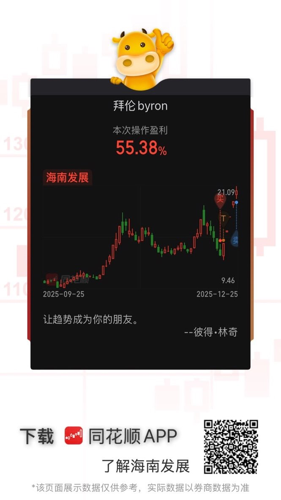

## 说明

本次交易是根据国家政策变化（海南自贸区封关）获利的一个例子。盈利 55.8%

## 选股
1. 官方公布海南封关日期（12月18日），整体海南板块/海南自贸区利好。
2. 选择市值在100-500亿的中盘股。过大市值难有起色，过小市值会被操纵。
3. 寻找连续下跌的股票，突破多个支撑均线。（原则：上涨盯成本，下跌盯利润）
4. 检查股票近期下跌是否是因为负面消息。

## 建仓入场
1. 规划仓位：分四次建仓，每次20%。
2. 交易结构：
    1. 2025-11-24至2025-12-05三次试探13.45元，可以作为前期支撑。
    2. 2025-12-11放量下跌，交易换手。开盘价18.35元作为阶段性高点，上涨幅度36.43%。这天买入被套的人若不止损会在再次回到这个价格的时候离场。
    3. 2025-12-11后斐波那契回撤未支撑住。检测前期低点13.45元。
3. T日（2025-12-18）日：入场 & 止损 & 止盈：
    1. 前期低点13.45元。设置20日均线13.15元止损，若反弹再买回来，否则离场。
    2. 止盈条件：
        * 回到前高（18.35元） 未涨停。
        * 突破前高 & 成交量放大 & 未涨停。
        * 新高反转。

## 持仓
1. T+1日：
    1. 2025-12-19 设置止损位条件单。如果成交，就再设置反弹同一价位双倍买回至计划仓位（40%）。止损位下移到当天最低（12.66元）。
    2. 收盘涨停（14.54元），止损位上移到收盘价。
2. T+2日：缩量涨停，表示卖出意愿不强。突破多个均线的阻力位，表示动能很强。止损位上移到当天最低（15.87元），继续持仓。
3. T+3日：缩量一字涨停，止损到涨停价格8%（17.24元），继续持仓。
4. T+4日：跳空突破前高（18.35元），并涨停。表示在前高中部分被套的人获利离场，且动能持续，上移止损至前高（18.35元），继续持仓。

## 止盈离场
1. T+5日：符合止盈条件2 成交量放大，第一批获利盘走掉，第二批接手。当天未触及涨停，全部止盈离场。

## 反思改进
1. 离场太快，可以止盈部分，等待回调。
2. 根据索罗斯的反身性理论，可以在T+4/T+5加仓至80%。

