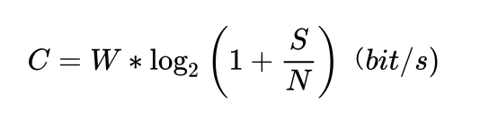

2025年年终总结来的比较晚，当我的大脑被工作和生活“碎片化”之后，很难集中注意力完成一件事情。这篇总结从动笔之日经历了两个月，很抱歉这么晚才和大家见面。

## 工作：研发效能的黄昏

2025年是 Agentic Coding 大爆发的一年，很明显感觉到2025年的这个整个AI发展的节奏变快了。特别是从七八月份开始以Claude Code为代表的开发工具的出现，让我2023年在南京软件大会上的分享成为了现实。还记得这张图吗：

当时我认为 IDE 里的代码续写是死路，因为 AI 根本不需要代码，代码是给人类的。人类只需要对运行结果做验收（Accept），因此我在 2023年的 QECon 戏称未来都是 ATDD（Acceptance Test-Driven Development），只不过开发者慢慢被 AI 绞杀取代。

当时我在腾讯用 Python 手搓了个类似 Claude Code 的原型，基本的工作就是能够读取需求（文本格式，非markdown，主要是因为省token），自己编写代码，执行（仅限 Python，因为当时的编程模型处理 Python 会更好）。当时我预言说未来的软件（不仅仅是编程工具）就是一个REPL（***R****ead，**E**val，**P**rint，**L**oop*），所有的软件架构（以Clean Code 或 DDD）作为基础的更新，当时并没有 Agent，只有 Copilot。

这里，我要再更新下我的“预言”：

1. 未来会出现通用型软件AI（类似Claude Code），这个通用型AI是所有软件的原型。人们所做的就是需要让 AI 能够理解领域（Domain）和基础设施（Infrastructure）的约束，并且构建出解决方案，让人通过AI 的快速反馈达成目的。
2. 未来的 UI，是大模型指令的“快捷方式”。
3. 当重写的成本足够低，软件都值得用 AI 重写一遍。
4. 现代人终被AI解放，但被解放的现代人会陷入迷茫。

30多年前，人们就在 EMACS上就已经用 Lisp 来干这件事了。那时候程序员会用 Lisp 写出各种各样的“方言”来解决各种问题。这么多年过去了，一些事情变了，另外一些事情没有变。

### 技术战略：AI 时代更要关注人

关于AI，我的关注点有所不同。我更关注在应用 AI的过程中的人类学和社会学问题而非技术问题。

我把 AI 应用分为三个阶段，九个等级：

#### 阶段一：AI 作为一个工具

Level 1: AI 作为一个玩具：AI 提供给你的更多是新奇，你在测试它的上限但你不会做严肃的事情。

Level 2: AI 作为一个搜索引擎：AI 开始解决一些严肃问题，但它仅仅是搜索引擎的一个替代。（或者是下一代搜索引擎）

Level 3: AI 作为一种特殊软件：AI 开始解决一些之前的软件并不能解决的问题，比如生成内容。

提示：当你还把 AI 作为一个软件，那么你还没发挥AI更大的价值。

#### 阶段二：AI 作为一个人

Level 4: AI 作为一个Copilot：AI 干活，你来监督。
Level 5: AI 作为一个Agent：AI 干活，你不需要监督。
Level 6: AI 作为一个 Coach：AI 发挥它的专业，来解决你的问题。比如各种数字人，心理咨询师，虚拟女友……

**提示**：你在训练AI的时候，AI 也在训练你。当 AI 越来越“像你”，那么“你”又是谁？

#### 阶段三：AI 超越一个人

Level 7: AI 成为一个组织：让 AI 扮演不同的角色，甚至是政府和企业。

Level 8: AI 作为一个世界：AI 不仅可以扮演人类，还可以成为任何一种东西（存在或不存在的生物，

Level 9: AI 成为一个神：当 AI 的认知超过你并且了解你，你只有选择信和不信。

**提示**：是你自己决定要这么做，还是 AI 决定要这么做？

这里需要说明的是，在应用 AI 的过程中，9个阶段可能同时存在，但对于个人来说，他会经历上述的每个 Level。

说到底，AI还是一种工具。当人频繁和AI互换信息后，在乔哈里窗的作用下，人类会开始把自己和 AI 融合。最终会把 AI 变成一种超越自己的存在。那么你当如何面对这个存在？

我的建议是：**让 AI 帮助你成为更好的自己，人类自身应该去接触更多真实的人。**

### 技术战略：信息论和香农公式

今年最大的收获是把信息论中的香农定理和香农公式加入到了技术战略的工具箱中，搭配制度经济学获得很强的解释能力：

其中：C是数据速率的**极限值**，单位bit/s；W为**信道带宽**，单位Hz；S是信号功率（瓦），N是**噪声功率**（瓦）。

香农公式配合交易费用实际上可以解决很多管理和协作中的问题，让我们把它带到研发效能里面去： 

软件工程之间的人类协作本质上是信号在不同人之间传递的过程。人越多，信号和噪声都在上升，随着人数的增加，通信网络的增长会带来更大的噪音。

当噪音很大，其需要降低噪音所伴随的成本就会更高。由于人类大脑算力的限制，我们需要更多的角色（产品经理，开发工程师，测试人员，运维工程师）来处理复杂度不断膨胀的信息（本质复杂度&次要复杂度），再加上每个角色的成本（交易费用），随着时间的增加。需要传播的知识会越来越多……

因此，为了减少噪音，我们采用了很多方法来减少噪音，包括需求规格说明书、用户故事、测试用例、测试驱动开发、DevOps……等希望通过标准化或者规范化的方式降低噪音。

管理，或者说协作的方向应当是减少噪音，提升信噪比的。那么，在信息传播过程中的所有噪音都应当去除。

那么，我们把这个噪音的极限推向于零，我们会得到一个结论：

随着AI在软件领域里不断成熟，软件开发的门槛大大降低、最简化的形式是一人自己满足自己的需求，几乎没有“噪音”。每个人只要会打字，就会编写软件。

那么，在这个终态出现之前，会发生些什么？

### 研发效能的黄昏：软件的“黑灯工厂”马上到来！

“黑灯工厂”就是高度自动化、智能化的“无人/少人工厂”，生产过程主要由机器人和系统自动完成，理论上可以关灯运行，所以叫“黑灯工厂”。

而随着 Claude Code 等工具的成熟，加上模型的发展。软件工程师之间的差异最终将抹平。你不会再去费心招一个“资深工程师”，因为最好的AI工程师一定会被开源，从而拥有世界上所有软件工程师最棒的实践和经验。

所以，你需要做好的是建立企业的知识库，并且不断用 AI 生成的软件来迭代你的知识库。

你需要的是一个资深软件工程专家，TA们可以：

1. 帮你把开源AI工程师训练成理解企业内部的工程师。
2. 能够帮你构建并维护知识资产。
3. 能够对 AI 生成的结果进行鉴定，以识别是否在糊弄你。

未来的场景会是很少的资深工程师在不断通过企业内部资产训练企业内部的“软件工厂”的形式，百人以上规模的团队即将成为过去。研发效能说到最后，都是一个“制度费用”的问题。当AI 降低了关键环节的成本，也降低了组织规模及其制度的运营成本。

这就会涌现出一个新的团队： AI 适配团队。

### 技术战略：帮助企业适配 AI，创建新的 AI 生产关系

AI 适配团队是帮助企业 “AI化”的团队，他们需要盘点当前的资产：文档、代码、数据。并且通过构建新的业务流程和模型逐渐“优化”掉因为 AI 提效产生的岗位、流程、制度、软件。这需要长期

我的想象中，这样的团队开始会通过文档建立简单的模型。并且让 AI 在不断吸取内部文档、代码、数据后建立起适配于 AI 的流程和体系。

这个过程中需要企业中自己建立专家团队，并且和 AI 适配团队进行沟通交流，并且文档化运作起这个流程。

这个过程中最大的工作量是“沟通”以及“文档化”，这个部份是 AI 很难独立完成的，原因基本也是我在上文中提及的“三大阶段”所言所以需要建立一个多专业的协作团队来完成。

那么，被“优化”的岗位怎么办？

### 展望 - AI 让现代人“去工具化”，但人类会把自己“再工具化”
 
从2024年开始，随着生成式AI的进步，大量的工作岗位被裁撤，未来只会加速这个过程。不过我倒是持乐观态度：AI 是人类的解放，让 人们从“工具化”的制度中脱离，活成真实的自己。

自从专业化分工开始，人类社会就不断的把人工具化。随着科技和生产关系的进步以及战争的需要，每个人都是“国家机器”中的工具。当你失去了“被当作工具”的价值，你就失去了存在于社会中的价值。即便是在消费主义下，“有消费能力的人”的人也是一种“消费工具”。然而，AI 作为生产资料，大大降低了，AI 则让每个人有了更多的可能性。但是，在新的生产关系诞生之前，社会经济还是会被 AI 所带来的恐慌所笼罩，毕竟，经济运行制度的改变并不会来的这么快。

对于当前的人们来说，要么你成为某个领域的专家，在企业中帮助来对 AI 生成的结果进行评审；要么探索新的“AI 原生”经济组织形态和新的市场。

毕竟，有多少人工，就有多少智能。

## 生活：开启人生的下半场

2025年10月份把自己的第一套房子卖掉，清空了自己的负债。同时也清空了那些“未曾圆满”愿望和纪念品。生活似乎又回到了12年前，当时自己一无所有，怀揣着闯荡世界的梦想离开了新疆，踏上陌生的城市，陌生的地方总能给人带来很多幻想和希望。“择一人白首，择一城终老”当时只是这么简单的想法，有了自己的房子，仿佛就有了自己的家，看着孩子在这个城里长大，享受和喜欢的人和事在一起的每一天。

但真实的生活确是浪里踏舟，充满惊险和变数。进入了人生下半场，便总会想花更多的时间陪伴家人，生活的选择会越发谨慎。回顾过去那种完全属于自己可以自由支配的生活，已经一去不返。

希望慢慢变成了各种绝望，更少独处的时间，更多的家庭生活。精力和体力的下滑和各种长期积累的小毛病会对自己产生怀疑。到了年底，则有一种自己变笨的感觉：大脑很难集中注意力完成一件事情。包括编写年底总结的事情，也是很难专注完成。当身心因为疲劳缺乏精力，则会做出很多错误的决策。

真的需要一个自己的悠长假期来进行调理，人生即将迈入不惑之年，最重要的，还是要保重身体。

## 线下分享

2025年参加了GOPS 2025 深圳站 [https://www.bagevent.com/event/2025GOPS-ShenZhen](https://www.bagevent.com/event/2025GOPS-ShenZhen) 的分享，分享的是BizDevOps的内容。完整版实际上是 BizSecDevOps，但由于时间原因，把安全的部分删减了。这个是我整年在SHEIN做BizSecDevOps 的心得。几个关键内容如下：

1. BizSecDevOps 不是 BizDevSecOps 的原因是要把安全合规放在较早的时间考虑，发展期的企业随着规模的扩大会需要做各种治理。
2. 在 BizSecDevOps 不是IT的开发和运营（运维），而是业务（Biz）安全的运营和运维。这中间包括影响业务可持续性运营的风险因素。
3. 以终为始，从运营（xOps）的角度来看如何去对业务需求、IT 需求进行分级分类，因为运营是业务的心跳和呼吸。
4. 通过对业务可持续性风险不同角度的关注来上升统一各方利益诉求，调整不合理的考核绩效目标，而非带来阻力。

## 阅读 & 写作

今年没有读完任何一本书，而是重温以前读完的书，最常看的还是[《人月神话》](https://book.douban.com/subject/36459444/)和[《人件》](https://book.douban.com/subject/25956450/)，技术越来越发展

今年也没有发表其他的内容，还是积累了很多心得和草稿。不知不觉，发现我的草稿已经积累了10年。未来还是需要坚持深度阅读和深度思考，并通过写作的方式输出。

就像前文所说，如果你的思考力被 AI 剥夺了，其实就是被AI再工具化了。所以，现在需要训练的是深度阅读和深度思考能力。

## 2026年展望

世界的波动性在增加，每个人的生活轨迹都会迎来波动，能应对已是不易。

2026年，要用行动替代焦虑，多输出，少纠结。

新年快乐，与君共勉。
