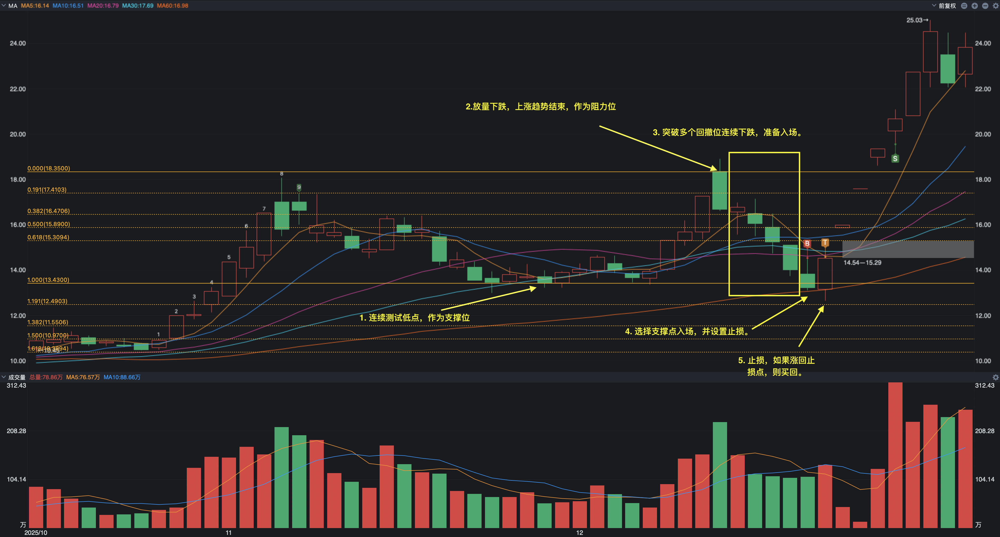

## 声明
本文是根据我自己的交易系统在海南发展（SZ.002163）的一次短线交易上的交易复盘，从2025年12月18日至12月23日累计5个交易日共获利55.38%。本文仅作为交易心得分享，不涉及任何投资建议。

本文就是从这次交易的选股、进场、持仓、离场做一次全面总结。然止盈离场并未十分完美，但整个交易计划和分析过程仍然自认为可圈可点。

如果你和我一样是上班族，没时间盯盘，就采用条件单的方式进行交易。只需要在早上开盘（9:30前），中午休市（11:30至13:00），下午收盘前（14:30）这三个时间点看一下就可以，避免情绪交易。

## 交易记录

### 1. 选股
海南2025年12月18日封关是一个重大的宏观政策节点。这个政策对于海南板块或者海南自贸区概念来说是长期利好。因此抓住这个时间点应该可以获利一波。

于是，我通过以下步骤进行筛选：
1. 海南板块/海南自贸区概念的成分股。
2. 市值在100-500亿的中盘股。大盘股难有起色，小盘股恐被操纵收割。
3. 连续下跌多日，特别是突破了多日均线支撑，反弹动力较强。另外，下跌的过程中被套住的筹码会成为你的利润
4. 检查该股票是否因为负面消息连跌数日。

经过以上筛选，选择了海南发展（SZ.002163）。

### 2. 制定交易计划
首先，要控制个股交易的最大仓位，特别是这种短期交易要制定交易计划。

一个完整的交易周期往往包含以下四个阶段:
1. **下跌等企稳**：支撑价格往往会通过多次对最低点的测试来确认。无论是上涨还是下跌，确认次数越多，概率越大。因此，不要第一次入场，很有可能是假企稳。
2. **企稳等上涨**：多次确认最低点（收盘价而非最低价）后，筹码足够后就会上涨。但也会下跌（假支撑）。因此要做好止损或者加仓准备。
3. **上涨等回调**：上涨的过程中要不断的根据量价变化判断多空力量，上移止损点（而非止盈点）离场，或者在过程中加仓。这时候要关注你的成本和交易对手的成本。因为成本比你低的筹码会收割你。所谓“上涨盯成本”就是要注意自己的成本的优势。确保随时可以“割”比你成本更高的筹码。
4. **回调等下跌**：下跌的过程是资金流出的过程，这个时候会有人买入，买入的筹码就是你的利润。所谓“下跌盯利润”就是这些被套的筹码会持仓等待未来价格更高的时候卖出，或者止损离场。这就是你未来能够获得的利润，所谓下跌盯利润。然后再等继续支撑。

需要注意的是，在整个交易的过程中要寻找连续上涨的一段行情，同时在整个过程中都要关注成交量的变化幅度和价格的变化幅度。

一个完整的交易计划就是要在支撑时（阶段1或2）买入，回调时（阶段3或4）卖出。以本次交易为例，在交易时间前有以下几步：
1. 找到前一段时间交易的支撑位和阻力位，计算交易最大获利幅度。
2. 采用斐波那契回撤线和均线建立止损&止盈关键价格。
3. 如果突破前高，就继续持有，等待成交量缩小（价格太高没有人买）。
4. 如果没突破前高，就观察成交量和收盘价，将止损点移动到关键价格线上。

当时这只个股我计划用5%的最大仓位来进行交易，每次加仓1%，分5次完成建仓。

### 3.分批入场（12月18日）

入场的第一步就是要知道你的交易对手是谁，你准备买入谁的筹码，并且未来要卖给谁。简单说你入场就要知道自己要割哪一波韭菜，同时也要知道自己作为韭菜会被谁割。这样，可以找到比较低的成本。

在海南发展中，我的利润来源于最高点2025-12-11日12-18日支撑位的买入筹码（因为他们的成本比你高）。

通过条件单挂单买入，上午在支撑位挂单买入计划仓位的20%（总仓位的1%），下午在止损位（-1%到-2%之间）挂单买入另外20%。

收盘后晚上要复盘并制定第二日的交易计划，如果今天的行情没有触及止损加仓，那么明天就按止损价卖出。然后等到反弹后再按止损价双倍买回。仓位达到2%

如果第二天上涨，那么就在同样的价位进行加仓

止盈实际上是一种不断上移的止损点，对于这波行情来说，我设置了如下3个止盈点：
1. 触及前高（18.35元）且未涨停，收盘低于前高。表示之前的阻力仍在。
2. 突破前高（18.35元）且未涨停，成交量放大并且振幅放大，表示多空博弈加剧。
3. 创新高后反转，一根阴线触及了上移的止损位。

如下图所示：

### 4.持有待涨
持有的过程要时刻盯着自己的成本，并且根据价格的上涨不断提升自己的止损位保住利润。
1. 12月19日：缩量涨停，表示卖出意愿不强。突破多个均线的阻力位，表示动能很强。止损位上移到当天最低（15.87元），继续持仓。
2. 12月20日：缩量一字涨停，止损到涨停价格8%（17.24元），继续持仓。
3. 12月21日：跳空突破前高（18.35元），并涨停。表示在前高中部分被套的人获利离场，且动能持续，上移止损至前高（18.35元），继续持仓。

如下图所示：

### 5.止盈离场（12月22日）

符合止盈条件2 成交量放大，第一批获利盘走掉，第二批韭菜接手。当天未触及涨停，全部止盈离场。
全部交易记录如下图所示：

## 总结

### 做的好的部份
1. 遵守交易系统止损。
2. 遵守交易系统买回。
3. 遵守交易系统离场。

### 做的不好的部份
1. 加仓太少，可以在反转后2倍加仓。
2. 离场太早，可以分步减仓。

### 反思
1. 根据索罗斯的反身性理论，可以在离场日加仓至80%，或者减仓50%。

